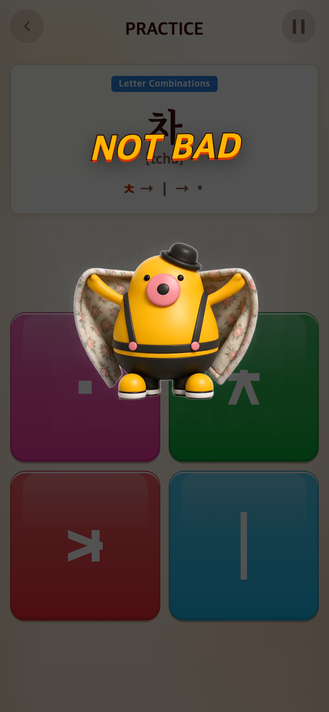
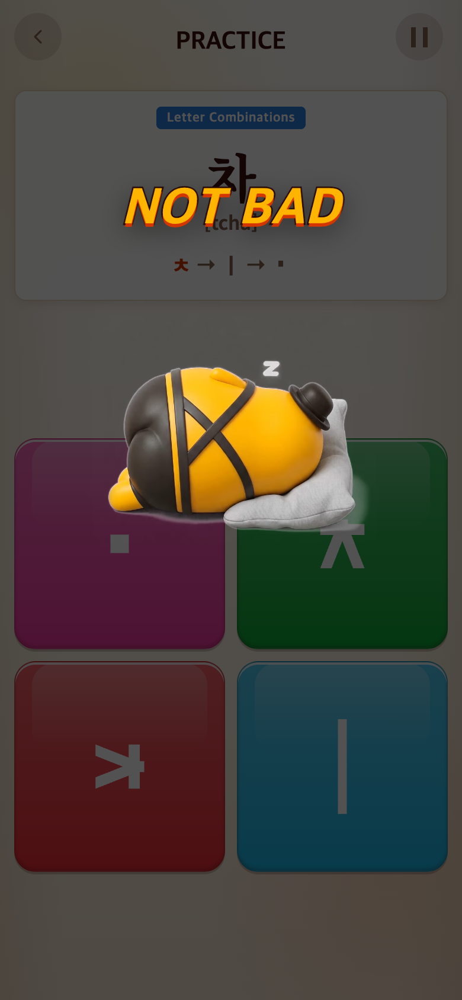
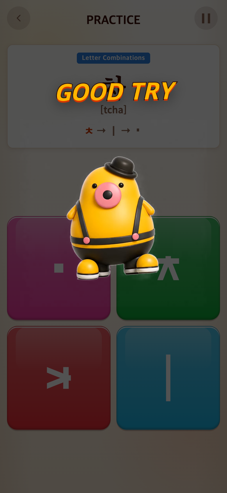
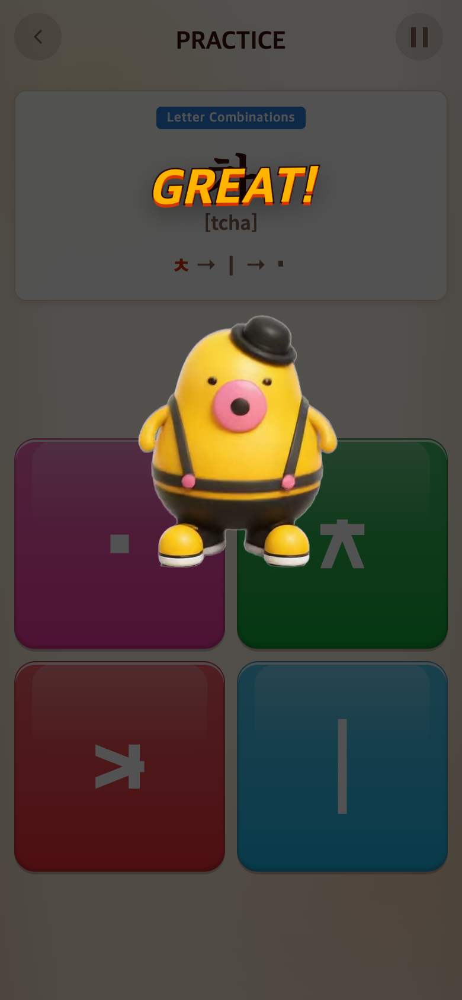
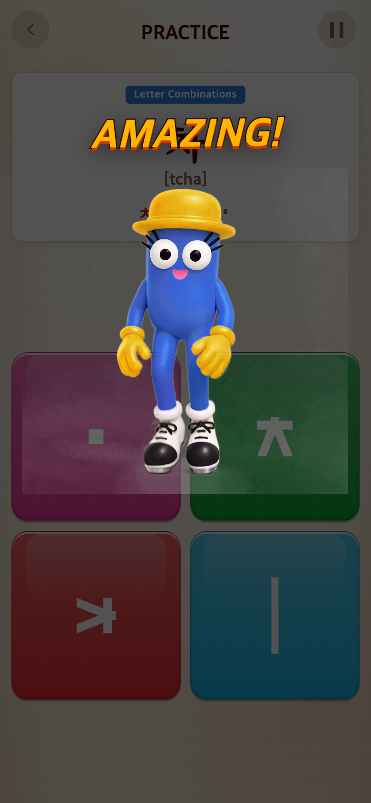
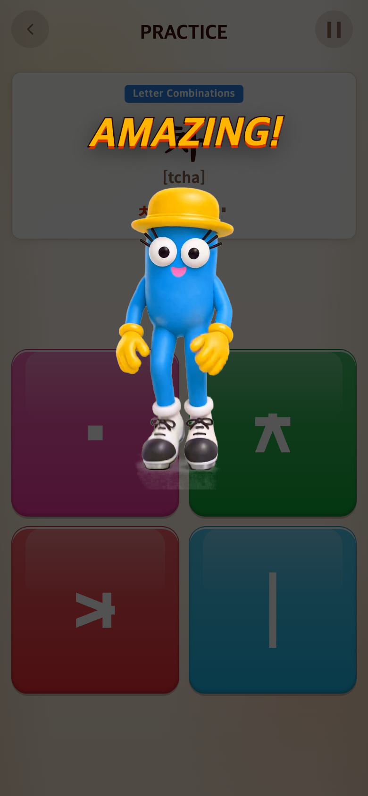
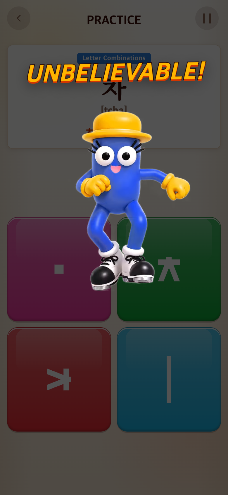
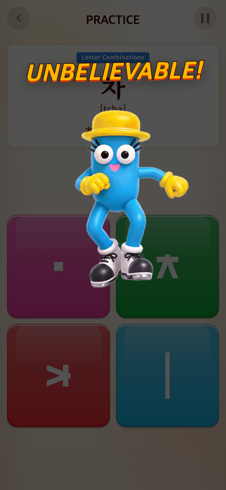
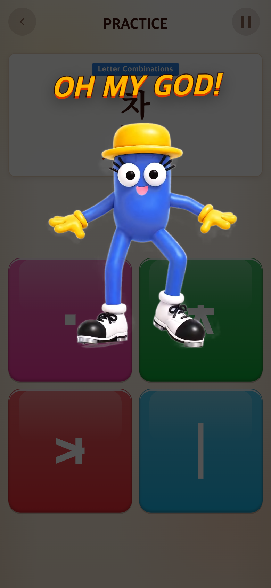
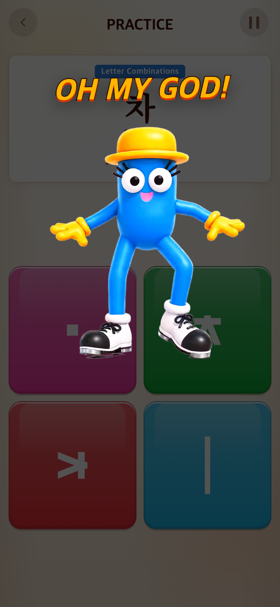

# 2026-09-17 등급별 영상 교체·파일명 정리

- 변경 커밋: `f7ef7e1`
- 비교 커밋: `4838108` (사용자 업로드 완료, 연결 전)
- 과거 화면 재현 성공: git archive로 별도 임시 폴더에서 실행. 작업 트리로 과거 화면을 합성하지 않음.

## 요청·변경 이유

업로드 파일 이름과 실제 적용 등급이 달라 사용자 지정 매핑으로 재연결했다. MP4/WebM/MP3를 한 묶음으로 같은 등급명으로 정리해 다음 교체 시 혼동을 줄인다.

| 등급 | 기존 연결 | 새 연결 | 업로드 당시 이름 |
| --- | --- | --- | --- |
| NOT BAD | movie/notbad | 0917-movie/notbad | notbad |
| GOOD TRY | movie/GOOD TRY | 유지 | — |
| GREAT·튜토리얼 | movie/tipi | 유지 | — |
| AMAZING | movie/AMAZING | 0917-movie/amazing | GREAT |
| UNBELIEVABLE | movie/taepi | 0917-movie/unbelievable | Amazing |
| OH MY GOD | movie/OH MY GOD | 0917-movie/ohmygod | OH MY GOD |

모든 확장자에 동일하게 적용. 사용자 메시지의 nobad는 실제 업로드 notbad로 확인했다. 9개 파일은 내용 변경 없는100% rename이며 기존 movie 파일들은 삭제하지 않았다. 더 이상 사용하지 않는 CELEBRATION_MOVIES 연결 상수만 제거했다. 세 게임의 공통 설정이므로 모두 적용된다. 점수·등급 경계·튜토리얼 GREAT·영상 레이아웃·2초 점수 표시·탭 이동은 유지한다.

## 검증

- Vitest34파일/231테스트 통과, production build 통과.
- 6등급 WebM 실제 렌더링 및 MP3 연결 확인. iPhone UA 분기의 MP4 URL·HTTP 성공 확인(실제 iPhone 재생 검증은 아님).
- ffprobe: 신규 MP4는HEVC, WebM은VP9. Amazing1440×1440, 나머지960×960. NOT BAD/AMAZING/OH MY GOD 약6.042초, UNBELIEVABLE5.875초. MP3는 각각6.121/5.938초로 약0.06~0.08초 인코딩 여유가 있다. 영상 시작 시간에 맞추는 기존 MP3 동기화 로직 유지. 기기 스피커 청취는 미검증.
- 첫 after 캡처는 개발 서버 실행 중 코드 교체와 겹쳐 readyState 대기 시간 초과. 파일 정리 후 after 전부 재실행 성공.
- 모바일390×844 CSS px/DPR2/PNG780×1688. 모두 영상0.5초 지점. 개발용으로 실제 Cheer를 직접 호출한 등급 미리보기이며 배경 PRACTICE 화면은 자연 플레이의 점수 결과가 아니다. 전후 동일 조건, 난수 고정, 합성 없음.
- `capture.mjs`로 재현 가능. PLAYWRIGHT_MODULE을 설치된 Playwright 경로로 지정하며 after는 실행 시 작업 트리다. `CAPTURE_SIDE=after`로 after만 재검증 가능.

## 전후 화면

| 등급 | 이전 `4838108` 재현 | 변경 `f7ef7e1` |
| --- | --- | --- |
| NOT BAD |  |  |
| GOOD TRY |  |  |
| GREAT |  |  |
| AMAZING |  |  |
| UNBELIEVABLE |  |  |
| OH MY GOD |  |  |
