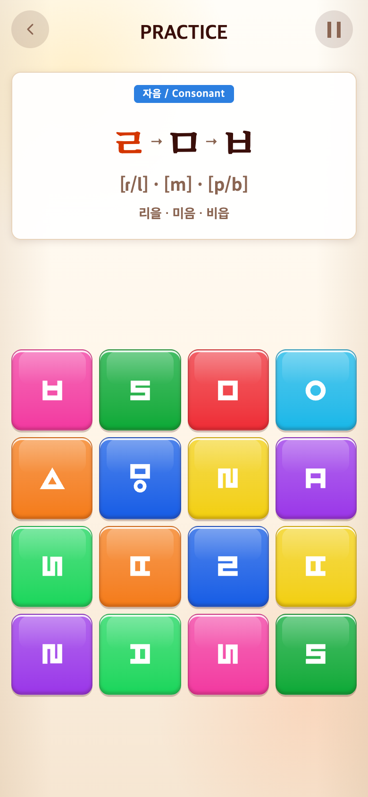

# 2026-09-20 사용자 SVG로 순경음미음 교체

- 적용 커밋: `90287b3`
- 비교 커밋: `f5d0e97`
- 요구: 첨부 순경음미음.svg로 기존 ㅱ 함정 도형 교체.
- 확인: 배경·외부 폰트 없이 두 path로 구성된 Illustrator SVG. 위쪽 직사각형이 기존보다 세로로 높다.
- 변경: 원본을 assets/glyph-sources/labial-mieum.svg에 보존. 추출 스크립트에 우선 적용하여 빈 페이지 여백만 제거하고 원본 두 경로·좌표 크기·비율을 유지한 채 100×100 viewBox 중앙에 배치. 배포용 u3171.svg와 인라인 연결표 갱신. 다른 기호·함정 판정·점수는 불변.
- 검증: 34파일232테스트 및 빌드 통과. 원본 두 경로가 인라인 SVG에 그대로 들어가는 회귀 테스트 추가. 전후 glyph 컨테이너39px 유지. 모바일 화면 확인.
- 전후 조건: Chrome390×844 CSS px/DPR2, PNG780×1688. 동일 시드123, Alphabet18번 ㄹㅁㅂ 시작 상태. 과거 커밋은 별도 임시 폴더에 git archive로 추출해 실행했고 합성하지 않았다. 재현 성공.

| 변경 전 `f5d0e97` 재현 | 변경 후 `90287b3` |
| --- | --- |
|  |  |

재실행은 capture.mjs 사용. PLAYWRIGHT_MODULE에 설치된 Playwright 경로를 지정한다. after는 실행 당시 작업 트리다.
