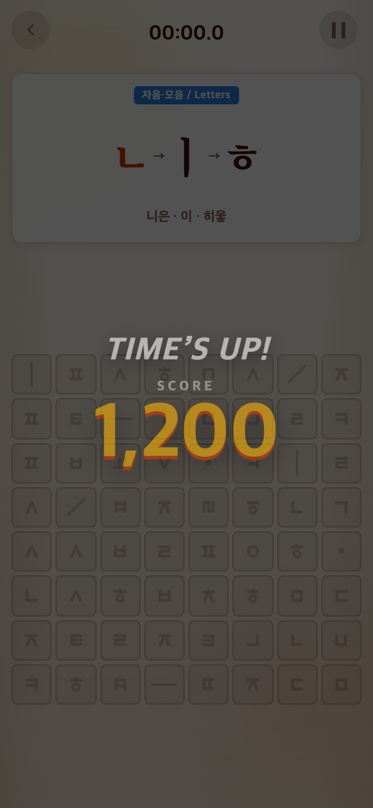
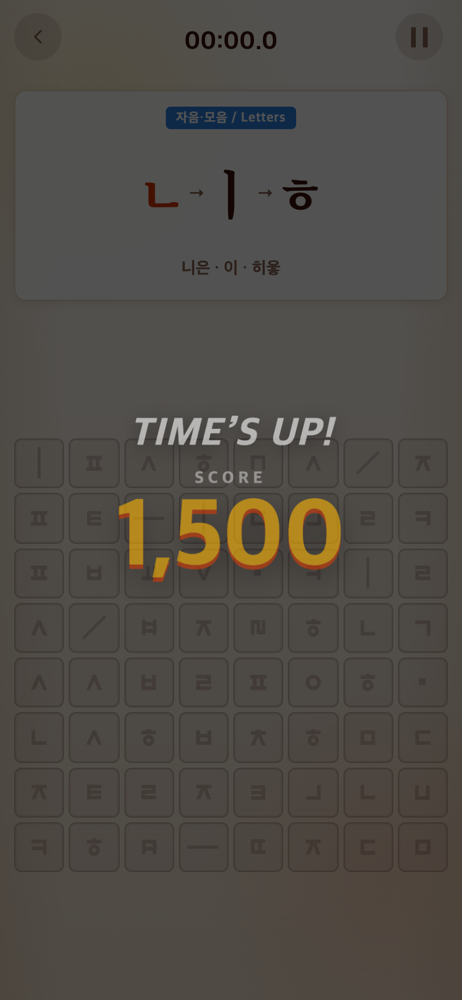

# 2026-09-20 실플레이 기준 점수 조정

- 비교 커밋: `b5c9fbd`, 별도 임시 폴더에서 git archive로 실행.
- 적용: 이 문서와 함께 커밋된 `Tune OMG targets to eight letters/syllables and six words`.

## 요구·이유

사용자 실플레이 후 OMG 달성 기준을 Alphabet/Syllable10→8개, Vocabulary7→6개로 완화 요청.

## 변경·결과

문제당187.5/187.5/250점. 합산 후 소수점 버림. 8/8/6개에서 정확히1500점. 7/7/5개는1312/1312/1250점, 9/9/7개는1687/1687/1750점. 상한 없음·60초·등급·튜토리얼·영상 매핑 유지. Syllable 함정30%는8개1500점 달성부터 해금된다.

전체 테스트232개 및 빌드 통과. 임계값 직전/정확히/이후와 소수점 합산 검사.

## 전후 화면

모바일 Chrome390×844 CSS px, DPR2, PNG780×1688. seed123. 실제 앱의 Alphabet 본게임에 완성 수8개·경과60초를 지정한 검증 체크포인트이며 사용자 플레이 기록이 아니다. 기존 커밋 화면을 임시 폴더에서 실행했고 합성하지 않았다.

| 이전:1200점 | 수정:1500점 |
| --- | --- |
|  |  |

`capture.mjs`로 재현. 기기별 실제 플레이 검증은 별도 필요.
