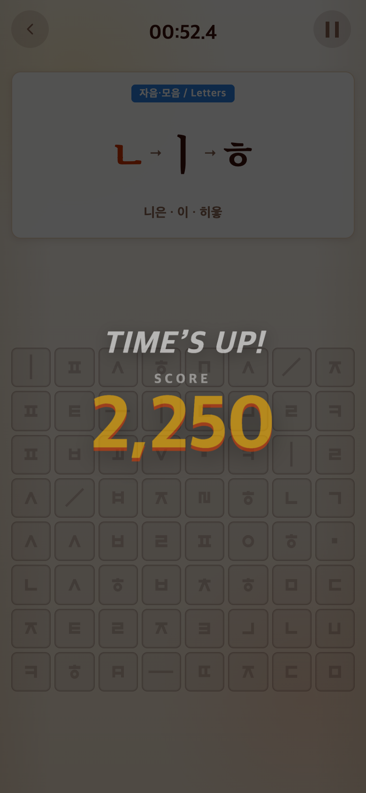
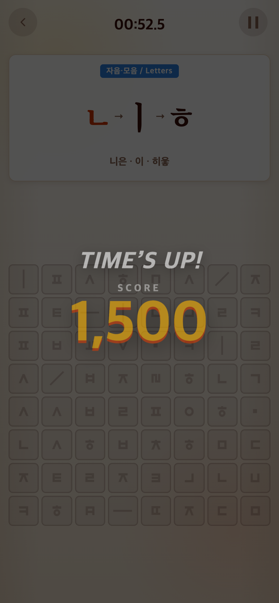

# 2026-09-20 점수와 튜토리얼 영상

## 요청·변경 이유

튜토리얼 영상이 GREAT 하나로 반복되는 것을 구간별 상승으로 변경. 본게임은 완성 수×고정 점수로 단순화하고 최고점 제한을 제거한다. Alphabet/Syllable10개, Vocabulary7개에서 OMG를 달성하도록 한다.

## 수정 결과

- Alphabet/Syllable 문제당150점, Vocabulary225점. 전부 무제한 점수. 10/10/7개에서1500/1500/1575점.
- 등급: 0 NOT BAD, 1~299 GOOD TRY, 300~599 GREAT, 600~999 AMAZING, 1000~1499 UNBELIEVABLE, 1500+ OMG. 영상 경계와 Syllable 함정30% 전환도 동기화.
- 튜토리얼2×2 완료GREAT,4×4 완료AMAZING,6×6 완료UNBELIEVABLE. Alphabet3회·Syllable2회, 점수 없이 영상 후 탭. 총 연습판수와60초 본게임은 유지.
- 테스트232개 및 빌드 통과. 9/10개·6/7개 등급 경계, 상한 제거, 튜토리얼 매핑 검사.

## 전후 화면

비교 커밋 `d61dea6`을 별도 임시 폴더에서 실행. 수정 후는 이 문서와 함께 커밋된 `Use uncapped per-target scoring and progressive tutorial rewards`. Chrome390×844 CSS px·DPR2, PNG780×1688. 고정 seed123, 실제 앱 진입 후 Alphabet 본게임의 완성 수를10으로 지정해 종료시킨 검증 체크포인트이며 실제 플레이 기록이 아니다. 이전 UI를 임의로 합성하지 않았다.

| 전:2250점 | 후:1500점 |
| --- | --- |
|  |  |

재현 스크립트 `capture.mjs`. 튜토리얼 영상 매핑은 자동 테스트로 확인하며 실제 기기별 영상 재생은 별도 확인 필요.
