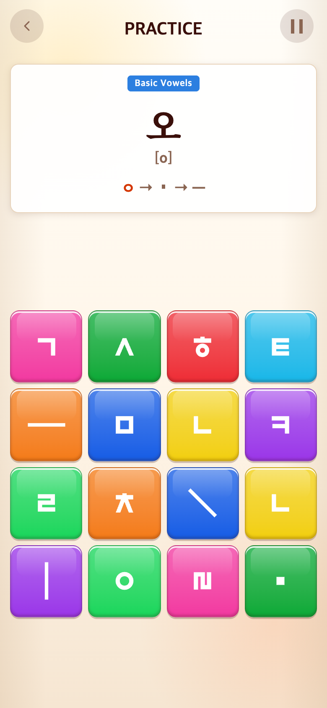

# 2026-09-20 Syllable 연습 축소·한영 학습명

- 비교 커밋: `f7cb2ec` 별도 임시 폴더 실행.
- 적용 커밋: 이 문서와 함께 커밋된 `Shorten second syllable practice and add bilingual categories`.

## 요청·이유

파란 학습 제목을 Alphabet처럼 한글 / 영어로 표기. 두 번째 튜토리얼만 약 절반으로 줄여 학습 부담을 낮춤.

## 변경·결과

첫2×2 자음·모음 조합5판 유지. 둘째4×4는 기본모음3·복모음3·쌍자음2·받침3·겹받침2, 총13판(기존25판). 총30→18판. 6유형과 전체59개 후보는 유지하며 시작마다 추첨한다. 쌍자음도5개 전부 대신2개를 중복 없이 체험. 첫5판GREAT·전체18판AMAZING 영상 후 본게임6×6. 본게임 점수·시간·단어풀은 변경 없음.

제목은 자음·모음 조합 / Letter Combinations, 기본 모음 / Basic Vowels, 복모음 / Compound Vowels, 쌍자음 / Double Consonants, 받침 / Final Consonants, 겹받침 / Double Finals.

232개 테스트와 빌드 통과. 각 유형 개수·중복 없음·5/18판 경계·본게임 전환·한영 제목 검사.

## 전후 모바일

Chrome390×844 CSS px·DPR2, PNG780×1688. seed123, 실제 앱 Syllable START 후 학습 인덱스5 지정. 과거 커밋은 별도 임시 폴더에서 실행했으며 합성하지 않았다. `capture.mjs`로 재현. 유형별 추첨 개수가 바뀌므로 난수 소비에 따른 예시는 달라질 수 있다.

| 전 | 후 |
| --- | --- |
|  |  |
