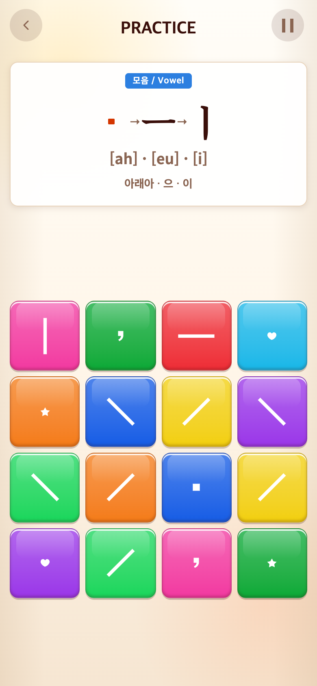

# 2026-09-20 제시어 모음천 50% 축소

- 변경 커밋: `b37edee`
- 비교 커밋: `b7abad0` (별도 임시 폴더에서 git archive로 실행한 과거 화면)
- 문제: Alphabet 제시어의 모음천이 점보다 큰 면처럼 보임.
- 수정: `.alphabet-target-jamo.is-cheonjiin::before`의 한 변 .34em→.17em, 모서리도 절반. 정사각형·중앙 위치·색상 진행·주변 자소 간격 유지. 블록과 작은 입력 안내 점은 변경하지 않음.
- 검증: 빌드 통과. 브라우저 실측 한 변14.9531→7.46875 CSS px(반올림 오차 내50%). 게임 규칙 변경 없음.
- 비교 조건: 390×844 CSS px/DPR2/780×1688 PNG, Chrome 모바일 에뮬레이션, 동일 시드123, 실제 Alphabet 튜토리얼22번 인덱스(ㆍㅡㅣ)로 이동해 촬영. 첨부 사용자 화면 자체의 복제는 아니며 같은 표시 컴포넌트를 사용한 재현이다. 현재 화면을 과거처럼 합성하지 않음.

| 변경 전 `b7abad0` 재현 | 변경 후 `b37edee` |
| --- | --- |
|  |  |

재현 스크립트: `capture.mjs`. `PLAYWRIGHT_MODULE`에 설치된 Playwright 경로를 지정하여 실행한다. after는 실행 시 작업 트리다.
