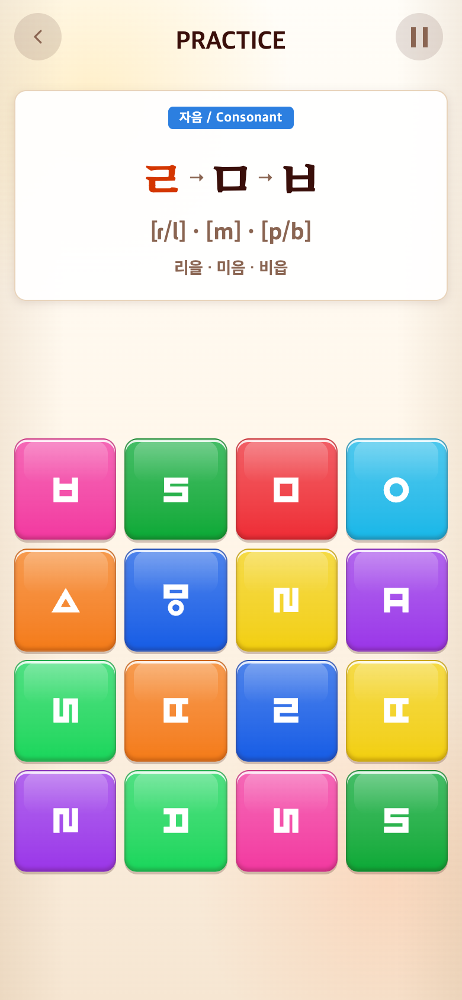

# 2026-09-20 삼각형 함정 110% 확대

- 변경 커밋: `31a1a71`
- 비교 커밋: `39bb3c3`, 별도 임시 폴더 git archive로 과거 화면 실행·재현 성공.
- 요구: 블록 속 삼각형이 다른 기호보다 작아 보여 현재 크기의110%로 확대.
- 변경: 업로드 △에 전용 클래스를 부여하고 블록 내부에서만 scale1.1 적용. 중심·원본 비율·색·판정·다른 자소·제시어는 유지한다. 회전 transform과 독립된 scale 사용.
- 검증: 빌드 통과. 모바일 브라우저 glyph 박스39→42.9 CSS px, 정확히1.1배.
- 캡처: 390×844 CSS px/DPR2/780×1688 PNG. Chrome 모바일 에뮬레이션, 동일 시드123, 실제 Alphabet18번 인덱스 ㄹㅁㅂ 시작 상태로 이동. 사용자 첨부의 진행 상태 자체가 아니라 동일 스테이지 컴포넌트의 전후 비교이며 합성하지 않았다.

| 변경 전 `39bb3c3` 재현 | 변경 후 `31a1a71` |
| --- | --- |
|  |  |

`capture.mjs`로 재현. PLAYWRIGHT_MODULE에 Playwright 경로를 지정하며 after는 실행 시 작업 트리다.
