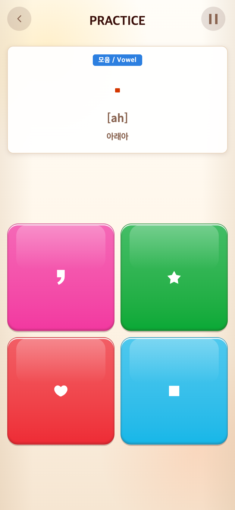
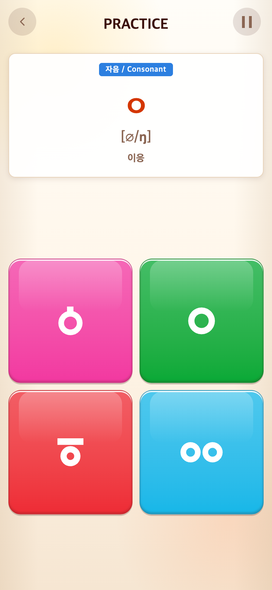
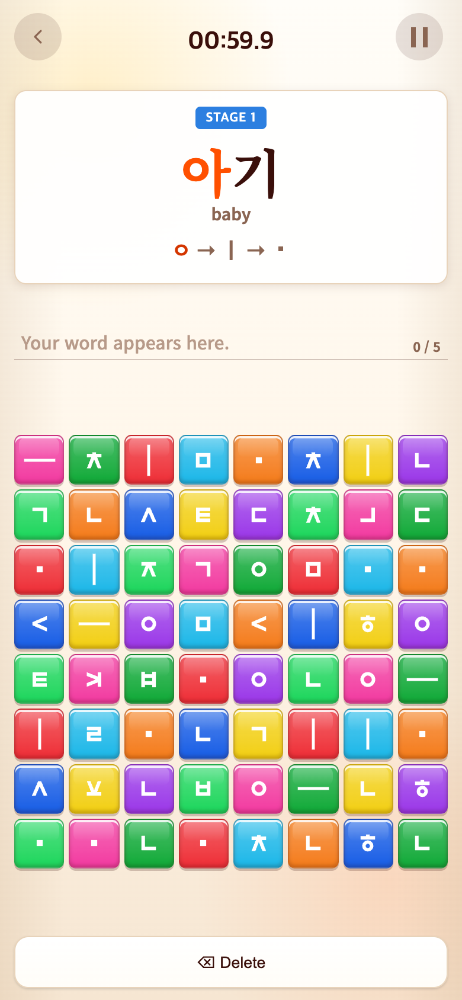
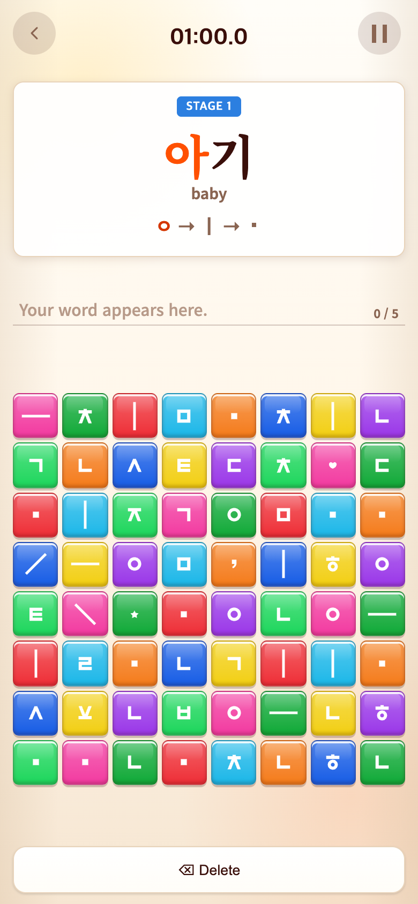

# 2026-09-20 블록 크기와 Vocabulary 모음 함정

- 적용 커밋: `50221fa`
- 비교 커밋: `2e99c8a` — 별도 임시 폴더에 git archive로 재현, 원본 작업 파일 변경 없음.
- 재현 성공. Chrome, 390×844 CSS px, DPR 2, PNG 780×1688.

## 문제와 수정 이유

블록의 모음천·관련 함정과 쌍이응이 작아 확대 요청. Vocabulary는 정답 모음은 있지만 함정 생성이 자음 변형에 한정되어 있었다.

## 수정 내용과 결과

- 블록 모음천과 하트·별·쉼표: 기존 크기 ×1.1. 쌍이응 ㆀ: ×1.2. 제시어 크기는 유지.
- Vocabulary에 ♥, ★, 쉼표, 양방향 대각선 함정을 각 하나씩 배치. 기존 함정 칸을 우선 재사용하고 부족하면 여분 칸을 사용한다. 정답 1.5배 예약 블록은 절대 바꾸지 않는다. 미래 콘텐츠가 보드를 가득 채우면 남는 칸만 사용한다.
- 함정은 정답 자모로 입력되지 않고 × 오입력 처리. Delete로 취소 가능.
- 전체 233개 테스트 및 빌드 통과. 모든 현재 단어의 정답 확보·함정 종류·오입력 검증 포함.

## 모바일 전후

고정 난수 seed 123. 실제 앱 진입 후 내부 학습 위치만 지정하고 시계를 멈춰 비교했다. Alphabet 인덱스14(모음천), 7(ㅇ), Vocabulary 첫 단어 아기. UI를 합성하지 않았으며 이전 커밋 자체를 실행했다. Vocabulary 수정 후에는 함정 클릭→×→삭제 복원도 브라우저에서 검증했다.

| 구간 | 수정 전 `2e99c8a` 재현 | 수정 후 `50221fa` |
| --- | --- | --- |
| 모음천 |  |  |
| 쌍이응 |  |  |
| Vocabulary |  |  |

캡처 스크립트: `capture.mjs`. 실제 iOS/Android 브라우저 화면이 아닌 모바일 크기의 Chrome 재현이다.
