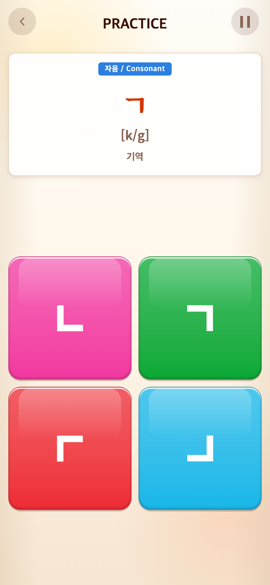
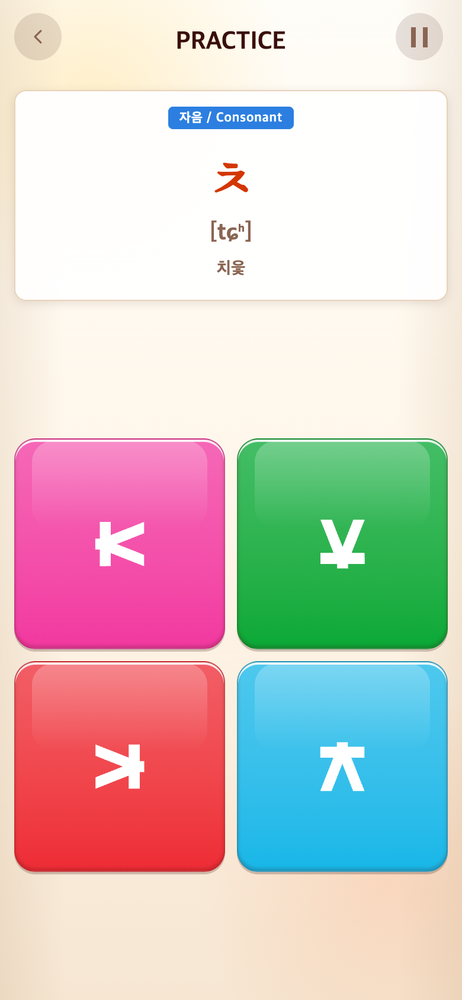

# 2026-09-23 세 게임 진행 저장

## 요청·배경

출시 전 반복 시작 문제 개선. 스테이지10 또는 튜토리얼 도중 종료해도 게임 선택과 START 후 하던 곳에서 이어야 한다. 로고/커버/메인/시작화면은 유지한다.

## 구현·이유

- UI 저장소 어댑터 `talkProgress.ts`: 모드별 버전1 localStorage, JSON 검증·오류 처리. 게임 규칙에는 DOM/localStorage 의존성을 추가하지 않았다.
- 현재 문제·타일 배치·누른 블록·입력·튜토리얼 목록·스테이지·라운드·완료 수·경과 시간·숙련 난도를 함께 저장. 단순 스테이지 번호만 저장하면 무작위 문제와 점수가 달라져 전체 상태를 보존한다.
- Word/Syllable 셔플 함수에 snapshot/restore를 추가해 남은 단어와 최근 중복 방지 기록 유지.
- 클릭/문제 전환/삭제/나가기/숨김 및 활성 게임1초마다 저장. 꺼져 있는 동안 시간은 흐르지 않고, 재접속으로 새60초를 받지는 않는다.
- 결과 재생 중 종료는 같은 결과 재표시 후 다음 라운드. 완료 전환 대기는 재개하며 점수를 다시 더하지 않는다.
- 기존 미저장 기록은 복구하지 못한다. 같은 브라우저의 사이트 저장소만 사용, 사이트 데이터 삭제/다른 기기에는 이어지지 않는다. 강제 종료 시 마지막 저장 이후 최대 약1초의 타이머 차이가 가능하다. 점수 등급/튜토리얼 길이/BGM 변경 없음.

## 검증

237개 테스트·타입 검사·프로덕션 빌드 통과. 저장 분리/JSON 왕복/손상·구버전·저장 거부, Word/Syllable 셔플 복원 회귀 테스트 포함.

실제 Chrome 탭 종료/재생성 후 메인→게임→START로 진입하여 Alphabet10번째, Syllable9번째+일부 입력, Vocabulary10번째+일부 입력/점수/남은 시간 복원 검증. 결과 중 재접속과 탭 후 라운드 증가·점수 초기화도 확인. 스크립트 `capture.mjs`. 실제 iOS/Android/PWA 강제 종료는 별도 기기 검증 필요.

## 전후 화면

- 이전 커밋 `a4f2c00`을 별도 임시 폴더에서 실행. 현재 파일로 이전 화면을 합성하지 않음.
- 이후는 이 문서와 함께 커밋된 `Persist per-game progress and resume saved sessions`.
- Chrome390×844 CSS px·DPR2, PNG780×1688. seed123. 두 버전 모두 Alphabet10번째 학습을 지정한 검증 체크포인트에서 탭을 닫은 후 재진입. 실제 사용자의 플레이 기록은 아님.

| 전: 첫 ㄱ부터 재시작 | 후: 10번째 ㅊ부터 이어하기 |
| --- | --- |
|  |  |
