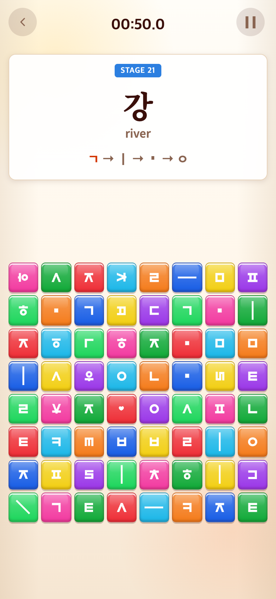
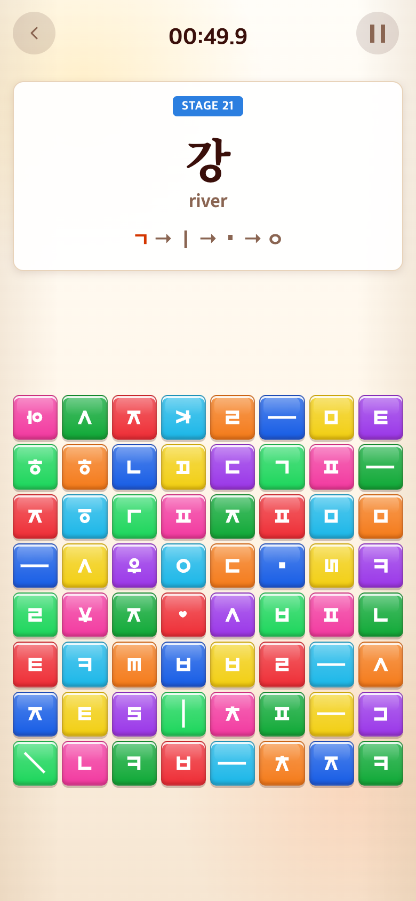
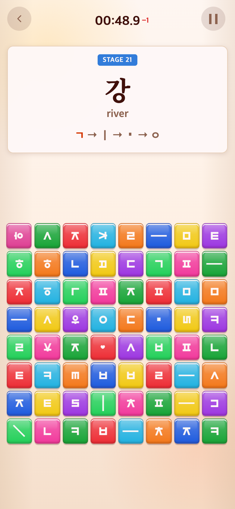

# 2026-09-28 정답 블록 감소 · 오답 화면 피드백

- 적용 코드 커밋: `e324de0`
- 비교 커밋: `fe16865`
- 과거 화면 재현: 성공. `git archive fe16865`를 별도 임시 폴더에 풀어 실행했으며 현재 파일을 과거처럼 바꾸거나 합성하지 않았다.
- 공통 캡처: Chrome 모바일 에뮬레이션, **390×844 CSS px / DPR2 / 780×1688px PNG**. 휴대폰 OS·주소창은 포함하지 않는다.

## 문제·개선 요구

스테이지가 진행되어도 정답 자소가 여러 개씩 쉽게 발견되는 문제를 줄이고 싶다는 요청이다. 예를 들어 ‘강’은 후반에 ㄱ·ㅣ·ㆍ·ㅇ이 각각1개만 나오고, 나머지는 다른 자소나 함정으로 채워야 한다. 또한 오답 때 숫자−1만으로는 피드백이 약하므로 잠깐 붉어지거나 흔들리는 효과를 요청했다.

## 수정 내용과 이유

### 1. 정답 여분을 단계적으로 감소

| 본게임 문제 번호 | 자소별 실제 정답 수 | ‘강’의 각 ㄱ/ㅣ/ㆍ/ㅇ |
| --- | --- | --- |
| 1–10 | 필수 입력 횟수 + 여분2 | 각각3개 |
| 11–20 | 필수 입력 횟수 + 여분1 | 각각2개 |
| 21이후 | 필수 입력 횟수만 | 각각1개 |

- 세 게임에 공통 적용한다. Alphabet/Syllable은 튜토리얼을 제외한 본게임 문제 번호이고 Vocabulary는 화면 STAGE 번호다.60초 라운드 번호가 아니다.
- 시간 없는 튜토리얼의 기존 판 구성은 변경하지 않았다.
- 쌍자음·겹받침·복모음과 단어 안 반복 자소는 **실제로 눌러야 하는 횟수만큼 유지**한다. ‘꾀’의 ㄱ2개, ‘사랑’의ㅣ2개/ㆍ2개 등을1개로 줄이지 않는다. 모두 한 번 쓰면 비활성화되는 별도 블록이다.
- 필요한 입력열 전체를 먼저 예약한 후 여분을 추가한다. 판이 아주 빽빽하면 여분만 줄이고 필수 입력은 보호한다. 현재118개 단어와50개 본게임 음절은 모든 단계에서 예정된 여분 수가 들어간다.
- 무작위 채움 후보에서 제시어의 정답 자소를 제외했다. 예약 수를 줄여도 채움 과정에서 같은 정답이 다시 늘어나는 문제를 방지한다.
- 빈 칸은 다른 자소/함정으로 채운다. 판 크기, 자소 그림, 색, 정답과 시각적으로 같은 함정 제외 규칙은 유지한다.
- Syllable의20%/30% 함정 정책, Vocabulary의 하트·별·쉼표·사선5종 함정도 유지한다.
- 기존 저장 스테이지 번호에서 여분 개수를 계산한다. 다음 라운드·메뉴·새로고침·이어하기에도 처음 난도로 되돌아가지 않는다. 저장 키나 기록은 초기화하지 않는다.

### 2. 짧고 약한 오답 화면 효과

- −1초 차감과 기존 빨간 숫자−1은 유지한다.
- 화면에8% 농도의 붉은색을280ms 동안 표시한다.
- 게임판만 좌우2px,240ms 동안 살짝 흔들어 HUD·제시어 가독성을 유지한다.
- 효과 레이어는 `pointer-events:none`이라 탭을 막지 않는다.
- 연타 시 빠르게 번쩍이지 않도록 **화면 효과만700ms당 한 번**으로 제한한다. 벌점−1초와 숫자 표시는 모든 오답에 계속 적용한다.
- 시스템의 ‘동작 줄이기’ 설정에서는 게임판/오답 타일 흔들림을 없애고 옅은 색 표시만 쓴다.
- Pause·메뉴·결과·새 라운드에서 효과를 즉시 지운다. 시간 없는 튜토리얼에는 전체 화면 효과나−1초 벌점을 추가하지 않았다.

## 수정 결과 / 재현 조건

Syllable 본게임 STAGE21,8×8, 제시어 ‘강’, 동일 난수 seed456으로 비교했다. 실제 콘텐츠 풀의 ‘강’을 테스트용 재현 입력으로 선택했으며 배치·함정·정답 판정·스타일은 각 커밋의 코드를 그대로 사용한다. 캡처 스크립트 외에 앱 코드를 재현용으로 변경하지 않았다. 판 구성 규칙이 달라졌으므로 블록 위치도 달라지는 것이 정상이다.

실제 유효 정답 블록 수(함정 제외):

| 자소 | 이전 `fe16865` | 이후 `e324de0` |
| --- | --- | --- |
| ㄱ | 3 | 1 |
| ㅣ | 5 | 1 |
| ㆍ | 4 | 1 |
| ㅇ | 3 | 1 |

### 정답 수 비교

| 이전 — `fe16865` 과거 버전 재현 | 이후 — `e324de0` |
| --- | --- |
|  |  |

### 오답 효과 비교

같은 조건의 판에서 함정1개를 눌렀다. 이전에도1초 차감과 선택 타일 흔들림은 있었지만 전체 화면의 색 피드백/게임판 흔들림은 없었다. 수정 후 PNG는 짧은 효과가 실제 실행되는 도중 촬영한 프레임이다. 정지 이미지이므로 흔들림의 시간적 변화 전체를 보여주지는 못한다.

| 이전 — `fe16865` 과거 버전 재현 | 이후 — `e324de0` |
| --- | --- |
|  |  |

## 검증

- **39개 파일/260개 Vitest 테스트 통과**, TypeScript/Vite 빌드 통과, Android 자산 동기화 성공. APK/AAB는 생성하지 않았다.
-118개 Vocabulary 전 어휘 ×3개 난도 ×3개 seed: 정확한 정답 수, 쌍자음 완성 블록 없음, 필수 입력의 별도 블록 확보,5종 모음 함정, 시각적 함정 충돌 없음 확인.
-50개 Syllable 본게임 어휘와 자소 묶음:6×6/8×8·20%/30% 함정·여분2/1/0에서 정확한 정답 수와 필수 입력 보장 확인.
- 브라우저 세 게임 모두 STAGE1/10/11/20/21/100의 여분 수 확인.20판을 실제 버튼으로 완성한 뒤21판에서 여분이 없어지는 것 확인.
- 메뉴·Pause·재접속 뒤에도 단계/난도 유지, 새60초 이어하기 정상. 튜토리얼 판·시간 규칙은 그대로 유지.
- 오답 연타는 매번1초 차감, 효과 수명/재생 간격/종료 정리,0초 시 버튼 잠금, reduced-motion 동작 및 탭 통과 확인. 브라우저 예외 오류0건.
- 전후 PNG4장 모두780×1688 확인 및 육안 검수.
- 재현 스크립트는 `capture.mjs`. `PLAYWRIGHT_MODULE` 환경변수로 Playwright의 실제 `index.mjs` 경로를 전달한다.

## 수정 경계

밸런스 숫자는 `src/content/boardDifficulty.ts`, 정답 개수 보장은 `core/hangul/answerCopies.ts`, 판 생성은 `board.ts`/`alphabetGame.ts`, 화면 수명은 `ui/timePenalty.ts`, 시각 효과는 `talk.css`에 분리했다. 콘텐츠·음악·점수·등급·저장 형식·다른 게임 저장소는 수정하지 않았다.
