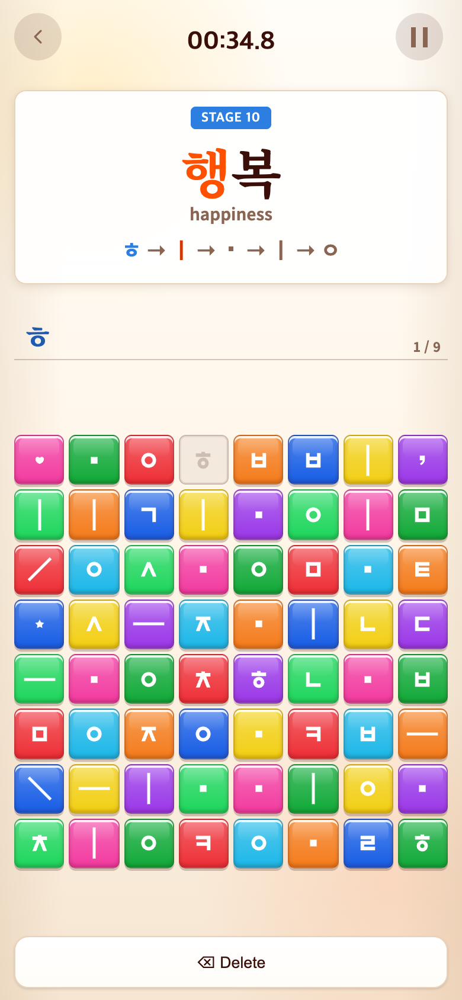
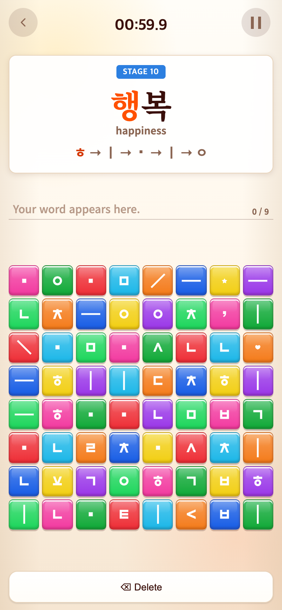
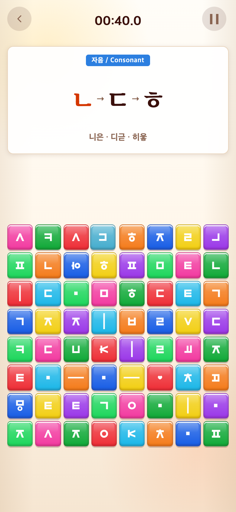

# 2026-09-28 저장 안정화 · 스테이지 재시작 · 오답 −1초

- 적용 코드 커밋: `496bc0d`
- 비교 커밋: `f152899` — 별도 임시 폴더에서 실행한 과거 버전 재현
- 참고: TAPtoTEN `2515854`의 `persistentStore.ts`, 시작 시 저장 로드/Retry 처리, HUD 시간 차감 효과. 다른 게임 저장소는 읽기만 했으며 수정하지 않았다.
- 재현 결과: 성공. 모든 PNG는 **390×844 CSS px, DPR 2, 780×1688px**.

## 문제·개선 요구

1. 사용자는 업데이트 뒤 진행 기록이 사라진다고 보고했다. 앱에서는 안전한지, TAPtoTEN의 저장 변경과 같은 처리가 가능한지 질문했다.
2. 세 게임에서 저장된 남은 시간과 부분 입력을 그대로 복원하지 말고 하던 문제부터 다시 시작하기를 요청했다.
3. 무작정 누르는 것을 막기 위해 시간제 게임의 오답·함정에 1초 차감과 TAPtoTEN과 동일한 효과를 요청했다.
4. 세 게임 무한 진행 및 단어 반복 방지 현황을 확인했다.

## 확인한 원인과 한계

- 이전 저장은 브라우저 `localStorage`에 직접 쓰고 읽었다. 읽기 오류/형식 불일치를 모두 ‘기록 없음’으로 처리했으므로 새 게임이 기존 값을 덮어쓸 수 있었다. Syllable 연습 목록을 정확히18개로만 인정하고 재사용할 블록 ID까지 검증해 콘텐츠·판 변경에 취약했다.
- 같은 origin의 일반적인 웹 배포만으로 localStorage가 초기화되는 것은 아니다. 사용자의 실제 휴대폰 데이터나 삭제 순간을 조사한 것은 아니므로 **이번 신고의 단일 원인은 확정하지 않는다**. 다른 도메인/브라우저, 방문 데이터 삭제, 저장 제한도 별도 가능성이다.
- TAPtoTEN의 새 저장 방식은 새로운 Git/서버 저장소가 아니라 앱 전용 **Capacitor Preferences**다. Android SharedPreferences/iOS UserDefaults 기반이고 웹에서는 별도 브라우저 저장을 사용한다. [공식 문서](https://capacitorjs.com/docs/apis/preferences)

## 무엇을 왜 수정했는가

### 저장

- 기존 설정/세 게임 키를 유지했다. 버전명·배포번호로 키를 바꾸지 않는다.
- 앱에서만 Preferences를 사용하고, 네이티브 값이 없을 때 같은 앱 WebView의 기존 localStorage를 이관한다. 원본을 삭제하지 않는다. Safari 웹 기록을 설치 앱으로 자동 이전하는 기능은 아니다.
- 시작 전에 모든 키를 읽고 검증한다. 실패하면 백업을 시도하며 복구할 수 없으면 플레이를 시작하지 않고 Retry를 표시한다. 새 게임 값으로 덮어쓰지 않는다.
- 웹과 앱 모두 이전 저장의 `.backup`을 유지한다. 네이티브 쓰기를 직렬화하고 쓰기 실패는 대기열에 남겨 재시도한다. 저장 실패를 눈에 보이는 안내로 알린다.
- 예전18/30판 튜토리얼 추첨 목록을 계속 읽는다. 예전 블록·사용 ID·부분 입력은 재사용하지 않고 새로 만든다. 현재 문제·진도·셔플 목록·최근 출제·해금 난도는 보존한다.

### 이어하기

| 상황 | 새 동작 |
| --- | --- |
| Alphabet/Syllable 튜토리얼 중 종료 | 같은 문제, 입력 처음부터, 시간 제한 없음 |
| 세 게임 본게임 중 종료 후 START | 같은 문제, 새60초, 이번 라운드0점, 새 판/입력 |
| 정답 직후 전환 대기 중 종료 | 완료 문제는 건너뛰고 다음 문제부터 |
| 결과 영상 중 종료 | 다음 라운드로 진입, 미완료 문제 유지·완료 문제 건너뜀 |
| 실행 중 Pause → Resume | 기존 입력·남은 시간을 유지 |

로고→커버→메인→게임 START 화면 흐름은 유지한다. 문제당 점수·등급·영상 매핑도 그대로다.

### 오답 시간 차감

- 시간제 세 게임의 **새 오답·함정 탭마다 −1초**. 계속 틀리면 누적된다.
- Vocabulary는 안내된 기본 자음/천지인 입력 순서를 기준으로 한다. 잘못된 입력을 지우지 않고 이어서 추가한 탭도 오답이다. 단순 화면 재표시로 중복 차감하지 않는다.
- 정답·이미 사용한 블록·Delete·일시정지·결과·문제 전환 중 탭 및 무제한 튜토리얼에는 차감하지 않는다.
- 시계 오른쪽 빨간 `−1`: `#dc2626`, 12px/700, 500ms, 처음55% 유지 후 위로4px 이동하며 사라짐. 연속 오답은 애니메이션 재시작. reduced-motion 시 이동 없이 표시. TAPtoTEN과 동일하다.
- 차감으로0초가 되면 즉시 기존 점수/영상 결과로 넘어가며 블록을 잠근다.

## 무한 구간 현황 — 이번에는 콘텐츠를 추가하지 않음

| 게임 | 본게임 출제 방식 | 반복 한계 |
| --- | --- | --- |
| Alphabet | 자소3개 조합 무작위, 직전과 같은 순서 피하기 | 무한 진행이지만 같은 조합은 다시 나올 수 있음 |
| Syllable | 뜻 있는1음절50개 셔플, 최근10개 회피 | 유한 어휘를 순환하므로 장기 반복은 가능 |
| Vocabulary | 도입32개 뒤 추가86개(3글자21·4글자17·5글자48), 긴 단어 가중치, 셔플·최근10개 및 최근 복합어 조각 회피 | 총118개. 끝없이 새로운 단어를 생성하는 구조는 아님 |

## 모바일 전후 화면

과거 화면은 `git archive f152899`를 `mkdtemp` 폴더에 풀고 따로 실행했다. 현재 파일을 과거처럼 바꾸거나 이미지를 합성하지 않았다. Chrome 모바일 에뮬레이션으로 촬영했으며 휴대폰 OS/주소창은 포함하지 않는다.

### Vocabulary STAGE10 재접속

같은 저장 데이터(‘행복’, 일부 입력, 약35초 남음)를 구버전과 수정본에 각각 로드했다. 새 버전은 같은 제시어/번호를 유지하지만 판은 다시 생성하므로 타일 위치가 달라지는 것이 정상이다. 화면 캡처 시점까지의 수백ms 경과는 표시된다.

| 수정 전 — `f152899` 재현 | 수정 후 — `496bc0d` |
| --- | --- |
|  |  |

### Alphabet 본게임 오답

같은8×8 구간, 같은 난수 seed,40초가 남은 시점에서 함정을1회 탭했다. 캡처까지 약0.1초 경과하므로 수정본은38.9초, 빨간−1이 보인다. 이전 버전에는 시간 벌점이 없다.

| 수정 전 — `f152899` 재현 | 수정 후 — `496bc0d` |
| --- | --- |
|  |  |

## 검증

- Vitest **37파일/251테스트 통과**, TypeScript/Vite 빌드 통과.
- `cap sync android` 성공, `@capacitor/preferences@8.0.1` 연결 확인. APK/AAB는 만들지 않았다.
- 브라우저: 구버전 저장→수정본 이관, 세 게임 독립 진도, 동일 제시어·튜토리얼 목록, 새 시간/점수/입력, 완료 대기/결과 경계, Syllable6→8판·난도 유지 확인.
- 브라우저: 빠른 연속 오답 누적, 정답/사용 블록/Delete/Pause/튜토리얼 무료, 벌점으로0초 시 종료·버튼 잠금 확인. 예외 오류0건.
- 브라우저: 저장 기본값 손상 시 백업 복구, 복구 불가 시 원본 유지·로딩 차단 확인.
- 가짜 네이티브 저장 어댑터 단위 테스트: 기존 값 이관/네이티브 우선, 읽기 실패 시 덮어쓰기 금지, 느린 비동기 쓰기 순서, 용량 오류 후 재시도, 백업 복구 확인.
- PNG 크기4장 모두780×1688 확인 및 육안 검수.
- 재현 스크립트: `capture.mjs`. `PLAYWRIGHT_MODULE`에 Playwright의 실제 `index.mjs` 경로를 지정해 실행한다. 스크립트는 결과를 현재 폴더에 저장한다.

## 출시 전 남은 실제 기기 검증

- **동일 서명/appId의 구버전→신버전 설치 테스트는 아직 하지 않았다.** Android/iOS 실기기 보존을 이번 웹 테스트만으로 보장하지 않는다.
- 앱 삭제·데이터 삭제·기기 변경에는 계정/서버 백업이 별도로 필요하다. 이미 삭제되었고 백업도 없는 과거 진행을 복구할 수는 없다.
- iOS 프로젝트 생성 시 공식 문서에 따라 UserDefaults용 PrivacyInfo.xcprivacy를 추가해야 한다. 현재 저장은 계정 동기화나 별도 최고점 기록 서비스가 아니다.
