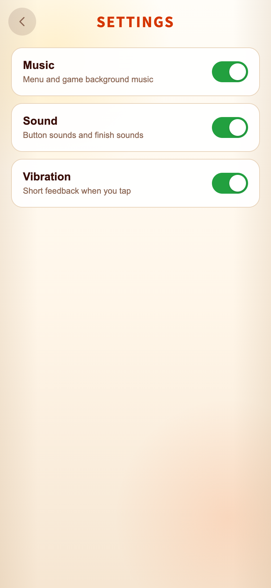
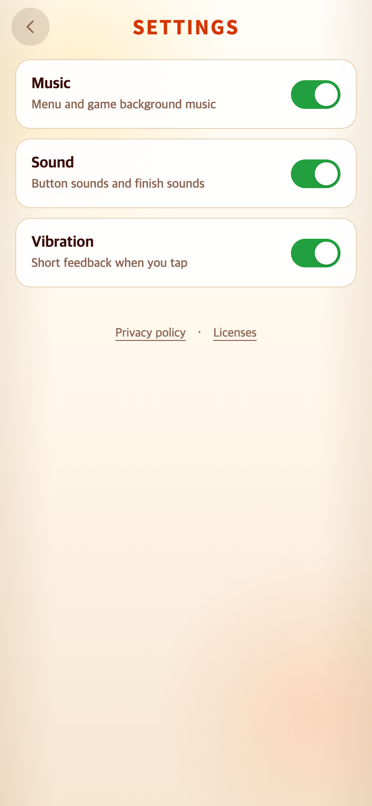
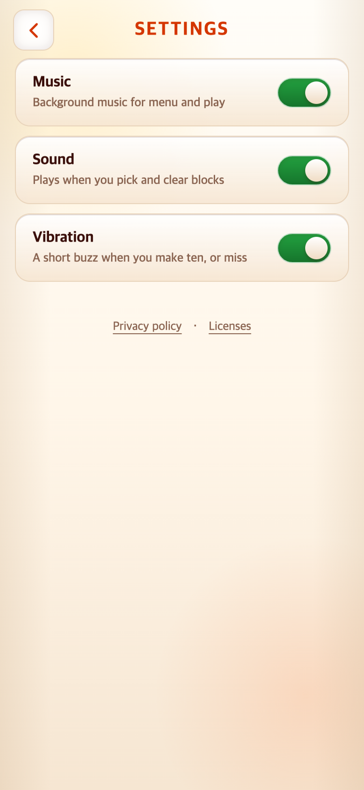
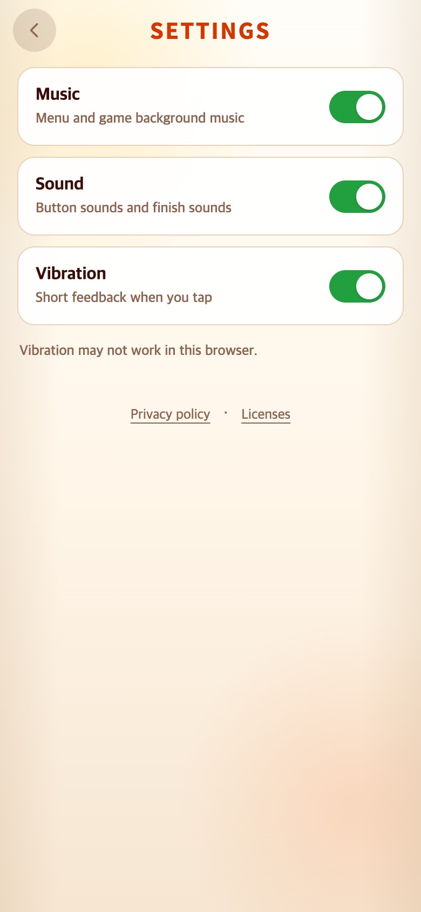
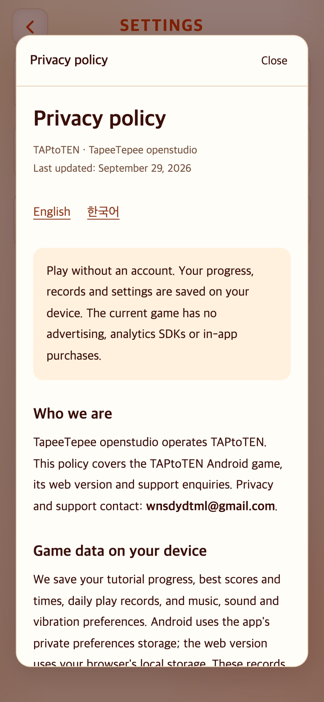
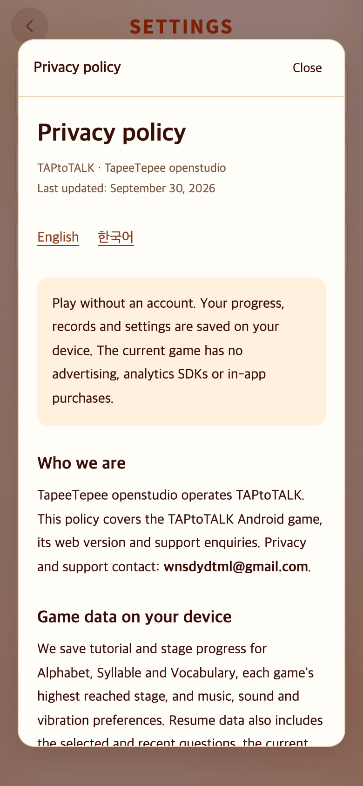
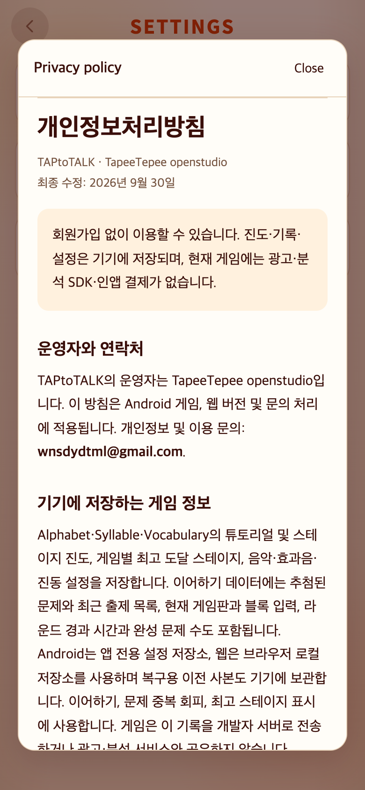
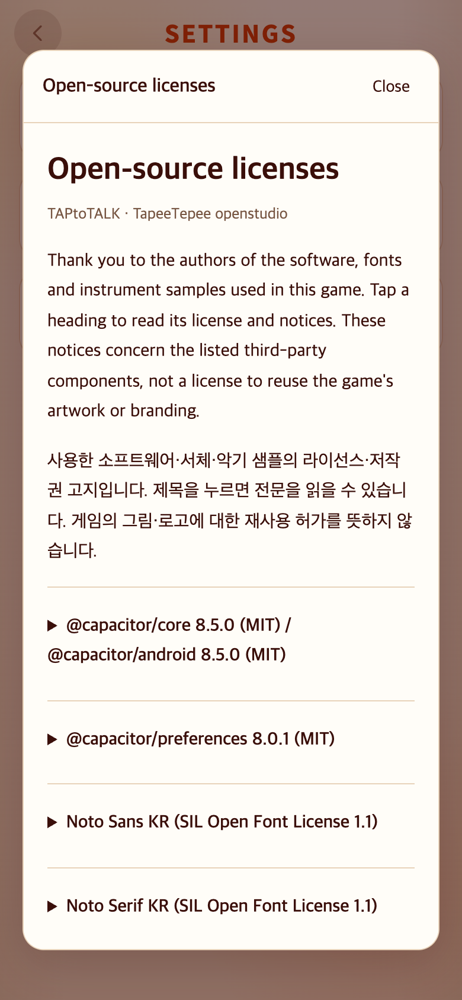

# 2026-09-29~30 출시용 개인정보·라이선스

- 적용 커밋: `53980cdf8a264663f02e37be7c65404456c97b82`
- 비교 커밋: `717c4252d2bddcc433e40843e996235d43833ccf`
- 공통 UI 참조: TAPtoTEN `cae2e49b5af230a95b2f1890daf01b47b321b621` (읽기만 함)
- 재현: 전·후 및 참조 커밋을 각각 `git archive`로 임시 폴더에 풀어 실행. 현재 checkout을 과거 버전으로 바꾸지 않음.
- 날짜 폴더는 작업 시작일9월29일, 최종 검증은9월30일 KST. 정확한 캡처 시각·Chrome 버전·PNG 및 핵심 파일 SHA-256은 [verification.json](verification.json).
- 조건:390×844 CSS px, DPR2, 터치/모바일, en-US, Asia/Seoul, 기본3설정ON. PNG780×1688. 폰트/화면전환 완료 후 캡처.

## 문제·개선 요구

출시 전 앱 내부에서 개인정보처리방침과 오픈소스 라이선스를 읽을 수 없었다. 같은 제작자의 TAPtoTEN·TAPtoTALK은 설정의 공통 링크·읽기 창 위치/크기를 맞추되, 데이터 처리 설명은 각 게임의 실제 구현을 반영해야 한다. 앱 업데이트나 정책 열람이 기존 진도·최고기록을 초기화해서도 안 된다.

## 수정 내용과 이유

- Settings에 Privacy policy · Licenses를 넣고 로컬 HTML을 native dialog 안에서 읽도록 했다. 앱 자산에 포함하므로 정책을 읽기 위해 외부 서버나 별도 브라우저가 필요하지 않다. 문서는 스크립트 금지 iframe이며 닫기/Escape/원래 링크 포커스 복귀를 지원한다.
- 같은13px/500·44px 터치영역·가로6px·상단26px을 적용했다. 최초 구현은 링크가TEN보다3px 위였으므로 Settings 한정 HUD56px·설정 텍스트 상속 폰트/설명13px로 실제 좌표를 맞췄다. 게임 HUD·게임판은 변경하지 않았다.
- 진동 미지원 안내는 켜진 경우에만 스위치 목록 뒤에 표시한다. 안내가 있을 때도 TEN과 같은 문단 여백·행간으로 링크가 내려간다.
- 한·영 방침은3게임 진도, 최고 **도달 스테이지**, 저장된 입력/판/출제목록/라운드, Music/Sound/Vibration, 복구 사본을 설명한다. TEN의 최고시간/날짜별 기록 설명은 가져오지 않았다. 로컬 게임 데이터와 Android 백업, Vercel 웹 접속 로그, Gmail 문의를 구별했다.
- Noto Sans KR·Noto Serif KR(OFL), Capacitor core/android/preferences(MIT), 실제 Android release의50개 의존성(Apache), Cordova/AndroidX NOTICE, 게임곡의 VCSL6개 악기 샘플(CC0) 전문·출처를 포함했다.
- 운영자 TapeeTepee openstudio, 연락처 **wnsdydtml@gmail.com**. package는 기존 `io.github.junyyyong.taptotalk` 그대로다. 서명키·Play Console·다른 저장소는 수정하지 않았다.

## 결과와 검증

| 비교 항목 | TAPtoTEN / 변경 후 TAPtoTALK (CSS px) |
| --- | --- |
| 일반 Settings 링크 묶음 | x16, y327,358×44 |
| Privacy policy | x114.90625,y327,85.828125×44,13px/500 |
| Licenses | x217.59375,y327,57.5×44,13px/500 |
| 진동 미지원 안내가 있을 때 | 링크 y361.796875 (동일) |
| 문서 창 | x19,y42,352×760 |

- Vitest **278개/41파일** 통과, typecheck·production build 성공. 패키지ID·연락처·로컬문서·라이선스·안정적 저장키 테스트 추가.
- Android Preferences8.0.1 실제 등록, `cap sync android` 후 정책/라이선스의 배포본 일치 확인.
- release 의존성 추출 및 `:app:processReleaseMainManifest` 성공. min24/target36, INTERNET과 앱 자체 signature 권한만 확인. [Android 감사 기록](android-audit.json).
- 실제 브라우저에서 EN/KR 전환, 라이선스 펼치기, iframe내 Escape, Close, 빠른 재열기, 포커스 복귀,320/390/430px 폭 점검. 페이지 예외0, 검사 흐름의 외부origin 요청0.
- 이전 커밋에서 생성한 Alphabet Stage10/Syllable Stage7/Vocabulary Stage12 및 최고기록/설정을 새 커밋으로 그대로 전달해 검증. Settings 정책 열기·닫기 전후 모든 저장 문자열 동일. 새로고침 후 세 게임의 최고 Stage 및 해당 문제부터 새60초 이어하기 확인.
- 저장소 단위 테스트에서도 웹/native 새 인스턴스가 모든 stable key와 backup을 수정하지 않는지 검증. 실제 단말의 같은 서명 앱 업데이트는 별도 출시 검사로 남긴다.
- 과거 사용자 파일 `docs/design-assets/`, 음악시안WAV2개, `scripts/export-glyph-kit.py`는 포함하지 않았다.
- 원문 OFL에 들어 있는 줄끝 공백은 라이선스 원문을 보존하기 위해 그대로 포함했다.

## 모바일 화면

| 수정 전 — `717c425` 재현 | 수정 후 — `53980cd` 재현 |
| --- | --- |
|  |  |

과거 커밋에는 정책 읽기 화면이 없으므로 수정 전 정책창 이미지는 만들지 않았다. 아래는 새 커밋과 참조 커밋에서 각각 실행한 실제 화면이며 합성하지 않았다.

| 참조 TAPtoTEN | 변경 후 TAPtoTALK |
| --- | --- |
|  |  |
|  |  |

| 한국어 방침 | 라이선스 |
| --- | --- |
|  |  |

## 재현

`AFTER_COMMIT=53980cdf8a264663f02e37be7c65404456c97b82 STRICT_METRICS=1 PLAYWRIGHT_MODULE=/path/to/playwright/index.mjs node docs/research/2026-09-29-play-policy/capture.mjs`

스크립트의 응답 가로채기는 테스트 브라우저에서만 앱 인스턴스를 노출해 기존 진행을 생성·검사한다. 배포 코드/사용자 브라우저 저장을 변경하지 않는다. 게임 스크린샷을 임의 데이터로 합성하지 않는다. 연구용 패키지는 공유하되 Vite 캐시는 각 임시 폴더 밖 별도 임시 경로를 사용한다.

## 배포와 남은 일

코드와 기록을 `origin/main`에 normal push한다. 공개 주소는 [Privacy policy](https://taptotalk.vercel.app/privacy.html), [Licenses](https://taptotalk.vercel.app/licenses.html). 공개 응답의 본문·해시 확인 결과는 별도 배포 확인 기록에 남긴다.

[출시 점검표](../../PLAY_POLICY_CHECKLIST.md)에 공식 User Data/Data Safety/Families 근거 및 콘솔 신고·대상 연령·미디어 권리·실기기 업데이트 할 일을 구분했다. 정책 파일 추가나 테스트 통과가 심사/법률 준수를 보장하지 않으며 Play 업로드·제출은 하지 않았다.
