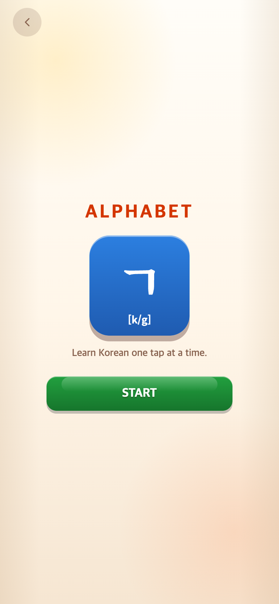
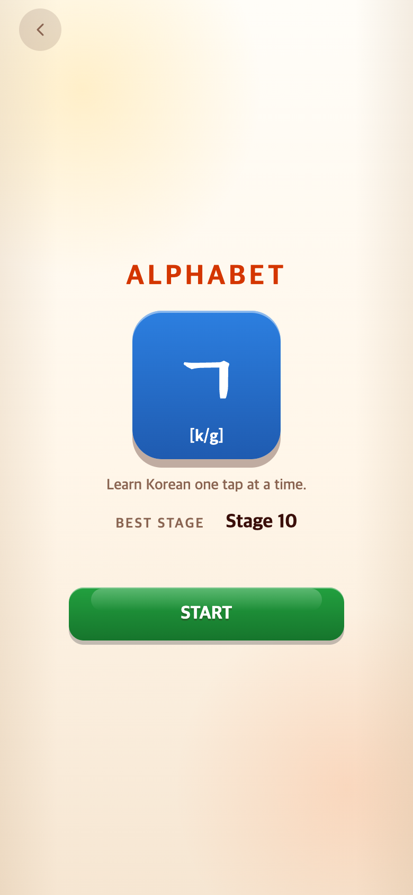
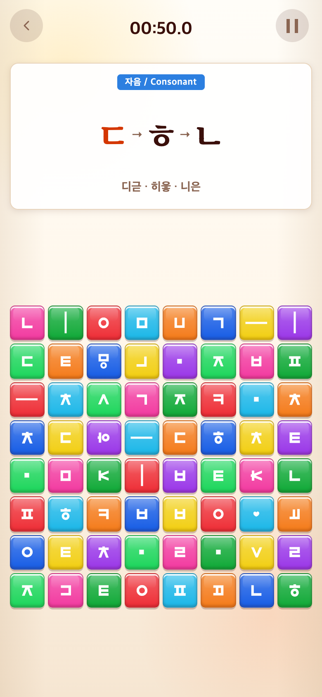

# 2026-09-29 본게임 번호·최고 도달 기록·100개 어휘

- 적용 커밋: `7ebf1b2`
- 비교 커밋: `4270bae` — 별도 임시 폴더에서 실행한 과거 화면
- 참고: TAPtoTEN `2515854`의 ENDLESS 시작 화면. 원본 저장소는 수정하지 않았다.
- 재현 여부: 성공. 전후 모두 390×844 CSS px, DPR2, **780×1688 PNG**.
- 코드·입력·점수·영상 변경 범위: 본게임 번호/기록 UI·저장/콘텐츠 확장만. 기존 60초·벌점·점수 공식·등급·영상·튜토리얼 구성은 유지한다.

## 문제·개선 요구

1. Alphabet 타이머가 시작되어도 파란 배지가 학습 분류를 표시해 본게임 진행 번호를 알기 어려웠다.
2. START 화면에서 각 게임의 최고 도달 스테이지를 확인할 수 없었다.
3. Syllable 본게임50개와 Vocabulary 추가86개를 각각100개로 늘리되, 실제 한글 조합과 교육용 어휘 기준을 지켜야 했다.

## 수정 내용과 이유

### 1. 본게임 번호

Alphabet 연습은 자음/Consonant·모음/Vowel 등 기존 분류를 유지한다. 타이머가 시작되는 본게임은 `Stage 1`부터 정답마다 증가한다. Syllable/Vocabulary도 기존 본게임 번호를 유지한다. 공통 `mainStageNumber`를 사용해 제시창·최고기록·정답 블록 여분 단계가 다른 번호를 세지 않도록 했다. Syllable은 저장된 연습 목록 길이를 사용하므로 예전30판/현재18판 이어하기 모두 호환된다.

### 2. 최고 도달 기록

세 게임 START 위에 `BEST STAGE / Stage N`을 추가했다. 아직 본게임 전이면 `—`를 표시한다. 클리어 수나 점수가 아닌 **이미 진입한 본게임 문제 번호의 최댓값**이다. 완료 직후 전환 대기 중인 다음 문제는 실제 진입하기 전까지 더하지 않는다.

`taptotalk.records.v1`을 기존 이어하기와 분리하고 같은 PersistentStore로 웹 localStorage/앱 Preferences에 저장한다. 기존 진행 기록에서 도달 위치를 읽어 최초 최고기록을 반영하며 진행 기록 자체는 수정하지 않는다. 더 낮은 단계에서 플레이해도 최고기록은 낮아지지 않는다. 유효성 검사·이전 값 백업·저장 실패 보호도 공유한다. 계정/서버 동기화는 아니며 데이터 삭제·기기 변경까지 보장하지 않는다. 현재 저장에 없는 과거 최고기록은 임의로 추정하지 않는다.

TAPtoTEN 시작 화면을 같은 뷰포트에서 측정했다. 라벨13px/700, 값18px/800, 가로 간격20px를 맞췄다. 두 번째 기록 줄의 자리만 비워 두어 위치가 밀리지 않게 했다. START만50px 높이로 맞추며 게임 중 컨트롤은 건드리지 않았다.

| 측정 항목 (CSS px) | TAPtoTEN | TAPtoTALK |
| --- | ---: | ---: |
| 기록 값 위쪽 Y | 481.6875 | 481.6875 |
| 라벨 위쪽 Y | 485.6875 | 485.6875 |
| START 위쪽 Y | 553.6875 | 553.6875 |
| START X / 폭 / 높이 | 65 / 260 / 50 | 65 / 260 / 50 |

문구 길이에 따라 기록 줄의 폭은 달라지지만 두 화면 모두 가로 중앙 정렬이다. 수치는 macOS Chrome 모바일 에뮬레이션 기준이며 실제 OS의 글꼴 렌더링 차이는 있을 수 있다.

### 3. 콘텐츠 확장

| 게임 | 변경 전 | 변경 후 | 순환 방식 |
| --- | --- | --- | --- |
| Alphabet | 무작위 자소 조합 | 동일 | 스테이지 계속 증가 |
| Syllable | 본게임50개 | 본게임100개 | 100개 한 묶음에서 각각 한 번씩 출제 후 다시 섞기 |
| Vocabulary | 고정32+추가86=118개 | 고정32+추가100=132개 | 고정32 → 3글자10판 → 4글자10판 → 남은 추가 어휘 → 100개씩 섞기 |

Syllable 추가50개(모두 영어 뜻 포함):

> 힘 꾀 소 말 술 춤 해 비 밤 낮 / 봄 벌 뱀 새 쥐 곰 양 용 왕 돈 / 금 은 철 실 줄 끈 천 솜 빗 붓 / 떡 죽 국 면 잣 꿀 잎 싹 논 밭 / 늪 굴 빛 맛 뿔 알 볼 짐 잠 일

독립적인 뜻이 있는 한 음절 낱말만 사용한다. 의미 없이 발음만 연습하는 워·외·웨·까 등은 본게임에 추가하지 않았다. 동음이의어는 한 가지 쉬운 뜻을 선택했다(말 horse, 밤 night, 굴 cave, 알 egg 등). 기존 튜토리얼의 발음/뜻 표기를 바꾸지 않았다.

Vocabulary 추가14개:

| 길이 | 단어 / 뜻 |
| --- | --- |
| 3 | 손전등 flashlight · 계산기 calculator |
| 4 | 머리카락 hair · 보물찾기 treasure hunt · 불가사리 starfish · 프라이팬 frying pan |
| 5 | 자원봉사자 volunteer · 환경미화원 street cleaner · 오케스트라 orchestra · 건강보험증 health insurance card · 심폐소생술 CPR · 비디오게임 video game · 고속터미널 express bus terminal · 소프트웨어 software |

추가 풀은3글자23개/4글자21개/5글자56개다. 기존 ID가 바뀌지 않도록 각 목록 끝에 추가했다. 5글자 비중은 과반을 유지하고 순서 추첨 가중치는3/4/5글자=1/2/4 그대로다. 한 묶음 내 중복 제거, 최근10개 반복 회피, 최근3개와 두 글자 이상 겹치는 복합어를 후순위로 보내는 정책도 유지한다. 무한 스테이지이지 무한히 새로운 어휘를 생성하는 방식은 아니다.

모든132개 Vocabulary와100개 Syllable을 실제 기본 자음·천지인 입력으로 끝까지 조합해 검사했다. 새14개는 받침 마지막 기본 자음과 다음 초성이 같은 경우도 제외했다. 후보 중 `수족관`은 ㄱ+ㄱ이 합쳐져 `수조꽌`이 되어 제외했고, `스테이플러`는 ㄹ이 연속되어 새 목록에서 제외했다. 예전 제외어 학교·초등학교·국립박물관·반짝반짝도 복원하지 않았다. 전체 정답이 난도별 블록 수 안에서 가능한지도 기존 회귀검사에 새 콘텐츠를 포함했다.

진행 중인 현재 문제·남은 셔플 묶음·최근 기록을 초기화하지 않는다. 이전50개/86개에서 남아 있는 묶음은 먼저 마무리하고 다음 묶음부터 새100개 풀을 사용한다.

## 모바일 화면

동일 제시어·동일 난수 시드456·8×8·본게임 첫 문제·시계50.0초로 멈춘 조건이다. 실제 게임 렌더러로 실행했으며 화면 합성/DOM 문구 덮어쓰기는 하지 않았다. 캡처용 테스트 진입점으로 게임 인스턴스를 노출해 진행 위치를 설정했다. 기록 화면은 예전 버전에서 Alphabet10/Syllable7/Vocabulary12까지 도달한 테스트 저장을 만들어 새 버전에 전달했다. 실제 사용자의 저장소와 분리된 브라우저 컨텍스트다.

| 수정 전 — `4270bae` 재현 | 수정 후 — `7ebf1b2` 재현 |
| --- | --- |
|  |  |
|  |  |

[TAPtoTEN 참고 화면 — 2515854](reference-ten-intro.png)

## 검증

- `npm test`: 40개 파일, **267개 테스트 통과**.
- `npm run build`: TypeScript/Vite 빌드 통과.
- 실제 버튼으로 정답 입력 시 Alphabet `Stage 1 → Stage 2` 전환 확인.
- 세 모드별 최고기록 분리·더 낮은 단계에서 유지·브라우저 재접속 후 보존 확인.
- 예전 진행 기록 이관 시 progress 원문은 변경되지 않음. START 후 같은 문제/새60초 이어하기 확인.
- 튜토리얼 분류·PRACTICE 표시는 유지하고 본게임 최고기록을 낮추지 않음.
- Syllable100/Vocabulary추가100/고정32 확인. 옛 작은 셔플 묶음 보존 후100개로 채우기 검증.
- 전체 콘텐츠의 연속 조합, 필수 블록 개수, 새 어휘의 받침-다음초성 중복 배제 검증.
- Chrome390×844 기록/START 좌표·폰트 비교 일치. 320×568·430×932에서도 세 게임 START가 화면 밖으로 나가지 않음.
- 모든 PNG780×1688 확인, 브라우저 실행 오류 없음. 화면 전환 애니메이션 종료·폰트 로드 후 캡처.
- Native Preferences 저장/재시작은 테스트 더블로 검사했다. 실제 iOS/Android 설치 업데이트 보존 검사는 이번 작업에서 수행하지 않았다.

## 재현

[capture.mjs](capture.mjs)는 전후 커밋과 TAPtoTEN 참고 커밋을 각각 임시 폴더에 풀어 실행한다. 현재 작업 파일을 체크아웃하거나 수정하지 않는다. Vite 캐시도 임시 경로를 사용한다. 실행 전 이 저장소에서 의존성을 설치해야 한다.

```sh
PLAYWRIGHT_MODULE=/Users/scdi/.cache/codex-runtimes/codex-primary-runtime/dependencies/node/node_modules/playwright/index.mjs node docs/research/2026-09-29-stage-records-content/capture.mjs
```

기본 브라우저는 로컬 Chrome, 참고 저장소는 `/Users/scdi/Documents/ChatGPT/TAPtoTEN`이다. 다른 환경에서는 `PLAYWRIGHT_MODULE`, `TEN_ROOT`와 스크립트의 Chrome 실행 경로를 맞춘다. 생성된 PNG는 이 기록 폴더에 저장한다. APK 생성 및 다른 게임 저장소 push는 하지 않았다.
