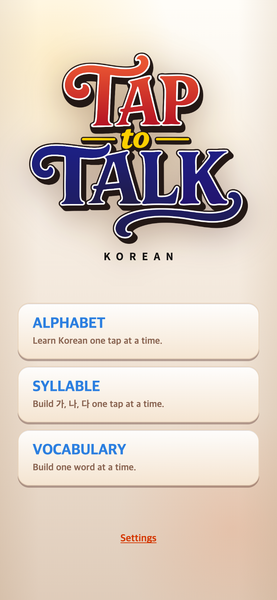
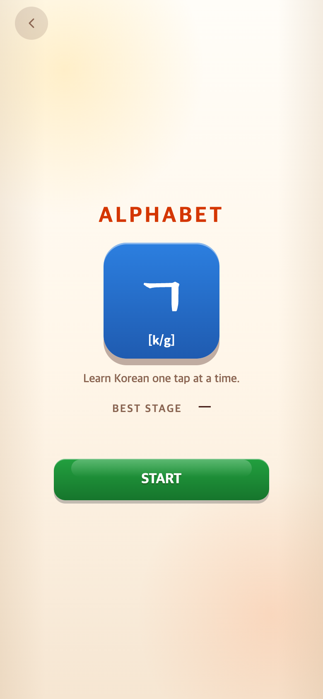
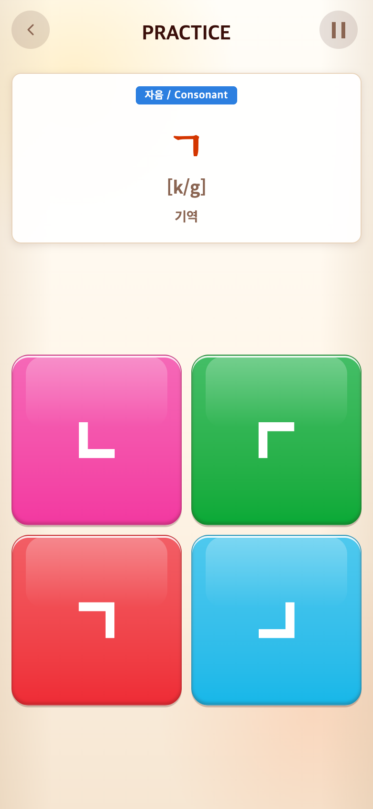
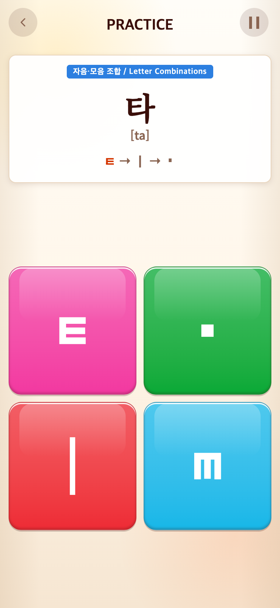
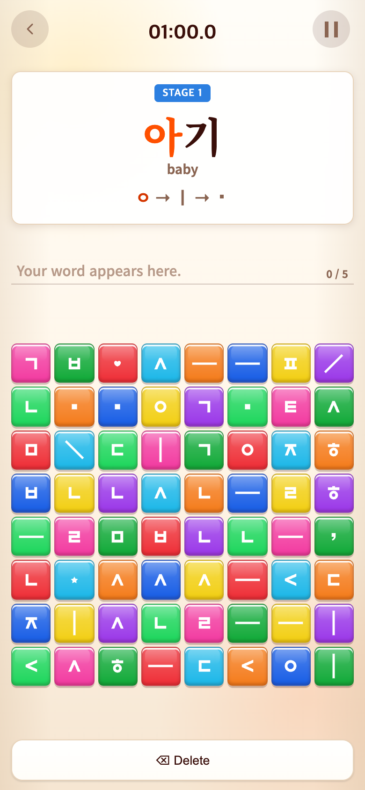
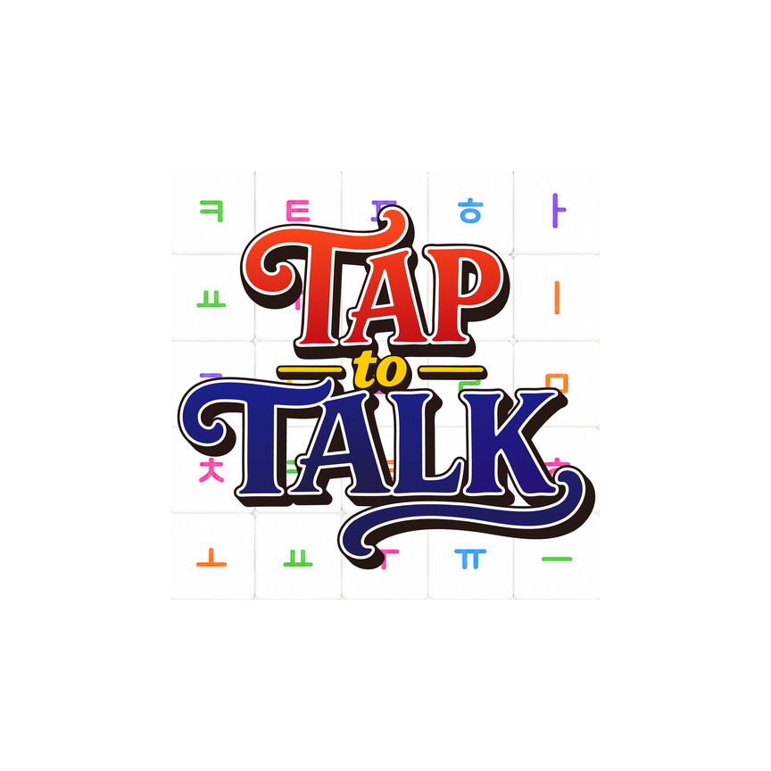

# 2026-09-30 Android 글자 배율·설치 아이콘 업데이트

> 후속 승인: 이 아이콘/글자 배율과10/1의 화면 수정을 합친 최종 런타임은 `fed5879`/1.0.2/code4에 포함됐다. 기존 코드2/3 AAB는 보존하며 새 업로드 파일은 [1.0.2 출시 검증](../2026-10-01-android-release/README.md)을 따른다. 아래 상태/PNG는 당시 후보 기록이다.

- 비교 커밋: `43a49ce4a39a701e09985aefe17961489b21a4c5` (1.0/versionCode1)
- 적용 상태: 위 커밋 기반 **미커밋 작업 트리**, 최종1.0.1/versionCode3. 사용자가 첫 후보 코드2 업로드를 확인하여 내부 코드만 올렸다. 에이전트의 commit/push/Play 업로드 없음.
- 재현 여부: 과거 웹 화면 재현 성공. **과거/현재 Android 큰 글씨·launcher 실기기 화면은 재현하지 못함.**
- 비교 조건: 390×844 CSS px, DPR2, 실제 PNG780×1688, 동일 브라우저·영어 locale·난수 seed·격리된 빈 저장소. 메인/START/세 게임 첫 문제. Vocabulary 시계만 연구 브라우저에서01:00.0으로 정지.

## 문제·개선 요구

Android 시스템 큰 글씨/쉬운 사용 설정이 WebView 텍스트를 확대해 고정 게임판과 글자 비율이 달라질 수 있었다. 앱 텍스트만100%로 유지하고 OS density·돋보기·화면 확대는 건드리지 않는 것이 요청 범위다. 설치 아이콘은 새 사용자 PNG를 원본 글씨까지 보존해 적용해야 했다.

## 수정 내용과 이유

1. 설치된 Capacitor8.5.0 `BridgeActivity`를 확인했다. `super.onCreate()` 안에서 bridge/WebView가 생성되므로 그 이후100% 적용. `onResume`·`onConfigurationChanged`에서도 super 호출 후 즉시 적용하고 UI queue에서 재적용한다. `fontScale` configuration change를 manifest에 추가해 불필요한 Activity 재생성을 줄인다. CSS `text-size-adjust`/`-webkit-text-size-adjust:100%`는 웹 자동 글자확대 보완이며 네이티브 정책의 대체가 아니다.
2. OS Configuration/fontScale/density, 화면 확대, 앱 저장소에는 쓰지 않는다. 게임 규칙·출제·점수·저장키·앱ID는 변경 없음.
3. 사용자 원본 `ICON-TAPtoTALK.png`(2134×2134)의 전체 픽셀 영역을 보존한 채 리사이즈/중앙 패딩만 했다. AI 생성·재디자인·원본 크롭 없음. adaptive foreground108dp에 중앙60dp 콘텐츠와 흰색 background. **최종 legacy/round는40dp 콘텐츠/48dp 캔버스**로 adaptive 가시 영역60/72와 같은 비율이다(초기 후보60/108 배치는 아래 추가 검수에서 교정). 밀도5종×3개=15개. 스토어용512px PNG는 원본 비율 유지.
4. 버전1.0(1)→1.0.1(2). 기존 업로드 인증서로 서명했으며 새 개인키는 만들지 않았다. 이전 출시 AAB는 그대로 보존했다.

API 의미는 [Android WebSettings](https://developer.android.com/reference/android/webkit/WebSettings#setTextZoom(int)), 계층/마스크 방식은 [Android adaptive icon 안내](https://developer.android.com/develop/ui/compose/system/icon_design_adaptive)를 참고했다.60dp 콘텐츠는 이번 사용자 지정 규격이다.

## 수정 결과·검증

- Vitest **43파일/285테스트 통과**, typecheck·Vite build·Capacitor sync 성공.
- Gradle `bundleRelease`, `testReleaseUnitTest`, `assembleDebugAndroidTest` 성공. Java 단위 테스트는 기존 산술 예제1개이며 **새 text zoom 네이티브 동작 검증으로 간주하지 않는다.**
- `TextZoomInstrumentedTest`는 최초100%·복귀·Configuration 호출·density 불변을 검사하도록 추가했고 **컴파일만 성공, 기기 실행은 하지 못했다.**
- 처음 offline 빌드는 캐시에 JUnit이 없어 실패했다. 공식 저장소에서 누락 테스트 의존성을 TALK 캐시에 받은 후 재실행 성공. Gradle flatDir/SDK XML/차기 Gradle9 경고는 남아 있으나 이번 release lint/build는 통과했다.
- bundletool validate 및 jarsigner 검증 성공. 자체 서명/타임스탬프 없음/Gradle ZIP manifest 순서 경고는 이전 AAB와 같으며 JarFile 검증은 성공했다.
- AAB package/version/minSDK24/targetSDK36, fontScale config flag, release(debuggable=false), 기존 업로드 인증서 일치 확인. 권한은 INTERNET와 앱 전용 signature 권한뿐이다.
- dist88개가 AAB에 바이트 일치, 아이콘15개가 보이는 RGBA 픽셀·알파 일치. AAPT가 alpha=0인 보이지 않는 RGB를0으로 최적화한 차이만 허용한다. adaptive 두 리소스의 foreground/background 연결 확인. `applyGameTextZoom`/`setTextZoom` compiled DEX 존재 확인. 비밀키·서명설정 파일은 번들에 없음.
- 전후10개 PNG 모두780×1688. 세 게임의 기본 글자/보드 좌표와 크기 동일, page error0. 이는 기본 브라우저 회귀 검사이며 Android fontScale 효과 검증이 아니다.

상세: [웹 캡처 검증 JSON](verification.json), [최종 코드3 AAB 검증 JSON](release-verification-vc3.json), [코드2 아이콘 보정본 검증 JSON](release-verification-iconfix.json), [첫 후보 AAB 검증 JSON](release-verification.json), [출시 노트·업데이트 방법](release-notes.md).

## 모바일 화면

수정 전은 `git archive 43a49ce`를 별도 임시 폴더에서 실행했다. 현재 작업 파일로 과거 화면을 흉내 내거나 합성하지 않았다. 수정 후는 로컬 변경 작업 트리다. 이번 변경은 Android 네이티브 텍스트 배율과 설치 아이콘이 중심이므로 아래 기본 크기 게임 화면이 동일한 것이 정상이다.

| 수정 전 —43a49ce 재현 | 수정 후 —1.0.1 작업 트리 |
| --- | --- |
|  |  |
|  |  |
|  |  |
|  |  |
|  |  |

## 아이콘 미리보기 — 실제 설치 화면 아님

[스토어512PNG](../../../store/android/taptotalk-play-icon-512.png) · [생성 치수/해시](../../../store/android/icon-generation.json)

| adaptive 원형 마스크 계산 미리보기 | 둥근 사각형 마스크 계산 미리보기 |
| --- | --- |
|  |  |

원본 심볼/TAP/to/TALK 글씨 보존을 시각적으로 확인했다. 생성 파일의투명 여백 때문에 흰 문서에서는 외곽 마스크 경계가 잘 보이지 않을 수 있다.

## 첫 후보 AAB — 보존용, 업로드 대상은 아래 최종 후보

- 파일: `android/releases/TAPtoTALK-1.0.1-vc2-20260930.aab`
- 패키지: `io.github.junyyyong.taptotalk`
- 버전: `1.0.1`, versionCode`2`, 56,239,282bytes
- SHA256: `569404679bff93107a892b0961c48a584d0a6cb157416c52bae7493eed3576e6`
- 기존 AAB SHA256(변경 없음): `09551072aae8e6b385cbf8fae2292538731c849ac7d81a90e11dff19863472f3`
- 업로드 인증서 SHA256(기존과 동일): `C8:69:BF:30:43:94:DC:9C:7C:B0:73:2E:FF:F6:9A:F2:A6:E9:8F:01:F8:5E:17:A5:0A:1A:57:CC:36:F7:69:FD`

AAB·서명키·비밀번호는 Git 제외다. 위 인증서 지문은 공개 인증서 정보이며 개인키/비밀번호가 아니다.

## 미검증 및 출시 전 확인

`adb devices -l`에 연결 기기가 없고 현재 SDK에 emulator/system image가 없다. 실제 Android의 큰 글씨·쉬운 사용·복귀·회전/설정 변경·launcher 마스크·Play 구버전→신버전 저장 보존을 **확인했다고 주장하지 않는다.** 합성한 버그 화면도 만들지 않았다.

출시 전 테스트 기기에서 기본/큰 글씨로 실행 → 앱을 둔 채 설정 변경 → 복귀 → 앱 재시작을 확인한다. OS 전체 화면 확대는 계속 작동해야 한다. 기존 Play 설치를 삭제하지 말고 업데이트해 세 게임 진도·기록·설정 보존을 확인한다. Easy mode가 density/화면 배율 자체를 바꾸는 부분은 이번 고정 대상이 아니다.

## 재현 방법

`python3 scripts/build-android-icons.py`로 자산 생성. `PLAYWRIGHT_MODULE=/path/to/playwright/index.mjs node docs/research/2026-09-30-android-text-icons/capture.mjs`로 별도 브라우저 캡처. `JAVA_HOME`과 `BUNDLETOOL_JAR`를 지정한 뒤 `python3 scripts/verify-android-release.py NEW.aab OLD.aab report.json`으로 번들 검증. 키를 새로 만들거나 이전 AAB를 덮어쓰지 않는다.

이번 실행에서 JDK/SDK/Gradle 도구는 TEN 경로의 기존 도구를 읽기 사용했으며 Gradle cache/생성물은 TALK 내부에만 저장했다. TEN 소스·출시물과 사용자가 남긴 미추적 디자인/음원 자료는 수정하지 않았다.

## 같은 날 추가 검수: legacy/round 크기 통일

다른 두 게임과 비교할 때 legacy/round에 adaptive 전체 layer 비율60/108을 적용해 아이콘이 작았다. 올바른 가시 영역 비율은60/72=40/48이다. legacy/round만 이를 적용해 xxxhdpi192px 캔버스의 원본 배치107px→160px로 바꿨다. adaptive108dp/content60dp와512PNG, WebView 글자 배율, 게임 코드, 버전1.0.1/code2는 그대로다.

round 파일은 기존에도 네 모서리 알파0의 원형 마스크였다. 흰 문서 위에서는 투명 부분이 흰색으로 보여 경계가 드러나지 않았다. 회색 배경의 [원형 PNG 미리보기](../../../store/android/taptotalk-legacy-round-preview.png)를 추가하고 최종 번들에서 다섯 밀도 모두 알파 마스크·크기·소스 배치를 검사했다.

아래는 **실제 기기 스크린샷이 아니라192×192 리소스 PNG 원본** 비교다. 전 파일은 보정 전에 보존했으며 첫 후보 AAB에 들어 있던 것과 일치한다. 미커밋 후보 간 수정이라 별도 커밋 번호는 없으며 이전 후보 AAB SHA는 위에 기록했다. 게임 화면은 이번 보정에서 변경하지 않았고 위의780×1688 웹 회귀 캡처를 새 촬영으로 표시하지 않는다.

| 첫 후보 리소스 | 보정 리소스 |
| --- | --- |
|  |  |
|  |  |

285테스트/typecheck 재통과, release AAB 재빌드 및 bundletool/서명/88개 웹 자산/15개 아이콘 픽셀 검증 재수행. 실기기 검증 제한은 동일하다. 이전 후보 AAB·인증서는 보존하고 새 파일명으로 저장했다. push/업로드는 하지 않았다.

## 최종 업로드 파일: 코드2 사용 확인 후 코드3으로 재빌드

사용자가 `TAPtoTALK-1.0.1-vc2-20260930.aab`를 이미 Play에 업로드했다고 확인했다. 뒤에 `iconfix`를 붙였던 보정본도 내부 코드가2였으므로 업로드에 사용할 수 없다. 표시 버전1.0.1과 아이콘·웹·게임 내용을 유지하고 `versionCode`만3으로 올렸다. 버전 검증 테스트와 출시 안내도3에 맞췄다.

- 최종 파일: `android/releases/TAPtoTALK-1.0.1-vc3-20260930-iconfix.aab`
- 버전: `1.0.1 / versionCode3`, 크기56,327,427bytes
- SHA256: `d70fe3f80fece344c1711942ffc0c1c5909e0d0ad90dd313b90e5e5213a398e3`
- 업로드된 코드2와 동일한 패키지·서명 인증서. bundletool·jarsigner 검증 통과, 웹88개/아이콘15개 검증 통과.
- Vitest43파일285테스트·typecheck·release 빌드 통과. 최초 sandbox 실행은 Gradle 잠금 소켓 권한 제한으로 실패했고 권한 승인 후 offline 빌드 성공.
- 기존 코드2 첫 후보와 코드2 아이콘 보정본은 삭제/덮어쓰기 없이 보존했다. 보정본 SHA256은 `f28b791771f79a12381ef764a578edf7726e6a5d7f49216f955a300000733551`이며 업로드용이 아니다.

이번 재빌드는 버전 메타데이터만 변경하므로 새 게임 화면 캡처는 만들지 않았다. 위 전후 캡처의 촬영 시점은 그대로이며 코드3 실기기 캡처라고 주장하지 않는다. 새 파일은 로컬에 준비했으며 Play 업로드/제출 및 Git push는 수행하지 않았다.
