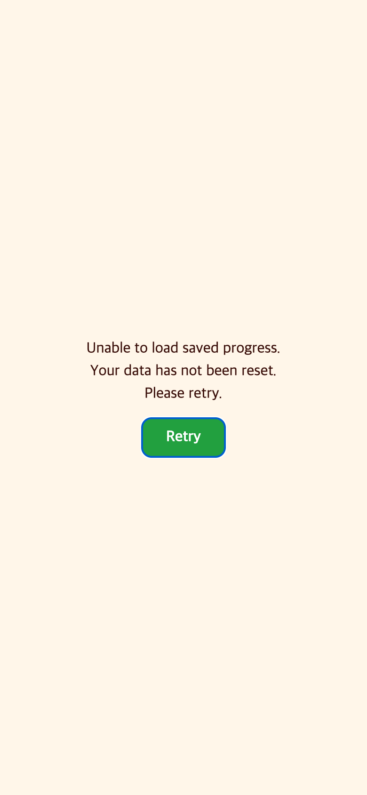
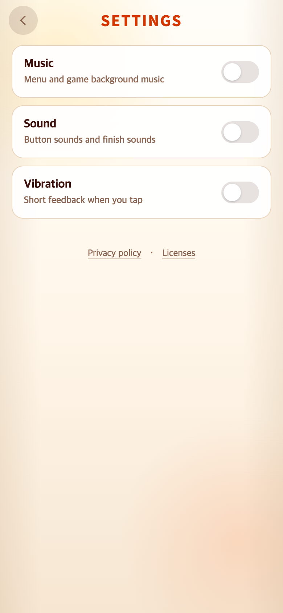

# 2026-09-30 저장 복구 후 클릭 차단 수정

- 적용 커밋: `520deca`
- 비교 커밋: `a861ab0`
- 재현: 성공. 각 커밋을 별도 임시 archive 폴더에서 실행했다.
- 조건:390×844 CSS px, DPR2(780×1688 PNG), Chrome 모바일/터치, en-US/Asia/Seoul. 브라우저별 실제3게임 진행과 설정/최고기록/backup을 만든 후 같은 원문을 사용했다.
- 시각·브라우저 버전·해시: [verification.json](verification.json)

## 문제·개선 요구

저장 읽기 오류 후 Retry가 성공했는데도 화면을 누를 수 없는 결함이 발견됐다. `hidden`을 설정했지만 뒤에 있는 동일 우선순위의 `.storage-notice.storage-blocking {display:flex}`가 숨김을 덮어썼다. 앱 자체의 inert는 풀렸어도 오류 패널이 계속 덮고 있었다.

## 수정 내용과 이유

- `StorageNotice.hide()`에서 blocking 클래스를 제거한다.
- hidden 상태가 blocking 표시보다 CSS 우선순위가 높도록 명시한다.
- 로컬/native 데이터·키·이관·복구 로직·게임 규칙은 변경하지 않는다.
- 단위 테스트3개: 복구 성공, 재실패 시 Retry 유지, 복구 후 비차단 쓰기 안내 재표시.

## 수정 결과

| 상태 | 수정 전 | 수정 후 |
| --- | --- | --- |
| Retry 성공 후 hidden | true | true |
| blocking class | 남음 | 제거 |
| 계산된 display | flex (결함) | none |
| app inert | false | false |
| 일반 Settings 클릭 | 가로막힘 | 성공 |

실제 브라우저에서 저장 getItem만 일시적으로 실패하도록 테스트 환경에 주입했다. 첫 실패 Retry에서 저장 원문은 변하지 않고 버튼을 다시 누를 수 있다. 이후 읽기를 복구하고 실제 Retry 버튼을 클릭했다. **force click 없이** Settings→Privacy→닫기 및 Alphabet/Syllable/Vocabulary START→게임판 클릭까지 확인했다. 오류가 난 기기의 실제 사용자 데이터를 수정한 것은 아니다.

- 281개 테스트/42파일, typecheck, production build 통과.
- 정책 열람 공통 UI·패키지명·키는 그대로다. Android 자산 sync도 완료했다.
- 실제 Android 구버전→신버전 업데이트/저장 오류 재현은 출시 전 실기기 검증으로 남긴다.

## 모바일 화면

| 수정 전 — `a861ab0` 재현 | 수정 후 — `520deca` 재현 |
| --- | --- |
|  |  |

왼쪽은 읽기가 이미 복구됐지만 기존 CSS로 패널이 남아 실제 클릭을 차단하는 화면이다. 오른쪽은 동일한 복구 후 사용자가 정상적으로 Settings를 누른 화면이다. 동일한 상태를 합성하지 않고 실제 결과 차이를 캡처했다.

## 재현 명령

`AFTER_COMMIT=520deca PLAYWRIGHT_MODULE=/path/to/playwright/index.mjs node docs/research/2026-09-30-storage-retry/capture.mjs`

별도 test browser/context의 저장만 사용하며 원래 작업 파일을 과거 커밋으로 바꾸지 않는다. 일반 배포 흐름에는 오류 주입 코드가 포함되지 않는다.
