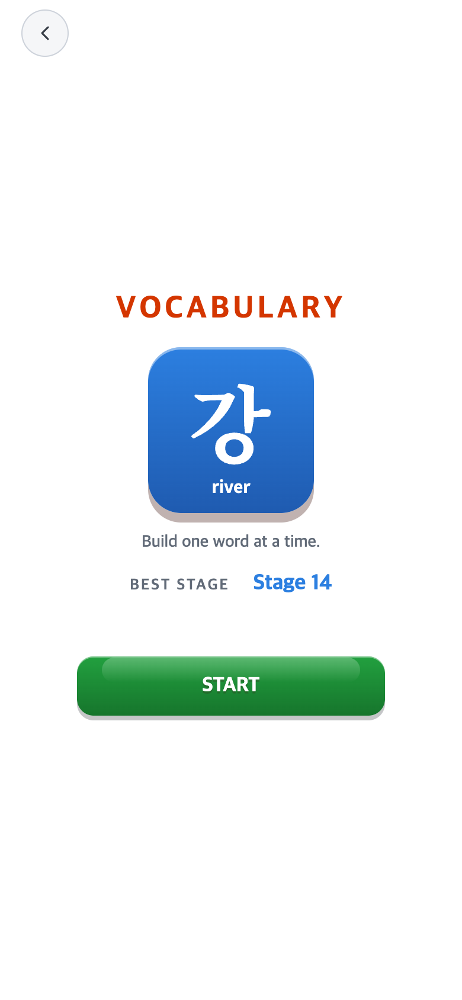
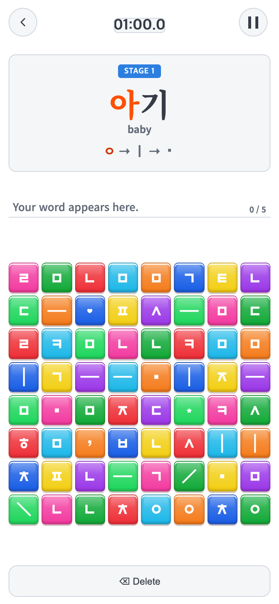
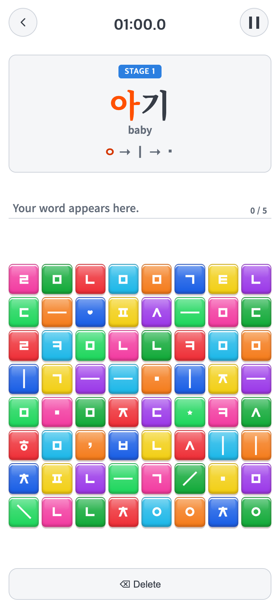

# 2026-10-01 BEST STAGE·상단 타이머 박스 제거

> 후속 승인: 이 최종 런타임을 `fed5879`에 커밋하고1.0.2/code4 AAB로 생성했다. 아래 미커밋·보류는 캡처 당시 상태이며 PNG/측정값은 보존했다. [출시 검증](../2026-10-01-android-release/README.md).

## 변경 제목

- 비교 커밋: `43a49ce4a39a701e09985aefe17961489b21a4c5` (`43a49ce`) + 직전 미커밋 강조색 복원 후보.
- 적용 커밋: 없음. 이번 로컬 수정은 **아직 미커밋**이다.
- 수정 전 아카이브: [before-source-overlay.tar.gz](before-source-overlay.tar.gz), SHA-256 `0248419cc28961774b2e784da09ac79ed109c59222254a81e6900c10b75b8b56`.
- 수정 후 아카이브: [after-source-overlay.tar.gz](after-source-overlay.tar.gz), SHA-256 `c92972e02da9f908871bb704a84957ba4cb4557ba17d5e885e665605b61425f9`. 두 아카이브 모두 서명키/비밀번호/사용자 저장 데이터는 제외한다.
- 재현: 성공. 해당 커밋과 당시 소스 아카이브를 별도 임시 폴더에서 실행했다. 순수43a49ce의 화면이 아닌 로컬 후보 재현임을 명시한다. 현재 파일을 과거 화면처럼 바꾸거나 화면을 합성하지 않았다.
- 조건: macOS Chrome154.0.8037.58,390×844 CSS px/DPR2, **780×1688 PNG**. 전후 같은 seed20261001·기록 fixture8/27/14·같은 문제 위치·시계01:00.0이다. 실제 Android 설치 화면은 아니다. 연구용 브라우저에서만 로고/커버 대기를 생략했다.

### 문제·개선 요구

일반 UI를 회색으로 정리하면서 원래 박스가 없던 BEST STAGE와 상단 시계에도 회색 바탕을 추가했다. 사용자는 두 부분의 박스를 없애고 글자만 보이게 요청했다.

### 수정 내용과 이유

`src/ui/styles/neutral.css`에서 두 요소의 `background/border-radius` 규칙과 타이머 `outline` 규칙만 제거했다. 기본 화면 위에 글자가 바로 표시되며, 최고기록 파랑·시간 진회색은 유지한다. DOM·공간·예비 기록 행·−1초 표시 위치는 변경하지 않는다. 회색 기본 박스/강조색/버튼 효과·블록·규칙·기록 저장·Android 비율에는 손대지 않았다.

### 수정 결과·검증

- 세 게임 모두 START의 BEST STAGE와 본게임 시간 뒤에 배경·테두리·outline·그림자가 없다. 모서리도 기본0px로 복귀했다.
- 전후8개 화면 조건의 좌표·크기·서체·굵기·행간·글자색 차이0, 게임 블록의 색/광택/효과 동일.
- 타이머/최고기록 변경 외 `src` 파일125개 SHA-256 동일. CSS도 두 규칙/설명 주석만 변경됐는지 검사했다.
- Vitest46개 파일·300개 테스트 및 TypeScript/Vite build 통과.
- 좌표 기반 터치8개 검사 통과. Android hook/남은 inset24·48 모의에서도 위치와 비율 유지. **실제 기기 검증은 미실시**다.
- PNG16장 모두780×1688 px 및 SHA-256 확인. [상세 검증](final/verification.json), [재현 검사기](check.mjs).
- AAB 생성·commit/push·Play 업로드는 실행하지 않았으며 다른 게임 저장소도 수정하지 않았다.

### 모바일 전후 화면

| 화면 | 수정 전 —43a49ce+직전 후보 재현 | 수정 후 —미커밋 |
| --- | --- | --- |
| Vocabulary START |  |  |
| Vocabulary 타이머 |  |  |
| Alphabet START | [전](final/before-alphabet-start.png) | [후](final/after-alphabet-start.png) |
| Syllable START | [전](final/before-syllable-start.png) | [후](final/after-syllable-start.png) |
| Alphabet 타이머 | [전](final/before-alphabet-main.png) | [후](final/after-alphabet-main.png) |
| Syllable 타이머 | [전](final/before-syllable-main.png) | [후](final/after-syllable-main.png) |
| Android 프레임 START 모의 | [전](final/before-native-word-start.png) | [후](final/after-native-word-start.png) |
| Android 프레임 타이머 모의 | [전](final/before-native-word-main.png) | [후](final/after-native-word-main.png) |

재검사는 저장소 루트에서 `CHECK_RUN`에 새로운 폴더명을 주어 실행한다. 기존 결과를 덮어쓰지 않는다. 시작 기록 fixture는 별도 브라우저 저장공간을 쓰므로 사용자 기록에 영향을 주지 않는다.

```sh
CHECK_RUN=recheck-YYYYMMDD PLAYWRIGHT_MODULE=/Users/scdi/.cache/codex-runtimes/codex-primary-runtime/dependencies/node/node_modules/playwright/index.mjs node docs/research/2026-10-01-bare-records-timer/check.mjs
```
