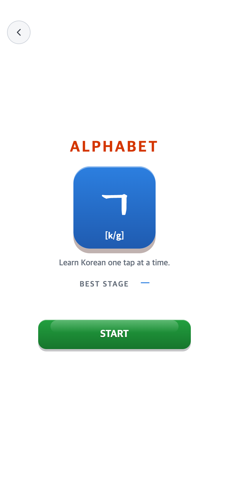
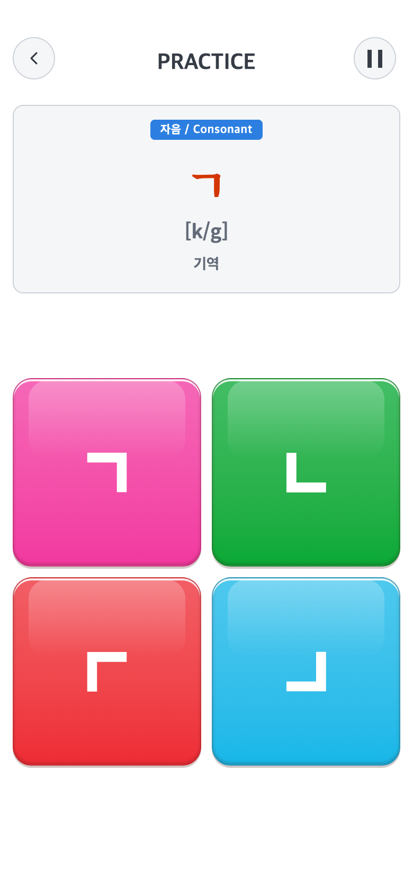
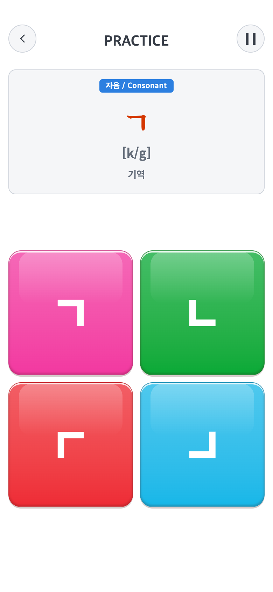
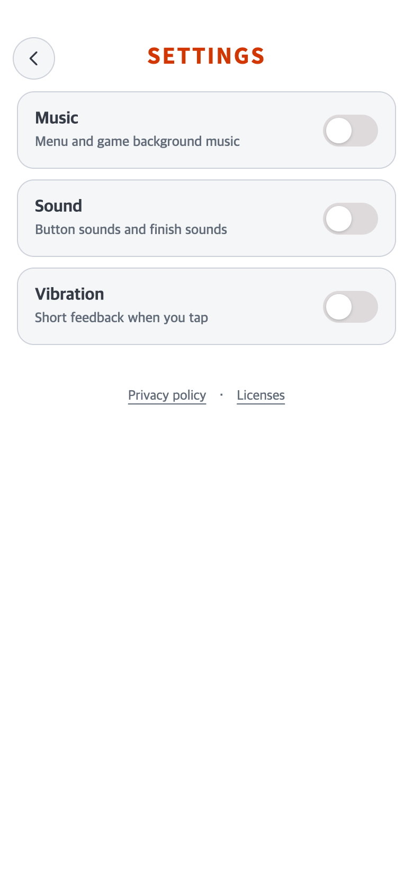

# 2026-10-01 뒤로가기·일시정지 위치 고정

- 비교 코드: `b79c8b4` + 직전 반응형 미커밋 후보.
- 적용 코드: 현재 미커밋 후보. AAB·push 없음.
- 수정 전 화면은 직전 [실제 캡처 기록](../2026-10-01-responsive-aspect/README.md)의 PNG를 그대로 복사했다. 이미 기록된 현재 후보이므로 과거 커밋을 다시 빌드하거나 화면을 임의로 만들지 않았다.
- 조건: Android 모의 화면,390×844 CSS/DPR2,780×1688 PNG, 남은 상24/하48px 안전영역. 실기기 검증 아님.

## 문제·수정·결과

START/Settings/게임은 HUD 높이56/62px와 좌우18/12px가 서로 달랐고, 넓은 Android 화면에서 게임 HUD만560px 가운데 열로 제한돼 버튼이 안쪽으로 이동했다.

`talk.css`의 상단 내비게이션 버튼만 안전영역을 기준으로 절대 배치했다. 뒤로가기는 왼쪽12px, 일시정지는 오른쪽12px, 둘 다 위11px이다. 타이머/중앙 제목은 grid 두 번째 열을 유지한다. 버튼 크기40px·모양·색·효과, 보드 및 나머지 콘텐츠/규칙은 변경하지 않았다.

화면 전환,2/4/6/8 보드, 작은/큰 창에서도 같은 화면 모서리에 유지된다. 실제 창 크기나 안전영역이 달라지면 모서리를 따라 움직이는 정상 반응형 동작은 유지한다.

## 비교

| 수정 전 — 직전 후보 실제 캡처 | 수정 후 — 현재 후보 |
| --- | --- |
|  |  |
|  |  |
|  |  |

## 필요한 검사만 실행

- 관련 Vitest3파일15개 통과. 전체 테스트·빌드·미디어 검사는 반복하지 않았다.
- 390×844,270×585,450×975,800×1280,1280×800에서 세 게임 START/게임/Pause 복귀·Settings·Alphabet 보드 전환의 버튼 좌표/크기65회 확인 통과, JS 오류0. 결과: [verification.json](verification.json).
- 초기 보조 스크립트의 존재하지 않는 메뉴 선택자를 제거했다. 앱 런타임 변경은 위 CSS5줄뿐이다.
- 실제 Android 기기 검사·AAB 생성·commit/push는 하지 않았다.
