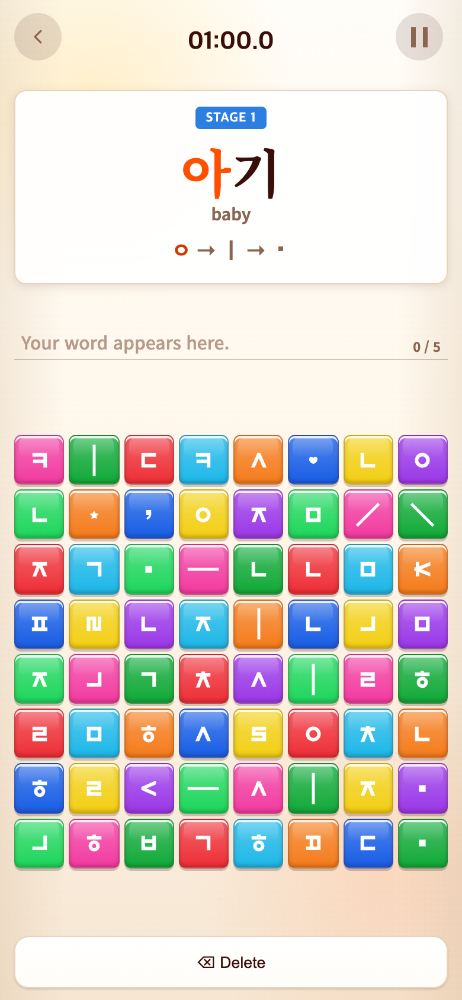
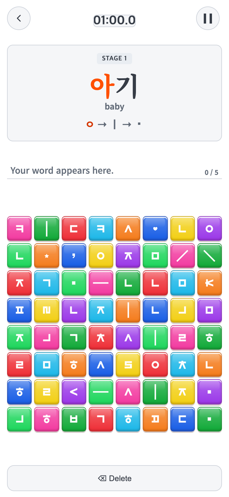
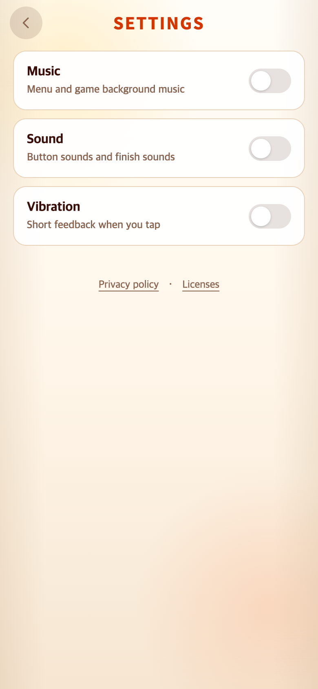
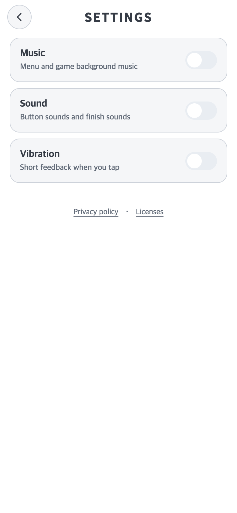

# 2026-10-01 일반 UI 평면화·Android 고정 비율 화면

## 변경 기준과 재현 조건

- 적용 상태: **로컬 미커밋 코드**. 이번 요청은 코드 수정·검증·연구기록만 승인되어 AAB 생성, 버전 증가, commit/push, Play 업로드는 하지 않았다.
- 비교 커밋: `43a49ce4a39a701e09985aefe17961489b21a4c5` + 변경 직전의 미커밋 소스 overlay. 이전 작업의 안전영역·서체 복원 등이 이미 포함되어 있어, **순수한43a49ce 또는 출시 AAB 화면과 같다는 뜻이 아니다.**
- 재현: 성공. `git archive`로 위 커밋을 별도 임시 폴더에 추출한 다음 [수정 전 소스](before-source-overlay.tar.gz)를 적용해 실행했다. 현재 작업 파일을 과거 버전으로 되돌리지 않았다. 수정 후 소스도 [별도 보관](after-source-overlay.tar.gz)했다.
- 수정 전 overlay SHA-256: `a84b482bf8fab41f4419731366d3496517e657c65d2a8af28deb9a0d72222fbb`
- 수정 후 overlay SHA-256: `b95f3c51ab5e4b0622a14dac918130f3946154d98ea39ddd5c7a633bf98995a0`
- 캡처: macOS Chrome154.0.8037.58,390×844 CSS px, DPR2, **780×1688 PNG**. 최종102장 모두 크기와 SHA-256을 확인했다. [파일별 정보·전체 측정](final/verification.json)
- 같은 난수 seed20261001, 별도 테스트 저장 공간, 같은 진입 동작과 문제 번호를 사용했다. 시간은PRACTICE/01:00.0으로 고정하고 영상은0.5초 프레임으로 정지했다. 연구용 브라우저에서만 시작 로고/커버 대기 시간을 생략했다. 실제 게임의 대기 시간·규칙·사용자 저장은 변경하지 않았다.

### 문제·개선 요구

일반 UI의 따뜻한 배경·그라데이션·입체 그림자를 TAPtoTEN의 흰색/연회색 디자인으로 맞추되, 알록달록한 게임 블록과 정답·오답 표시를 잃지 않아야 했다. 또 Android의 ‘화면 크게/작게’ 설정이 앱의 논리 viewport를 바꿔도 메뉴·글자·보드·버튼의 상대 배치가 달라지지 않아야 했다. 일부 요소만 줄이거나 안전영역을 두 번 제외하는 방식은 피해야 했다.

### 수정 내용과 이유

1. **일반 UI 전용 스킨**: `src/ui/styles/neutral.css`에 독립된 `--ui-*` 토큰을 추가했다. 배경#ffffff, 박스#f5f6f8, 테두리#cdd2da, 본문#363c46, 설명#626b78. 눌림#e9edf2, 선택#dce1e8. 기존 블록/피드백 토큰을 덮어쓰지 않는다. 로고 CSS drop-shadow만 제거하고 원본 PNG는 그대로다.
2. 메뉴·START·시간·최고기록·뒤로가기·일시정지·설정·제시창·Delete·정책 창의 일반 표면을 평면화했다. 원래 테두리가0인 버튼은 inset outline을 써서 크기/위치가 변하지 않도록 했다. 점수 표시는 흰 배경·진회색 글자로 정리했다. 게임 블록의 그라데이션·광택·그림자·흔적, 현재 자소의 빨강·완료 파랑·전체 완료 반전색, 오답−1/붉은 틴트/흔들림은 유지한다. 브랜드 PNG/커버와 브랜드 인트로, 등급 영상의 기존 효과는 보존했다.
3. **Android390×844 전체 화면**: TAPtoTEST의 `nativeFrame.ts` 방식을 참고해 `scale=min(사용 가능 너비/390, 사용 가능 높이/844)`로 전체 구성을 한 번에 맞추고 중앙에 배치한다. 그림·글자·블록·간격에 개별 배율을 적용하지 않는다. 종횡비가 다르면 흰 여백을 둔다.
4. `MainActivity`는 시스템바+display cutout과 실제 WebView 위치/크기를 비교해 **남은 겹침**만 전달한다. native padding이 이미 제외한 면은0이며, 이를 CSS env와 합산하지 않는다. 앱 내부 안전영역은0으로 하고 바깥 프레임에서 한 번만 제외한다. 페이지 로딩·복귀·configuration/global layout 변경 시 다시 계산한다. 기존 WebView textZoom100%는 유지하고 OS density/fontScale을 변경하지 않는다.
5. 활성 CSS의 viewport 단위를 `--layout-vw/vh`로, 높이 분기를 앱 container query로 옮겼다. Android는 기준 화면에 고정하고 웹은 기존 viewport와 같은 값으로 fallback한다. 구형 container query 미지원 WebView는 이전 반응형 방식으로 fallback한다.
6. 정책 dialog는 browser top layer, 저장 실패 안내는 body의 독립 패널이므로 같은 프레임 배율을 별도로 적용한다. 저장 안내를 inert 처리되는 앱 안으로 옮기지 않았다. 좌표 터치는 브라우저의 transform hit testing을 사용하며 임의 좌표 보정은 추가하지 않았다.

### 수정 결과와 검증

**최종 검증은 `final/`만 사용한다.** 초기attempt 폴더는 실패·불완전 검사 흔적이며 전후 증거로 사용하지 않는다. attempt1은 sandbox Chrome 실행 실패,2는 임시 경로의 Vite 이미지 접근 실패,3은 점수 입장 애니메이션의 측정 시점 차이,4는 검사기 선택자 오류,5는 일반 미입력 색까지 보존 대상으로 검사한 오류였다. 검사기 경로/선택자/동일 시점을 수정하고 전체 검사를 다시 통과시켰다. 성공한attempt6은final로 옮겼다.

| 검증 | 결과 |
| --- | --- |
| Vitest | 46개 파일·298개 테스트 통과 |
| TypeScript/Vite build | 통과 |
| Android release Java 컴파일 | 통과, AAB/설치 APK 생성 작업은 실행하지 않음 |
| GameInsets JUnit | 4개 통과: 전체 겹침·이미 제외된0·부분 겹침/cutout·밀도 변화 |
| 웹 전후 | 37개 화면/조건의 위치·크기·font-family·크기·굵기·행간 차이0 (측정 기준0.05px) |
| 게임 블록 | 전후 모든 캡처 상태의 색·그라데이션·테두리·그림자·광택·비활성 흔적·글자 속성 동일 |
| 정답·오답 | 완료파랑/current빨강·전체완료 파랑+흰 글자·wrong-pick/mistake-tint/mistake-shake/−1 표시 동일 |
| 보호 소스 | 규칙·콘텐츠·화면 흐름·저장·기록·로고/커버·폰트·BGM·motion 등65개 SHA-256 동일 |
| Android 브라우저 모의 | 256개 화면/안전영역 측정 통과, 화면/정방형 보드 잘림 없음 |
| 좌표 기반 터치 | 34개 게임 탭 검증 통과: 배율 적용된 블록 중앙 선택→입력 진도/사용·비활성 상태 확인. 각 프로필 START/Pause/Resume/Settings/정책·Delete도 터치로 진입/복귀 |
| 실제 Android/Galaxy | **미검증**. `adb devices -l`에 연결 기기 없음 |

웹의 추가 조건은320×568,360×640,390×660,390×700,390×701,412×915다. Android 전체 변환을 적용하지 않은 웹은 기존 반응형 배치를 유지했다.

#### Android 확대 모의 조건

같은 물리1080×2340 화면을 다른 표시 밀도로 환산했다. 상태 막대72px·하단144px도 같은 밀도로 나눴다. **갤럭시 설정 단계의 실제 수치를 측정한 것이 아니다.**

| 조건 | 논리 화면 | 남은 위/오른쪽/아래/왼쪽 inset |
| --- | --- | --- |
| 기준 | 390×844 | 0/0/0/0 |
| 밀도2 | 540×1170 | 36/0/72/0 |
| 밀도2.4 | 450×975 | 30/0/60/0 |
| 밀도3 | 360×780 | 24/0/48/0 |
| 밀도3.6 | 300×650 | 20/0/40/0 |
| 밀도4 | 270×585 | 18/0/36/0 |
| 작은 화면 | 320×568 | 24/0/48/0 |
| 비대칭 cutout | 412×915 | 30/18/36/8 |
| 가로 화면 | 844×390 | 8/30/16/20 |
| 표준 PNG용 안전영역 | 390×844 | 24/0/48/0 |

모든 조건에서 메인,Settings/정책,세 게임 START,Alphabet2/4/6/8판,Syllable2/4/6/8판,Vocabulary8판,각 Pause,점수창 및6등급 영상을 확인했다. 기준 canvas의 상대 위치/크기/서체와 보드 정방형을 비교했다. 같은 게임을 reload하지 않고 밀도4→2→3.6→3으로 변경하고, 이미 native padding된360×708의 inset0 및 inset만10/20px로 바뀌는 경우도 확인했다.

### 모바일 전후 화면

아래는 **수정 직전 로컬 후보의 과거 소스 재현**과 이번 로컬 수정본이다. 모두390×844 CSS px/DPR2,780×1688 PNG이며 실제 Android 설치본 캡처가 아니다.

| 화면 | 수정 전 —43a49ce+before overlay | 수정 후 —미커밋after overlay |
| --- | --- | --- |
| 메인 |  |  |
| Vocabulary |  |  |
| Settings |  |  |
| Alphabet START | [전](final/before-alphabet-start.png) | [후](final/after-alphabet-start.png) |
| Syllable START | [전](final/before-syllable-start.png) | [후](final/after-syllable-start.png) |
| Vocabulary START | [전](final/before-word-start.png) | [후](final/after-word-start.png) |
| Alphabet2×2 | [전](final/before-alphabet.png) | [후](final/after-alphabet.png) |
| Alphabet4×4 | [전](final/before-alphabet-4x4.png) | [후](final/after-alphabet-4x4.png) |
| Alphabet6×6 | [전](final/before-alphabet-6x6.png) | [후](final/after-alphabet-6x6.png) |
| Alphabet 본게임 | [전](final/before-alphabet-main.png) | [후](final/after-alphabet-main.png) |
| Alphabet 진행색 | [전](final/before-alphabet-input.png) | [후](final/after-alphabet-input.png) |
| Alphabet 전체완료 | [전](final/before-alphabet-complete.png) | [후](final/after-alphabet-complete.png) |
| Syllable2×2 | [전](final/before-syllable.png) | [후](final/after-syllable.png) |
| Syllable4×4 | [전](final/before-syllable-4x4.png) | [후](final/after-syllable-4x4.png) |
| Syllable6×6 | [전](final/before-syllable-main.png) | [후](final/after-syllable-main.png) |
| Syllable8×8 | [전](final/before-syllable-8x8.png) | [후](final/after-syllable-8x8.png) |
| Vocabulary 입력 후 | [전](final/before-word-input.png) | [후](final/after-word-input.png) |
| 긴 단어 | [전](final/before-word-long.png) | [후](final/after-word-long.png) |
| Alphabet Pause | [전](final/before-alphabet-pause.png) | [후](final/after-alphabet-pause.png) |
| Syllable Pause | [전](final/before-syllable-pause.png) | [후](final/after-syllable-pause.png) |
| Vocabulary Pause | [전](final/before-word-pause.png) | [후](final/after-word-pause.png) |
| 점수 | [전](final/before-score.png) | [후](final/after-score.png) |
| 등급 영상 | [전](final/before-grade.png) | [후](final/after-grade.png) |
| Privacy | [전](final/before-privacy.png) | [후](final/after-privacy.png) |
| Licenses | [전](final/before-licenses.png) | [후](final/after-licenses.png) |
| 메뉴 눌림 | [전](final/before-home-pressed.png) | [후](final/after-home-pressed.png) |

#### 수정 후 Android 프레임 모의 화면

이 비교도780×1688 PNG다. 왼쪽은 남은 inset0, 오른쪽은 위24/아래48 CSS px를 제외하고 같은 전체 canvas를 맞췄다. **흰 여백은 제외 영역/letterbox이며 기기의 상태 막대·탐색 버튼 이미지를 합성하지 않았다.**

| 화면 | inset0 | 남은 안전영역24/48 |
| --- | --- | --- |
| 메인 | [기준](final/native0-home.png) | [안전영역](final/native9-home.png) |
| START | [기준](final/native0-word-start.png) | [안전영역](final/native9-word-start.png) |
| Alphabet | [기준](final/native0-alphabet-main.png) | [안전영역](final/native9-alphabet-main.png) |
| Syllable | [기준](final/native0-syllable-main.png) | [안전영역](final/native9-syllable-main.png) |
| Vocabulary | [기준](final/native0-word.png) | [안전영역](final/native9-word.png) |
| Pause | [기준](final/native0-word-pause.png) | [안전영역](final/native9-word-pause.png) |
| 점수 | [기준](final/native0-score.png) | [안전영역](final/native9-score.png) |
| Settings | [기준](final/native0-settings.png) | [안전영역](final/native9-settings.png) |
| NOT BAD | [기준](final/native0-grade-0.png) | [안전영역](final/native9-grade-0.png) |
| GOOD TRY | [기준](final/native0-grade-1.png) | [안전영역](final/native9-grade-1.png) |
| GREAT | [기준](final/native0-grade-300.png) | [안전영역](final/native9-grade-300.png) |
| AMAZING | [기준](final/native0-grade-600.png) | [안전영역](final/native9-grade-600.png) |
| UNBELIEVABLE | [기준](final/native0-grade-1000.png) | [안전영역](final/native9-grade-1000.png) |
| OH MY GOD | [기준](final/native0-grade-1500.png) | [안전영역](final/native9-grade-1500.png) |

### 재실행과 실기기에서 남은 확인

[check.mjs](check.mjs)를 저장소 루트에서 실행한다. 출력 폴더는 매번 새 이름을 사용해 이전 기록을 덮어쓰지 않는다.

```sh
CHECK_RUN=recheck-YYYYMMDD PLAYWRIGHT_MODULE=/Users/scdi/.cache/codex-runtimes/codex-primary-runtime/dependencies/node/node_modules/playwright/index.mjs node docs/research/2026-10-01-neutral-proportional-frame/check.mjs
```

소스 아카이브는src/index/config/Java만 포함하며 서명키·비밀번호·사용자 데이터는 포함하지 않는다. 검사기와 PNG는 게임 진입점이나 배포assets에 포함하지 않는다.

실기기에서는 같은 서명의 업데이트 설치, 갤럭시 화면 확대/글자 크기 변경, 제스처/3버튼 탐색,cutout,복귀·실행 중 설정 변경,음악/영상,저장 기록 보존을 추가 확인해야 한다. 브라우저 모의는 Android WebView·Samsung 설정 화면이나 실제 IME/시스템바를 실행한 것이 아니다. TAPtoTEN/TAPtoTEST는 읽기 전용 참고이며 두 저장소는 수정하지 않았다.
