# 2026-10-01 아이콘 교체·Android 가용 화면 반응형

- 적용 코드: `b79c8b4` 위의 **현재 미커밋 작업 파일**. AAB/APK 생성·commit·push·Play 업로드 없음.
- 비교 커밋: `b79c8b406036576fcd1c21578b32b339f08af232`.
- 과거 재현: 성공. `git archive`를 별도 임시 폴더에 풀어 독립 Vite 서버로 실행했다. 현재 파일을 과거처럼 꾸미거나 합성하지 않았다. 임시 위치는 [검증 JSON](check-2/verification.json)의 `beforeRoot`에 기록한다.
- 비교 조건: Chrome/macOS,390×844 CSS px,DPR2, **780×1688 PNG**, 같은 난수 seed20261001·초기 저장·정지 시계·영상0.5초. 스플래시 대기시간 단축과 앱 참조 노출은 캡처 전용 브라우저 route에서만 수행했다. 게임 소스에는 캡처용 진입점이 없다.
- `native-*`도 **Android 모의 화면**이다. 플랫폼 hook·남은 inset 상24/하48px을 주입했으며 실제 Android/OS 바 캡처가 아니다. `web-*`는 기존 웹 배치다.

## 문제·개선 요구

직전 Android 방식은390×844 사각형을 통째로 맞춰 기기 확대 설정에는 안정적이지만, 실제 화면이 길거나 넓으면 여백이 남고 커버까지 그 작은 사각형에 갇혔다. 사용자는 기기 비율에는 반응형으로 대응하되, 같은 기기의 화면 확대 설정으로 배치가 바뀌지 않기를 요청했다. 새 캐릭터 PNG 아이콘과 새 디자인의 스토어 화면7장도 필요했다.

## 수정 내용과 이유

1. TAPtoTEST(폴더명 TaptoPick)의 `nativeFrame.ts`, `nativeResponsive.css`, `pickLayout.ts`, `title.css`를 **읽기만** 했다. 참고 파일의 SHA256은 [추가 검증 JSON](edge-verification.json)에 기록했다.
2. Android는 남은 시스템바·카메라 겹침을 먼저 제외하고, `scale=min(가용너비/390, 가용높이/640)`로 density를 정규화한다. 논리 너비·높이는 각각 가용 치수÷scale로 계산한다. **844를 고정 높이로 강제하지 않는다.** 같은 물리 화면의 density가 달라져도 논리 치수는 유지하며 기기 종횡비가 달라지면 실제 가용 비율을 따른다. 640은 짧은 창에서 내용이 무너지는 것을 막는 논리 최소 높이다.
3. 기존 `MainActivity`/`GameInsets`의 실제 WebView 겹침 측정·명시적0·WebView textZoom100%는 유지한다. 이미 native padding으로 제외된 바를 CSS에서 다시 더하지 않는다. OS 설정을 바꾸거나 앱에 크기 조절 메뉴를 추가하지 않았다.
4. 처음 두 화면만 남은 바 영역까지 확장해 칠한다. 스튜디오 배경은 기존 `#1d2087`, 원본 로고 전체·흰 글씨·42% 너비·contain 유지. 커버는 **원본 한 장, 가로100%, 높이auto, 세로중앙**이며 흰 배경 외 별도 그라데이션/합성/반복이 없다. 짧은 창은 위아래만 잘린다.
5. 메인 이후는 실제 논리 너비·높이에 배치한다. 보드가 쓰는 flex 공간을 container query로 측정해 `min(공간너비, 공간높이,560px)` 정사각형을 사용한다. 넓은 화면의 HUD·제시창·편집 버튼·설정 본문은 최대560px 열로 중앙에 둔다. 기준 글자 크기는 유지하며 짧은 Android 창에서 기존 웹용 축소 분기로 글자가 작아지지 않게 한다. 메인 음악 안내가 넘칠 때만 자연스러운 세로 흐름/스크롤을 사용한다.
6. top-layer 정책창과 body에 있는 저장 복구창도 같은 동적 너비·높이·배율을 사용한다. 터치에 별도 좌표 변환을 덧붙이지 않았다.
7. 새 사용자 PNG 전체를 아이콘 원본에 교체했다. 기존 기계적 생성기로 밀도별15개 launcher/adaptive/round PNG·512px Play 아이콘·마스크 미리보기를 생성했다. 원본을 자르거나 그림을 새로 그리지 않았다. 브라우저 favicon도 같은512px PNG로 연결했다. Android 패키지명·버전1.0.2(4)·서명 설정/키는 그대로다.

참고 소스 사후 감사에서 `nativeResponsive.css` 한 파일의 hash가 검증 시점과 달랐다. 본 작업은 해당 저장소에 쓰기 명령을 실행하지 않았다. 다시 읽은 파일도 가용 비율/density 정규화·560px 열/보드 원칙은 같았다. 처음 읽은 hash를 덮어쓰지 않고 [읽기 시점·최종 감사 hash](reference-audit.json)를 함께 기록한다.

## 수정 결과·보존 범위

긴 화면에서는 위아래 공간을 실제로 쓰며, 태블릿·가로 창은 너비가 늘어난다. 시스템바 밖의 기존 디자인을 통째로 letterbox에 가두지 않는다. 그림/영상 비율과 보드·개별 블록 정사각형은 유지한다.

게임 규칙·콘텐츠·미디어·기록 저장·기존 디자인 CSS·native Java·앱ID/서명 설정 **79개 파일의 바이트 동일성**을 확인했다. 기존 흰/회색 기본 UI, 파랑/주황/초록 강조,9색 블록·입체 효과·정답/오답·튜토리얼 반짝임은 유지된다. 웹 기준 화면은 모든 측정 항목 전후 차이0이다. 직전 커밋부터 이미 흰/회색 디자인이므로 아래 비교가 옛 갈색 화면에서 바뀌는 비교는 아니다.

## 모바일 전후 화면

모든 비교 PNG는780×1688이다. 왼쪽은 해당 커밋의 독립 재현, 오른쪽은 현재 소스다. OS 상태바 이미지는 합성하지 않았다.

| 수정 전 — `b79c8b4` 재현 | 수정 후 — 미커밋 후보 |
| --- | --- |
| 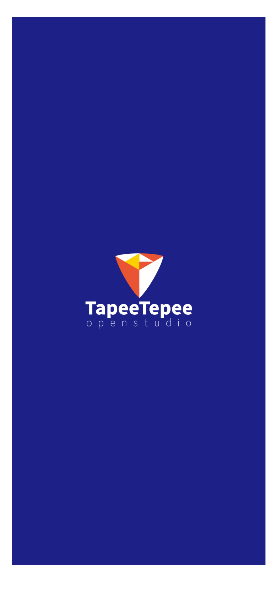 | 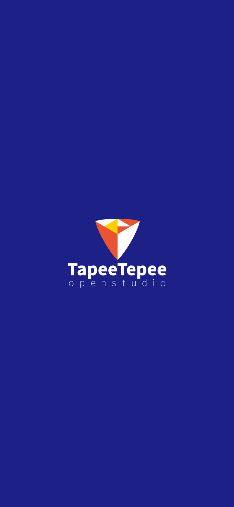 |
| 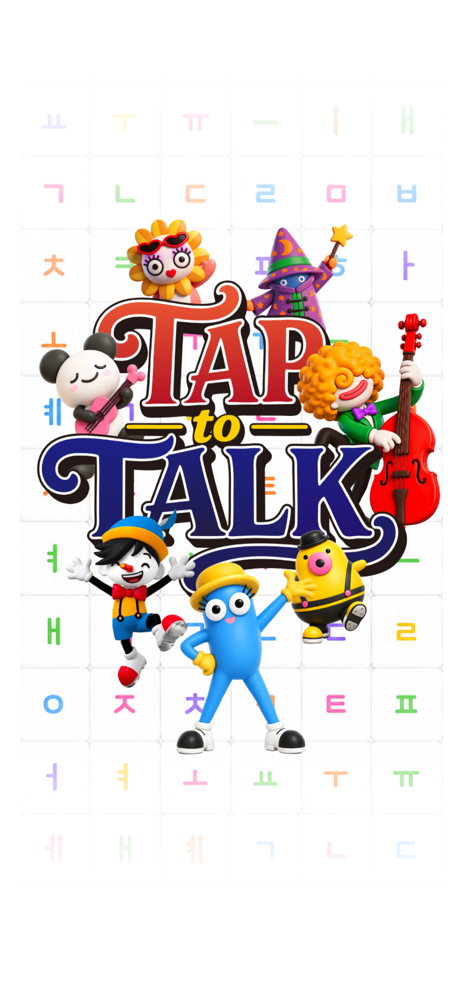 | 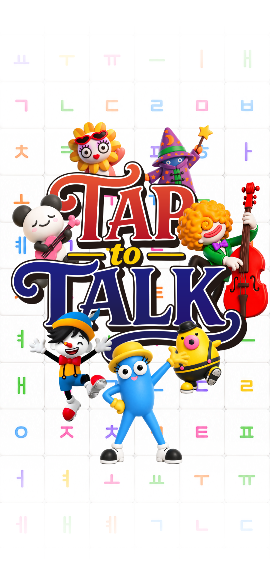 |
| 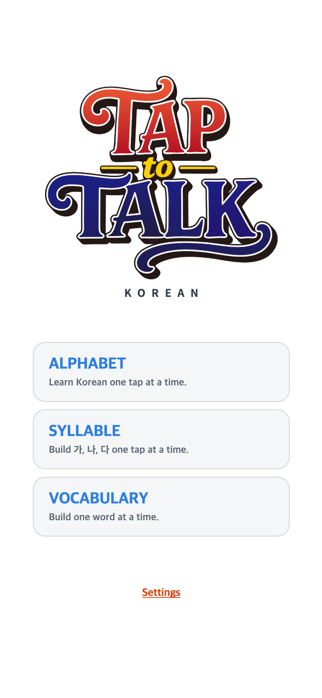 | 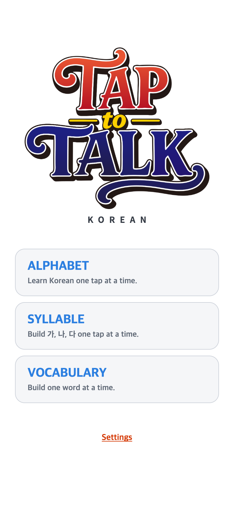 |
|  |  |
| 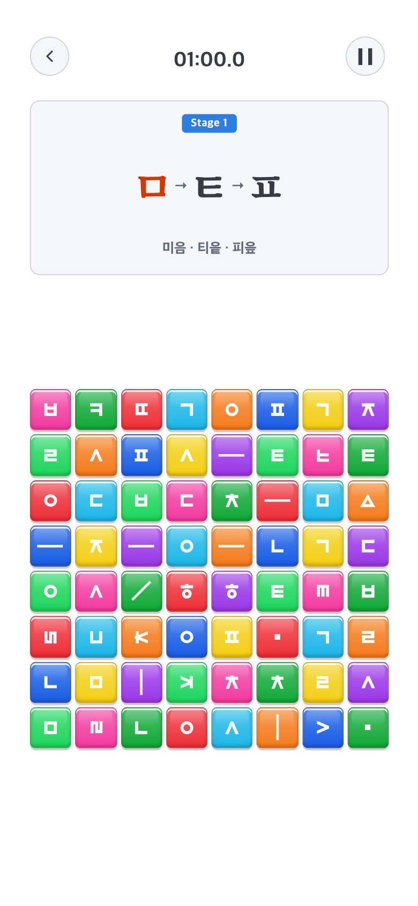 | 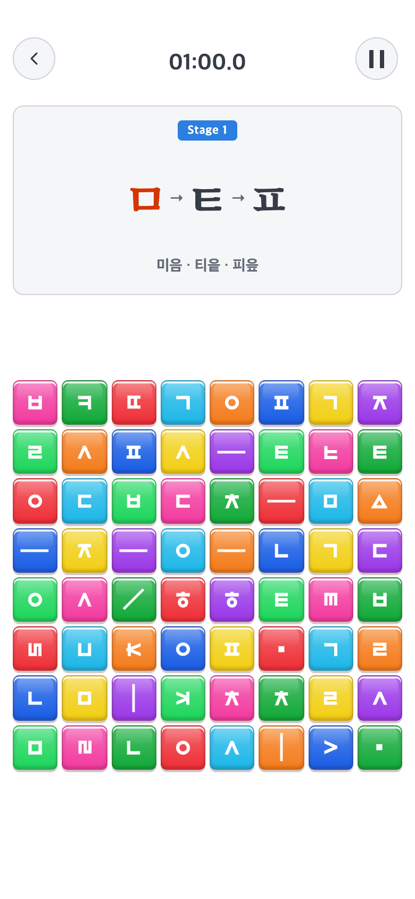 |
|  |  |
| 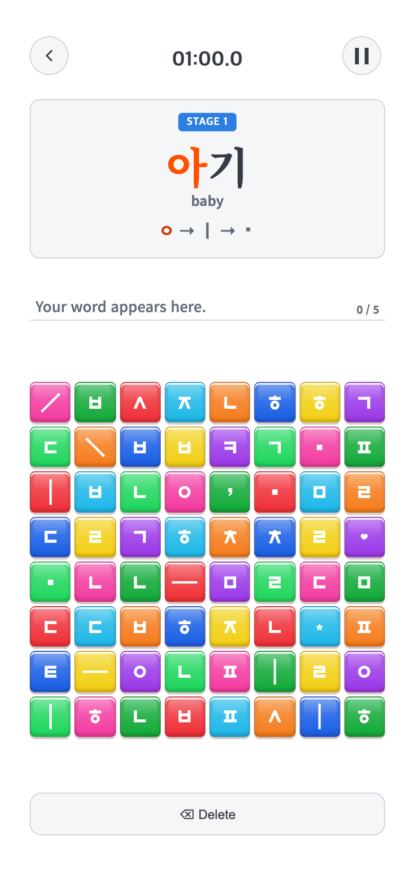 | 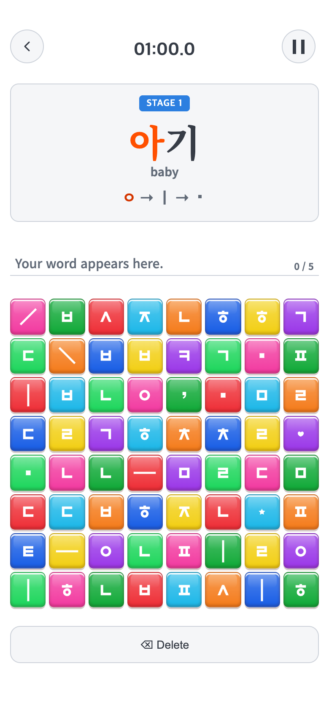 |
| 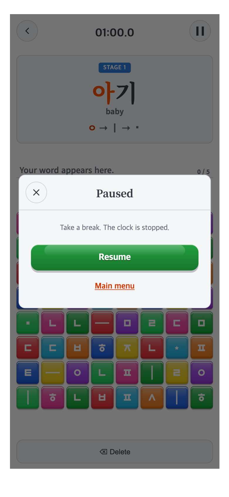 | 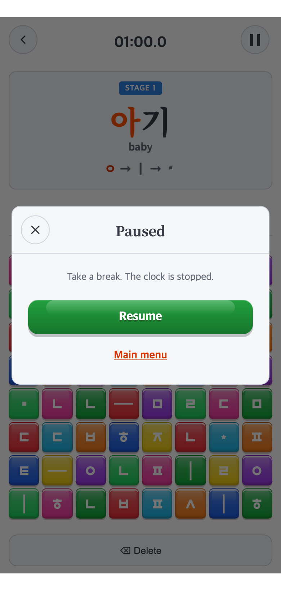 |
| 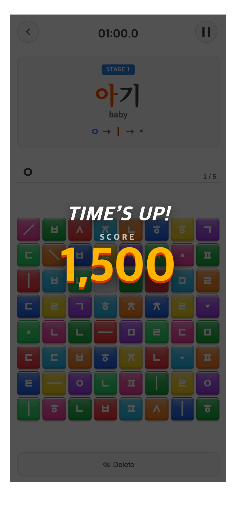 | 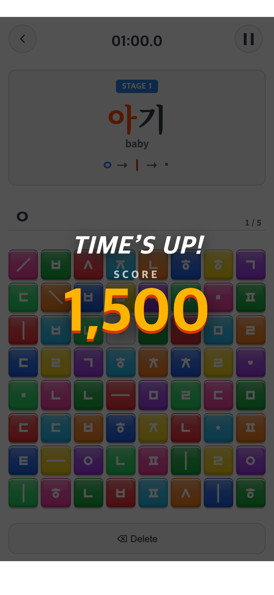 |
| 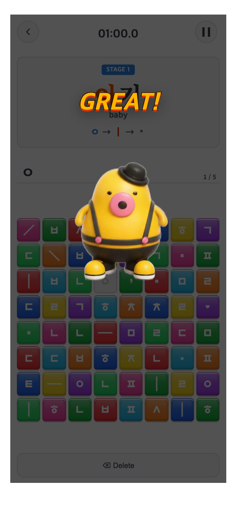 | 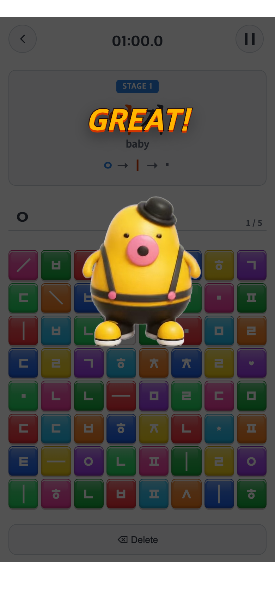 |
| 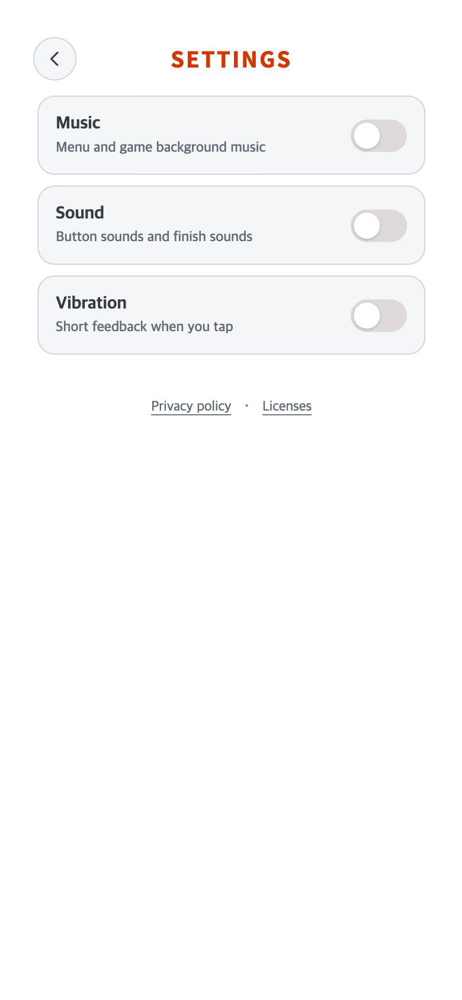 | 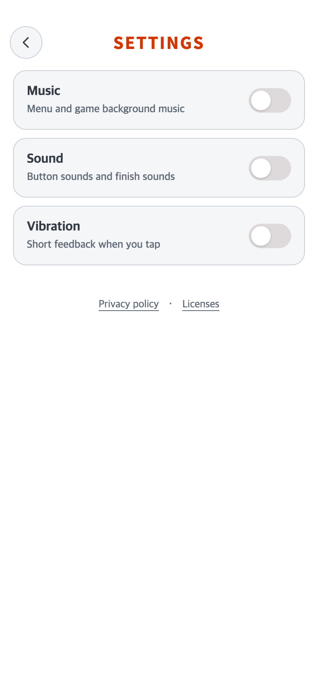 |

전체 캡처112장은 [check-2 폴더](check-2/)에 있다. 웹·Android 모의 화면, 세 START/게임/일시정지/점수/영상,2/4/6/8 보드와 입력 중 화면을 포함한다. 현재·과거 화면은 동일 캡처 조건을 사용한다.

## 다운로드할7장·아이콘

사용자 연락시트의7개 화면을 현재 디자인으로 다시 렌더링해 [개별 파일 목록](../../../store/screenshots/2026-10-01/README.md)과 [7장 ZIP](../../../store/screenshots/2026-10-01/taptotalk-screenshots-780x1688.zip)으로 분리했다. 웹 기준 레이아웃의 실제 모바일 렌더링이며 설치 앱 캡처로 표시하지 않는다. PNG 변환·합성 없이 검증된 캡처를 복사했다.

- [새 Play512px 아이콘](../../../store/android/taptotalk-play-icon-512.png)
- [adaptive 원형 마스크 미리보기](../../../store/android/taptotalk-adaptive-circle-preview.png) / [둥근 사각형 미리보기](../../../store/android/taptotalk-adaptive-rounded-preview.png): 기계적 마스크 확인용이며 실기기 화면이 아니다.
- 생성 정보·원본 hash·15개 파일: [icon-generation.json](../../../store/android/icon-generation.json).

## 검증

| 종류 | 조건·결과 |
| --- | --- |
| 단위 테스트·빌드 | Vitest47파일306개 통과, TypeScript 및 Vite 빌드 통과 |
| Android 리소스·Java | offline `:app:processReleaseResources :app:testReleaseUnitTest` 성공. 새 아이콘 리소스 처리, 기존 Java 테스트 캐시 재사용. AAB/APK 조립 task는 실행하지 않음 |
| 기본 모의검사 | 12조건, 터치 좌표51회 통과, 웹 전후 차이0, 보호 파일79개 동일, JS 오류0 — [JSON](check-2/verification.json) |
| 기기 비율 | 320×568,360×780,412×1000,800×1280,1280×800,844×390+비대칭cutout. 모든 메인·START·게임·Pause·점수·GREAT 영상·Settings를 측정 |
| 확대 설정 | 동일 물리1080×2340에서 density2/2.4/3/3.6/4. 같은 논리 배치 오차1.1px 미만, 사용 영역/보드 정사각형/터치 통과 |
| 실행 중 변경 | 270×585→450×975→390×844 및 native inset 변경. 같은 게임 상태 유지·3회 정답 좌표 탭 통과 |
| 이중 안전영역 | native가0을 보고하고 fallback이상24/하48인 경우에도 가용 화면을 다시 줄이지 않음 |
| 추가 edge 검사 | 로고/커버6비율·음악 안내·정책창·저장 복구창·6개 등급×6비율=36개 영상 배치 통과, JS 오류0 — [별도 JSON](edge-verification.json) |
| 실제 Android | **미검증**. `adb devices -l`에 연결 기기 없음. Galaxy 화면 확대/축소·camera/system-bar·실제 런처 마스크·설치 업데이트/진도 보존은 출시 전 실기기 검사 필요 |

첫 캡처 시도 `check-1`은 sandbox에서 Chrome 실행이 차단돼 이미지 없이 중단됐다. 승인된 로컬 브라우저 실행 `check-2`로 위 검사를 완료했다. 추가 edge 검사의 초기 실패는 테스트가 기존 hidden 저장창을 선택했던 보조 스크립트 문제였으며, 테스트용 새 패널을 정확히 선택한 뒤 전부 통과했다. 실패를 앱 화면으로 임의 재현하지 않았다.

재실행은 루트에서 `PLAYWRIGHT_MODULE=<Playwright경로> CHECK_RUN=<새폴더> node docs/research/2026-10-01-responsive-aspect/check.mjs`, 추가 검사는 같은 Playwright 환경변수와 `EDGE_RUN=<새JSON파일명>`으로 `edge-check.mjs`. 기존 증거를 덮어쓰지 않는다. 로컬 Chrome 실행 허용이 필요할 수 있다.

## 아직 하지 않은 일

AAB/APK 생성, 버전 증가, Git commit/push, Play 업로드는 사용자 별도 요청 전까지 하지 않는다. 현재 변경은 이전에 생성한1.0.2(4) AAB에 들어있지 않다. 다음 AAB를 만들 때 웹 자산 동기화와 새 versionCode가 필요하다.
