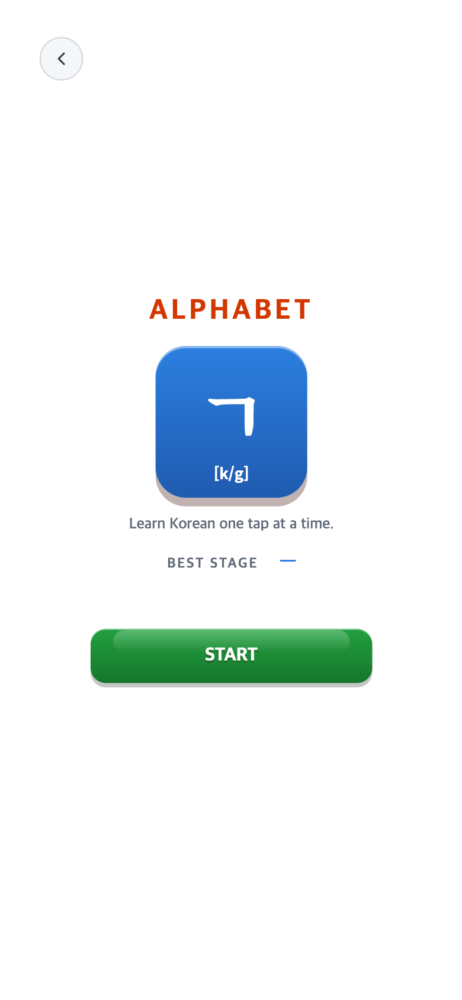
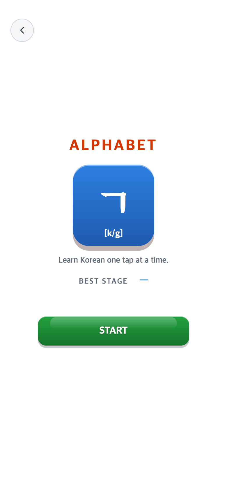
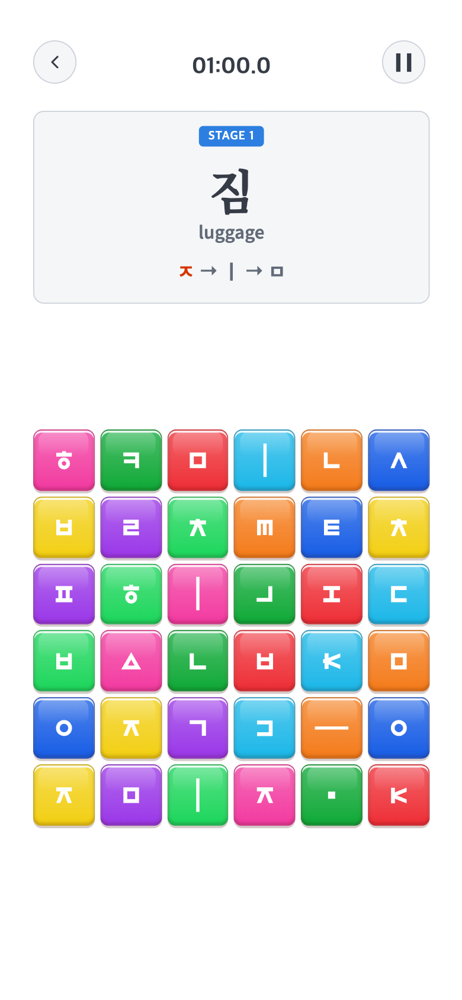
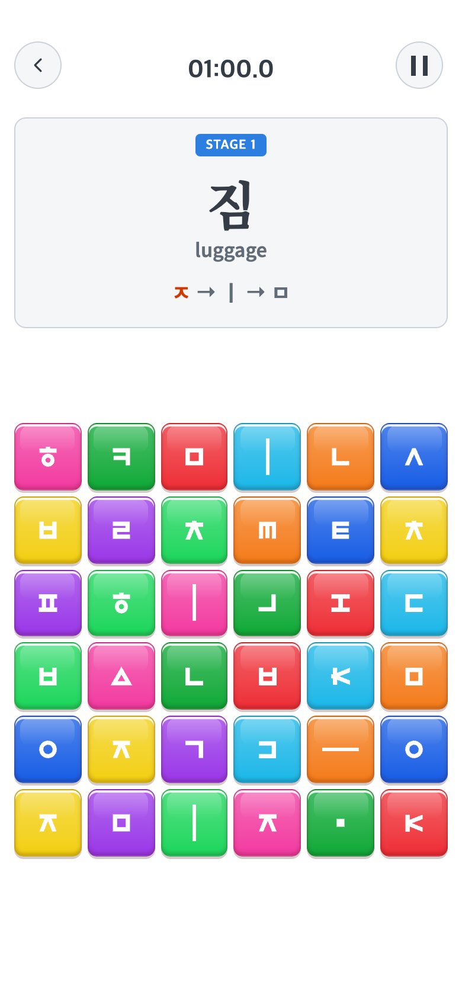

# 2026-10-01 최종 반응형·아이콘·Android 1.0.3

## 변경 제목

- 사용자 승인: TAPtoTALK origin commit/push, 기존 서명키로 새 AAB, 연락시트와 같은7종 화면 제공. Google Play 업로드/출시는 실행하지 않는다.
- 비교 커밋: `b79c8b406036576fcd1c21578b32b339f08af232` — 이전1.0.2/versionCode4.
- 적용 커밋: 최종 런타임 커밋은 후속 `release-verification.json`의 `sourceRevision`으로 기록한다.
- 재현: 이전 커밋을 별도 임시 폴더에서 실행한112장 비교 기록을 보존한다. 최종7장은 고정 내비게이션까지 반영한 현재 소스 실제 렌더링이다.

### 문제·개선 요구

고정390×844 전체 축소 대신 기기 종횡비에 맞춰 배치하면서, 같은 기기의 OS 화면 확대 변경에는 같은 논리 배치를 유지해야 했다. 새 캐릭터 아이콘과 흰색·회색 기본 UI/기존 강조색이 필요했고, 화면마다 상단 버튼이 움직이는 문제를 고쳐야 했다. 최종 코드를 Play용 AAB와7장 이미지로 전달하도록 승인받았다.

### 수정 내용과 이유

- density만 정규화하고 실제 가용 너비/높이를 사용한다. 보드는 잔여 영역에 정방형으로 맞추고, 안전영역을 한 번만 제외한다. 짧은 화면의 메인은 필요할 때만 자연 흐름/스크롤로 전환한다.
- 스튜디오 원래 파란 배경과 글씨를 포함한 PNG, 커버 원본 한 장/가로100%/비율 유지/세로 중앙을 보존한다. 이미지 합성·추가 그라데이션·배율 메뉴는 추가하지 않는다.
- 상단 내비게이션은 안전 화면 모서리 위11px/좌우12px에 고정한다. 기존 버튼40px, 글자 크기/서체/색/효과·나머지 배치를 유지한다.
- 사용자 원본 PNG로 Android15종 launcher/round/adaptive 및512px 스토어·브라우저 아이콘을 생성했다. 기존 안전 배치 방식을 유지한다.
- 게임 규칙·콘텐츠·저장/백업·패키지·업로드키는 변경하지 않는다. Android 버전은 **1.0.3/versionCode5**로 증가한다.
- 검사기의 `--icon-update`는 정확히 생성 아이콘15종과 브라우저`icon.png`만 이전 번들과 달라도 허용한다. 서명·권한·최신dist·원본 배치·나머지 미디어/서체 비교는 유지한다.

### 수정 결과·검증

- Vitest **47파일307개**, TypeScript/Vite·Capacitor Android sync 통과.
- 기존 반응형 모의검사:12개 기기/확대 조건,51회 좌표 탭, 실행 중 변경3회, JS오류0. 추가6개 비율×결과6등급36회 검사 등 통과. [원본 결과](../2026-10-01-responsive-aspect/README.md).
- 상단 버튼 후속 검사:5개 비율, START/Settings/게임/Pause 복귀·보드 변경 **65회** 좌표/크기 일치. [원본 결과](../2026-10-01-navigation-anchors/README.md).
- 최종7장 **780×1688 PNG**, 코드 실제 Chrome Android 플랫폼 모의 렌더링·JS오류0. [조건과 파일 해시](../../../store/screenshots/2026-10-01-release/capture-verification.json), [PNG7장·ZIP](../../../store/screenshots/2026-10-01-release/README.md).
- 실제 Android 설치/갤럭시 OS 확대 변경 검증은 미실시다. 실기기 캡처라고 표시하거나 합성하지 않는다. 이전 데이터 보존은 실제 업데이트 설치로 별도 확인해야 한다.
- Android 번들·서명 검증 결과와 최종 파일 정보는 빌드 후 이 기록에 추가한다.

### 모바일 전후 화면

모두390×844 CSS px/DPR2의780×1688 PNG이다. 아래 전·후는 native 모의 남은 안전영역 상24/하48px로 동일하다. 전은`b79c8b4` 별도 폴더 실행, 후는 반응형 변경 시점 후보 실행이다. 내비게이션까지 포함한 최종 화면은 별도7장과 버튼 후속 비교에서 확인한다. 중간 후보/설치 앱을 혼동하지 않는다.

| 화면 | 전 — b79c8b4 재현 | 후 — 반응형 후보 실제 렌더링 |
| --- | --- | --- |
| Alphabet START |  |  |
| Syllable 본게임 |  |  |

과거112장과 후속 버튼 전후 PNG를 재사용한다. 불필요한 과거 빌드/전체 화면 재검사를 반복하지 않았으며, 현재 소스로 과거 화면을 임의 재현하지 않았다. TAPtoTEN/TAPtoTEST는 읽기 참고만 하고 수정·push하지 않았다.
