# 2026-10-01 기존 디자인 유지·안전영역·작은 화면 대응

- 비교 커밋: `43a49ce4a39a701e09985aefe17961489b21a4c5`. 별도 임시 폴더의 수정하지 않은 Git archive를 실행했다.
- 적용 상태: 위 커밋 기반 미커밋 작업 트리. **화면 미리보기 검토 단계이며 새 AAB는 아직 생성하지 않았다.** 사용자는 AAB보다 스크린샷을 먼저 보기를 요청했다.
- 이번 작업에는 Git commit/push/스토어 업로드가 없다. 다른 게임의 소스·배포물은 수정하지 않았다.
- 모든 PNG는390×844 CSS px·DPR2·780×1688, 같은 Chromium/locale/난수 시드. 기존 연구 이미지는 덮어쓰지 않았다.

## 문제·개선 요구

Android 앱에서도 기록된 웹 디자인의 크기·비율·굵기를 유지해야 한다. 폰트를 전역 Noto Sans로 바꾸거나 임의의18px/600·12px/500 같은 새 디자인 수치를 정하는 것은 요청 방향과 달랐다. 사용자는 기기 기본 서체를 유지하고 Noto를 의도적으로 사용한 영역만 보존하기로 했다.

기존 게임판은 너비와52vh만 기준으로 삼아 작은 화면에서 Vocabulary의 Delete가 아래로 밀렸다.320×568에서 Delete의 끝이615.11px,390×660에서는671.17px였다. 일부 화면·오버레이는 공통 안전영역 여백을 덮어썼다.

## 기준 화면과 원래 값

중단된 `2026-10-01-web-app-proportions/` 후보는 승인된 디자인 기준으로 사용하지 않았다. 기준은 다음 기존 기록과 당시 코드다.

| 화면 | 기존 연구 기록 / 기준 |
| --- | --- |
| 홈·START·세 게임 | [2026-09-30 캡처](../2026-09-30-android-text-icons/README.md), `43a49ce` 기반. 그날 native textZoom/아이콘 작업은 웹 배치를 바꾸지 않았다. |
| START 최고기록 | [2026-09-29 기록](../2026-09-29-stage-records-content/README.md), `7ebf1b2` |
| 튜토리얼 | [2026-09-20 기록](../2026-09-20-short-practice/README.md), `a4f2c00` |
| 등급 영상 | [2026-09-17 기록](../2026-09-17-videos/README.md), `f7ef7e1` |
| 설정·정책 | [2026-09-29~30 기록](../2026-09-29-play-policy/README.md), `53980cd` |
| 일시정지·현재 점수창 | 최신 기준 커밋 `43a49ce`의 실제 컴포넌트를 이번에 재현했다. 예전 승인 캡처라고 표시하지 않는다. |

390×844·안전영역0·동일 브라우저에서 유지한 값:

| 요소 | 원래 값 |
| --- | --- |
| 메인 제목 / 설명 | 21px·800 /13px·700, 원래 normal 행간 |
| 메인 버튼 | 340×79px, 목록 간격10px |
| 로고 | 308.86×269.69px |
| START 제목 / 설명 | 26px·900 /14px·600 |
| START 버튼 | x65,y553.69,260×50px,17px·800 |
| 제시어 | 기존 공통36~44px·700, 명조체 |
| 설정 제목 | TAP Sans KR20px·800 |
| 등급 문구 | 기존 clamp(30px,11vw,68px)·900·italic |

메인700px/580px, 게임680px의 기존 짧은 화면 분기는 유지한다. 모든 화면에 compact 크기를 강제하지 않는다.

## 서체 경계

- 기기 기본 스택 유지: body의 Apple SD Gothic Neo → Noto Sans KR → Malgun Gothic → system-ui → sans-serif. 메인 버튼·START 설명/버튼·시계·설정 항목·결과 문구는 기존 상속 규칙 그대로다. 기기에 설치된 서체의 차이는 남는다.
- 의도적인 내장 **TAP Sans KR** 유지: KOREAN, 음악 안내, 발음/뜻, 입력 순서, 입력 자리표시/카운터, 설정 제목 등.
- 의도적인 내장 **TAP Serif KR** 유지: 한글 제시어·작성 글씨·일시정지 제목. ㄱ·가·강 START 그림과 블록 자소는 기존 SVG 자산이므로 OS 서체로 교체하지 않는다.
- 중단 후보의 body 전역 Noto 지정·Sans preload·전역 form 상속·새 행간·광범위 굵기 완화·메인 크기 축소·등급 문구 축소를 제거했다. 별도 선택 폰트와 원본 자산은 바꾸지 않았다.

## 수정 내용과 이유

1. Capacitor8.5 SystemBars의 남은 `--safe-area-inset-*` 값을 우선 사용하고, 일반 브라우저에서는 `env(safe-area-inset-*)`로 대체한다. 두 값을 더하거나 상태 바 높이를 앱에 상수로 넣지 않는다. Native padding으로 이미 소비된 경우 Capacitor가0을 전달하므로 두 번 빼지 않는다.
2. 홈·START·게임·설정·일시정지·점수/등급 영상·정책 창·저장 안내에 남은 안전영역을 반영했다. 왼쪽 값을 오른쪽에도 쓰던 규칙은 각 방향으로 분리했다. 스플래시/커버는 기존 전체 배경·이미지 연출을 유지한다.
3. HUD·제시어·편집 버튼 공간을 먼저 확보하고 남은 공간 안에 정사각형 보드를 배치한다. 원래52vh/가로폭보다 커지지 않고, 공간이 부족할 때만 줄인다. 기본390×844에서는 기존 보드 좌표와 크기가 유지된다.
4. 보이지 않던 음악 안내가 표시될 때에만 원래44px(아주 짧은 화면40px)+기존2px 간격을 footer에 예약한다. 안내가 화면 밖으로 내려가지 않으며 글씨 크기는 바꾸지 않는다.
5. 기존 아이콘·WebView100%·native 저장·서명·앱ID·콘텐츠·점수·게임 규칙은 이번 레이아웃 작업에서 변경하지 않았다.

## Android 미리보기의 한계

**실제 Android 설치 캡처가 아니다.** 연결된 adb 기기가 없고 SDK에 에뮬레이터/시스템 이미지도 없다. 새 AAB/APK를 만들거나 설치하지 않았다.

`*-safe-insets.png`는 앱 렌더러에 상단24px/하단48px의 **테스트용 안전영역**을 전달한 브라우저 미리보기다. 특정 Galaxy의 실제 측정값이 아니며, 상태 바/내비게이션 바 그림을 합성하지 않았다. 실제 Android 기본 서체와 WebView/OS 버전에 따른 렌더링, 설치 업데이트 후 저장 보존은 기기 검증이 필요하다.

### 안전영역을 적용한 미리보기

| 홈 | START |
| --- | --- |
| 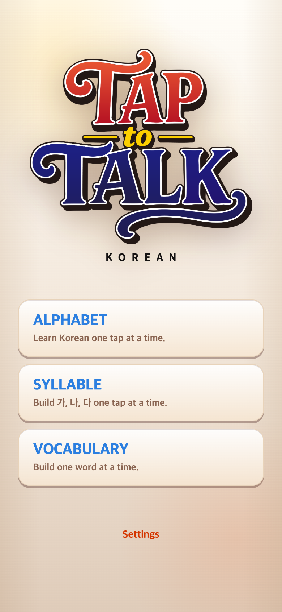 | 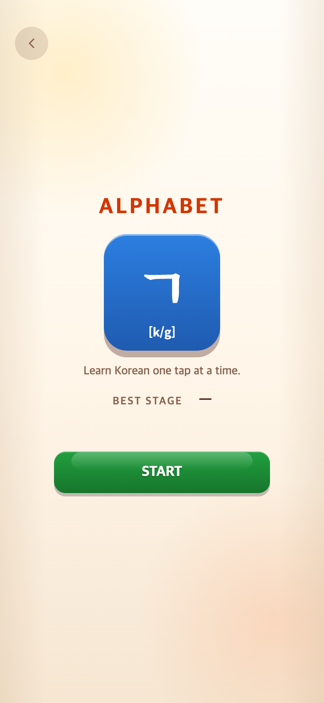 |

| Alphabet 본게임 | Syllable 본게임 | Vocabulary |
| --- | --- | --- |
| 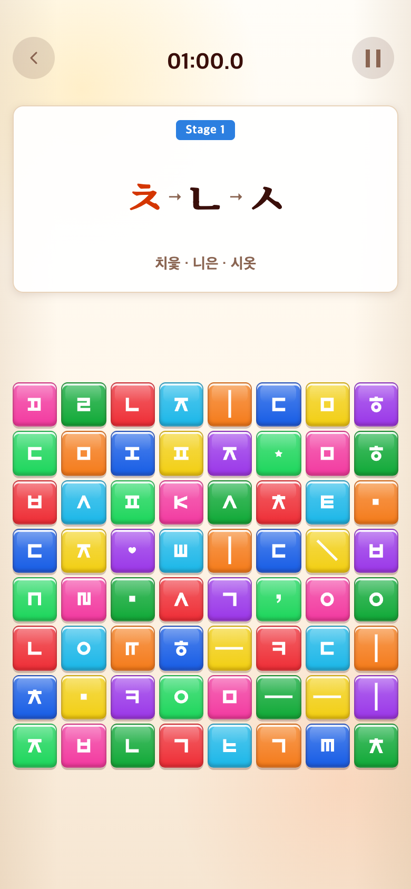 | 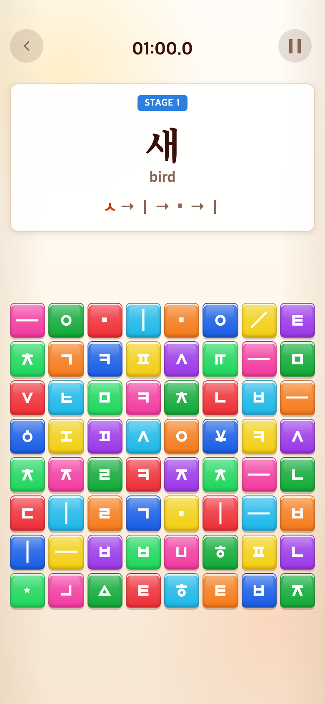 | 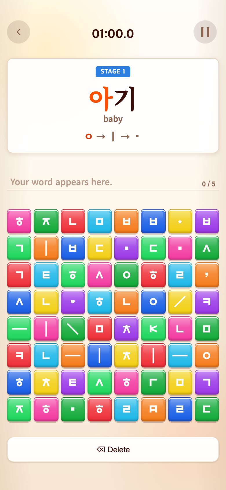 |

| Syllable 연습 | 긴 단어 | 설정 |
| --- | --- | --- |
| 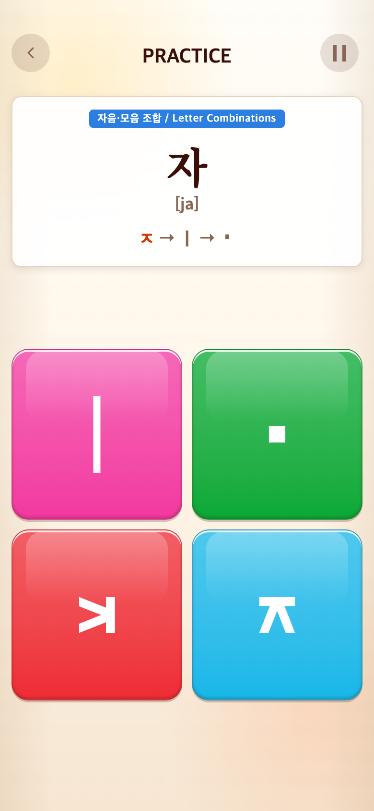 | 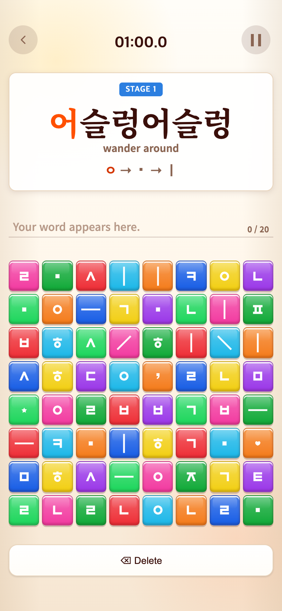 | 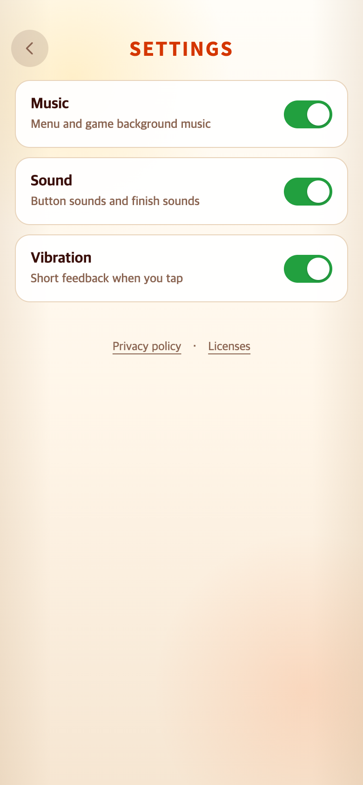 |

## 수정 전·후 비교 — 안전영역0, 동일 조건

| 화면 | 수정 전 `43a49ce` 재현 | 수정 후 작업 트리 |
| --- | --- | --- |
| 홈 |  |  |
| Alphabet START | 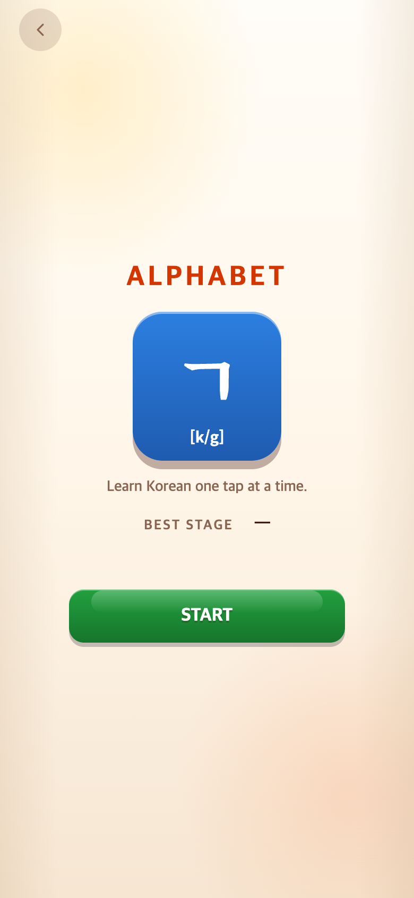 |  |
| Syllable START | 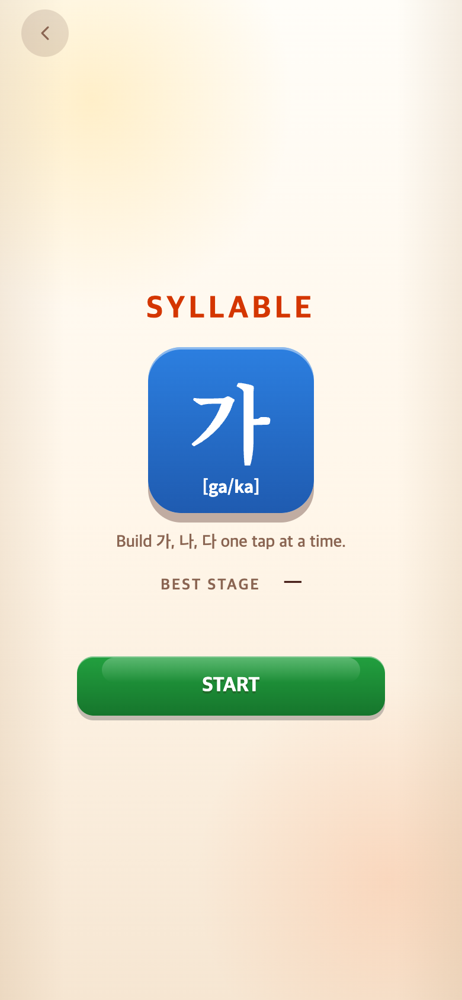 |  |
| Vocabulary START |  | 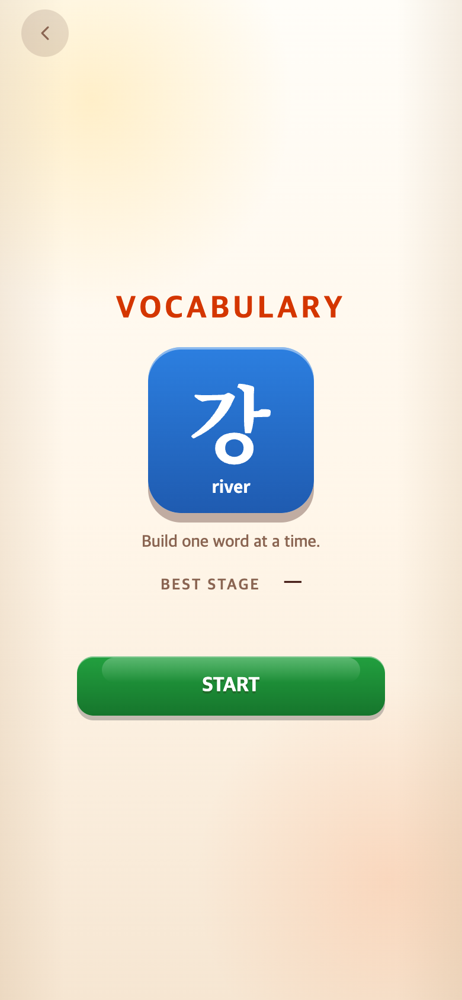 |
| Alphabet | 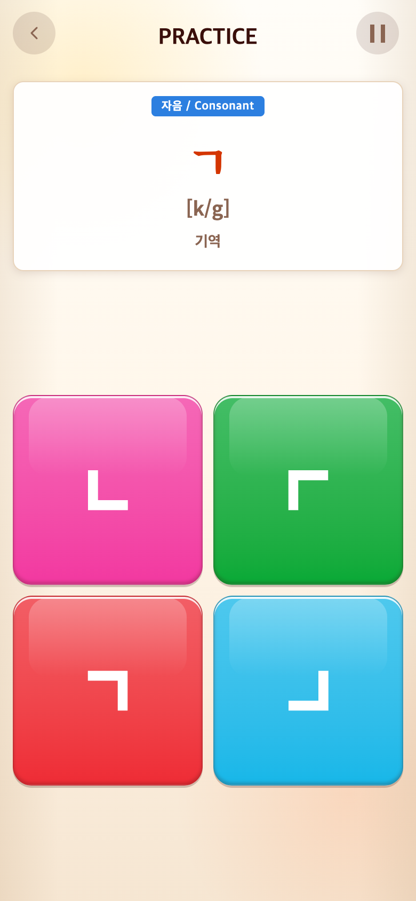 |  |
| Syllable |  | 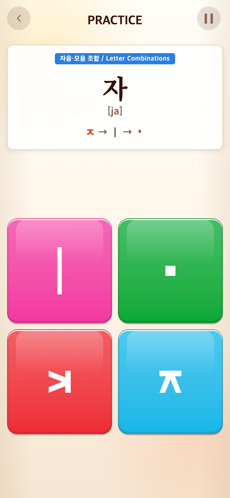 |
| Vocabulary | 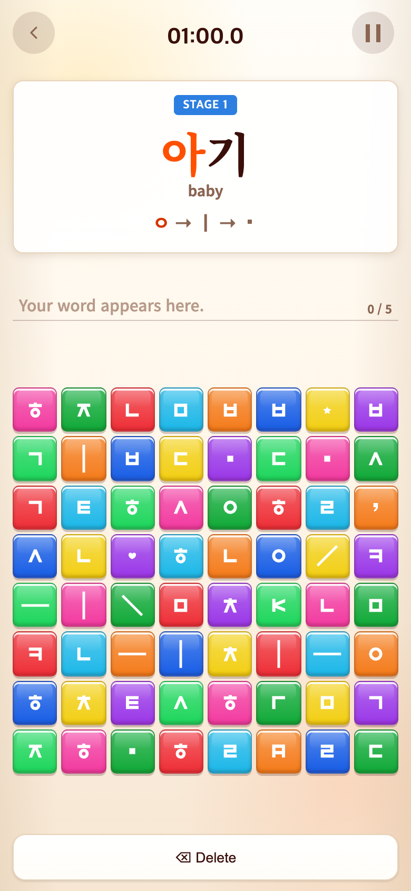 | 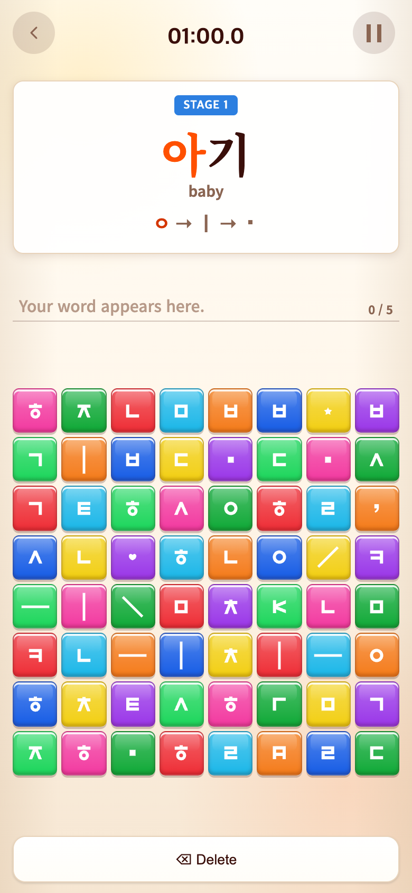 |
| 일시정지 |  | 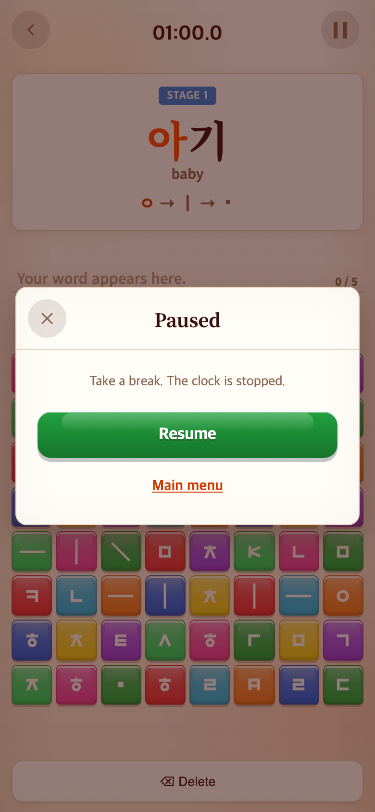 |
| 점수 |  | 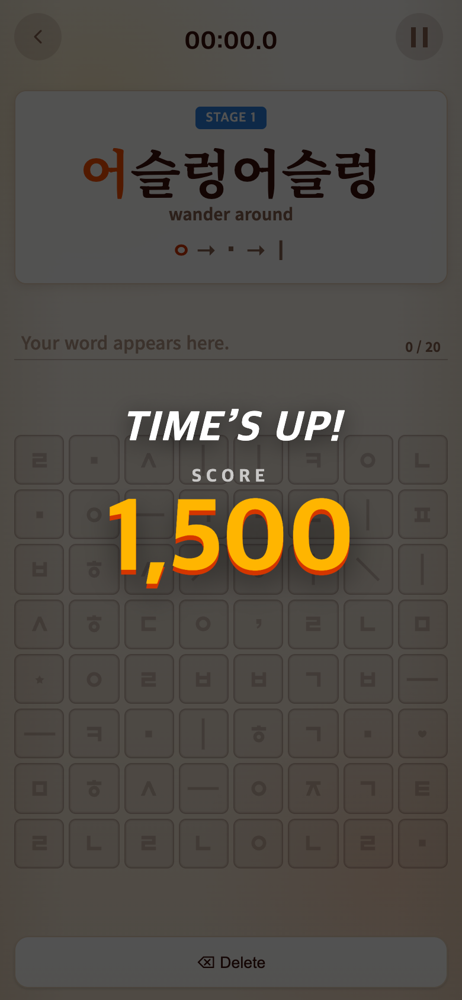 |
| 등급·영상 |  | 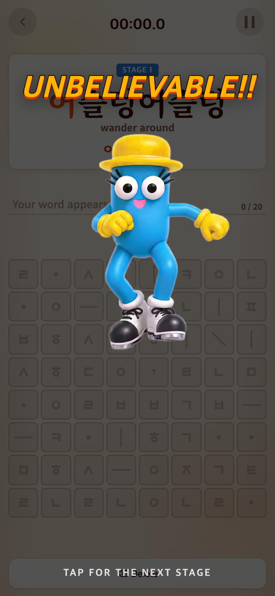 |
| 설정 | 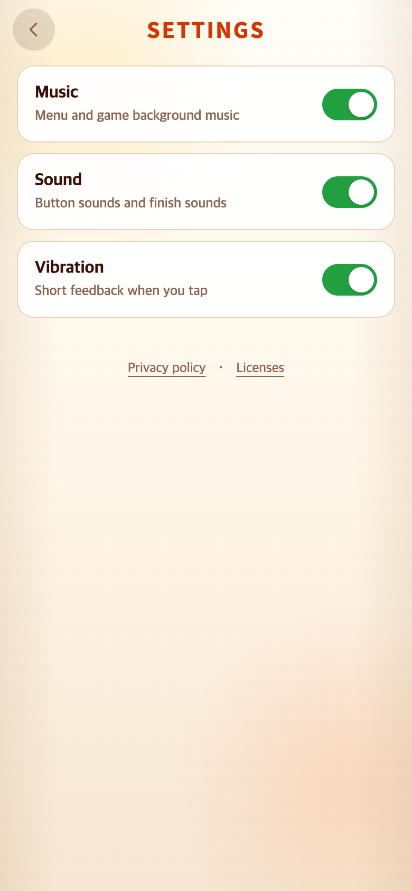 |  |
| 개인정보 | 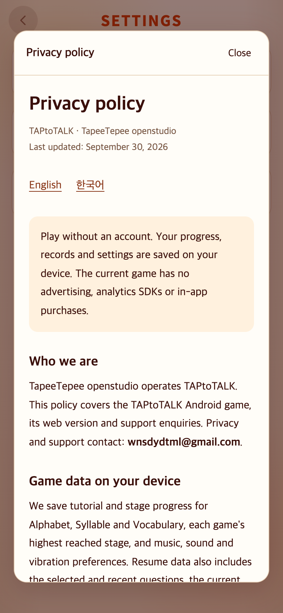 |  |
| 라이선스 | 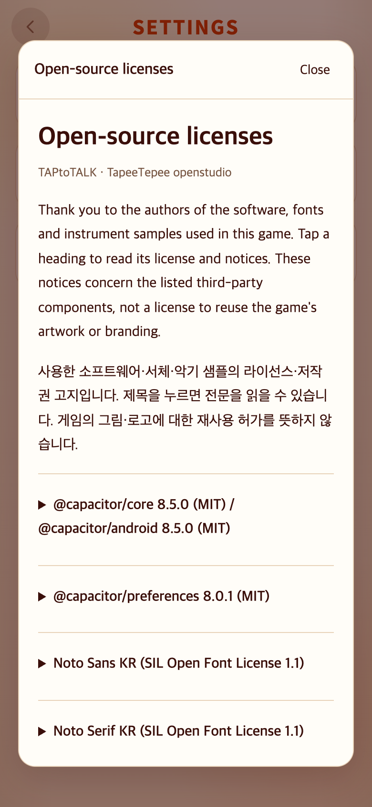 |  |

## 검증과 재현

- `npm test`:44파일289테스트 통과. `npm run build`:typecheck/Vite 통과.
- 390×844에서 기본 화면들의 좌표·크기·폰트·굵기·행간을 과거 커밋과 비교한다. 기준 이미지 픽셀 해시는 기록하며 원본에 쓰지 않는다.
- 320×568,360×640,390×660/844,412×915,430×932 및 상하/비대칭 좌우 inset을 포함한8개 프로필로 홈/안내/튜토리얼2·4·6판/본게임6·8판/긴 단어/일시정지/6등급/점수/설정/정책을 검사한다.
- 화면 바깥으로 벗어나는 요소, 게임판 정방형, 제시어/보드/컨트롤의 겹침을 검사한다. 실제 접속자의 저장을 읽거나 수정하지 않는다.
- 점수·등급은 원래 Cheer 컴포넌트를 직접 실행한 연구용 fixture이며 자연 플레이로 얻은 기록이 아니다. 영상은0.5초에서 정지한다. 학습 예시·시계도 격리된 테스트 컨텍스트에서 고정한다.
- 상세 결과, 실제 사용 서체, PNG/소스/기존 참조 이미지 SHA-256: [수정 전 JSON](before-verification.json), [수정 후 JSON](after-verification.json).
- [capture.mjs](capture.mjs)를 `PLAYWRIGHT_MODULE=/path/to/playwright/index.mjs node .../capture.mjs before` 및 `after`로 실행한다. 이전의 중단된 후보 캡처/검증 파일은 기준 비교에서 제외한다.

## 배포 상태

예정 버전은1.0.2/versionCode4이나 **새 AAB 생성 전 사용자 화면 검토 대기**다. 기존1.0.1/vc3/iconfix 등 출시 파일은 그대로 보존했다. 서명/번들 검증은 화면 확인 후 새 AAB를 실제 생성할 때 다시 수행해야 한다.
