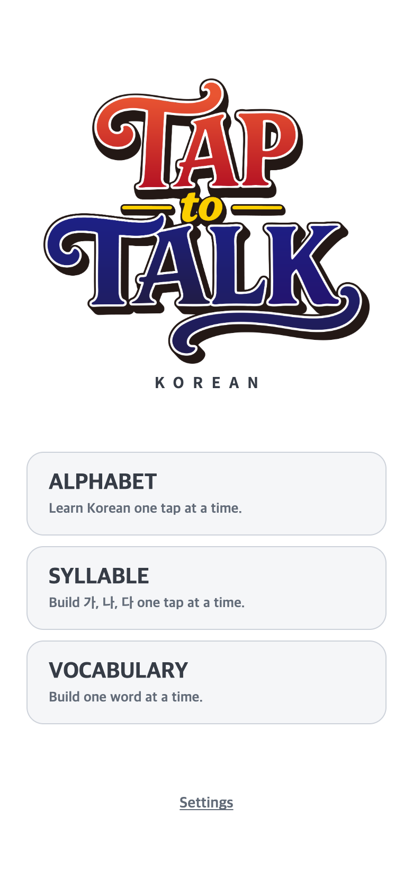
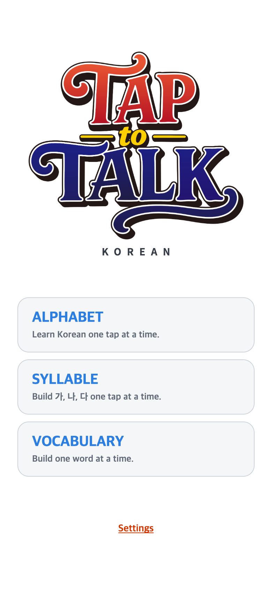
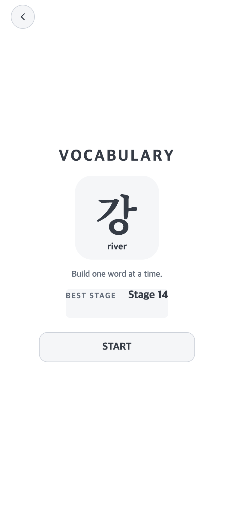
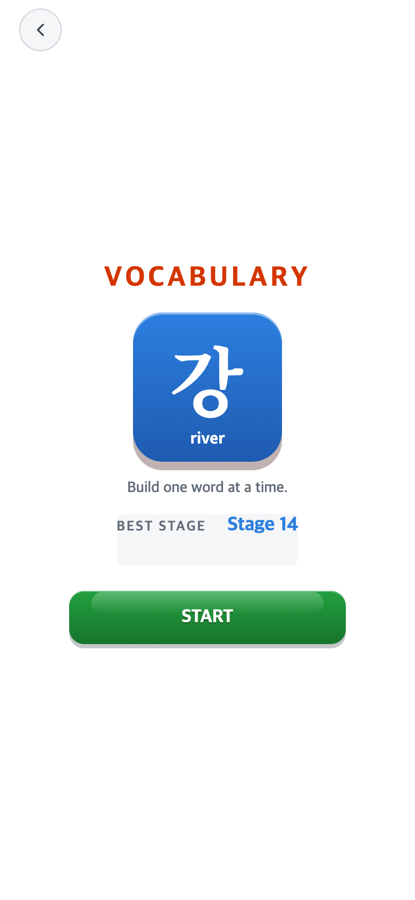
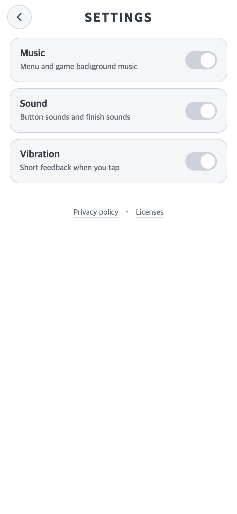
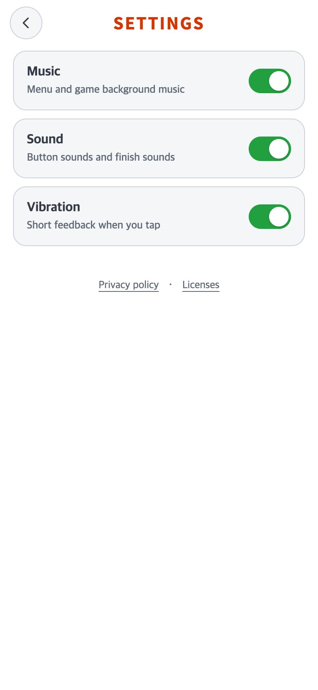

# 2026-10-01 흰 기본 UI 유지·기존 강조색과 효과 복원

## 변경 제목과 재현 조건

- 비교 기준 커밋: `43a49ce4a39a701e09985aefe17961489b21a4c5` (`43a49ce`).
- 수정 전: 기준 커밋 + 직전의 **미커밋 중립 UI/Android 프레임** 소스 아카이브. 순수 커밋 화면이 아니라 당시 로컬 후보를 재현한 것이다.
- 수정 전 소스: [before-source-overlay.tar.gz](before-source-overlay.tar.gz), SHA-256 `b95f3c51ab5e4b0622a14dac918130f3946154d98ea39ddd5c7a633bf98995a0`.
- 수정 후: 같은 기준 위 이번 로컬 변경본. **아직 적용 커밋 없음**. AAB/commit/push/Play 업로드는 실행하지 않았다.
- 수정 후 소스: [after-source-overlay.tar.gz](after-source-overlay.tar.gz), SHA-256 `0248419cc28961774b2e784da09ac79ed109c59222254a81e6900c10b75b8b56`. 서명키/비밀번호/사용자 데이터는 포함하지 않는다.
- 재현: 성공. 과거 코드와 overlay를 별도 임시 폴더에 풀고 독립 Vite 서버로 실행했다. 현재 파일을 과거처럼 바꾸거나 이미지를 합성하지 않았다.
- macOS Chrome154.0.8037.58,390×844 CSS px/DPR2, 모든 PNG **780×1688 px**. 실제 Android 설치 앱 캡처는 아니다.
- 전후 동일한 난수 seed20261001, 별도 테스트 저장 공간, 동일 단계/진입 순서. 시계는PRACTICE/01:00.0, 영상은0.5초로 정지했다. 연구 브라우저에서만 시작 대기 시간을 생략했고 실제 게임 대기 시간은 그대로다.
- 기록 예시는 유효한 격리 저장 fixture(Alphabet8/Syllable27/Vocabulary14)를 읽은 실제 START 화면이다. 사용자 데이터를 쓰거나 진도를 변경하지 않았다.

### 문제·개선 요구

직전의 전체 중립 UI는 배경과 일반 표면을 정리했지만 게임명, 시작 아이콘, START/Resume, 최고기록, Settings와 스위치까지 회색으로 바꾸어 강조 역할이 약해졌다. 사용자는 기본 흰색/회색은 유지하면서 중요 요소의 원래 색과 효과를 되돌려 달라고 요청했다.

### 수정 내용과 이유

읽기 전용 TAPtoTEST (`/Users/scdi/Documents/ChatGPT/TaptoPick`)의 `neutralUi.css`와 강조색 연구기록을 참고했다. **실행 코드 변경은 TAPtoTALK의 `src/ui/styles/neutral.css`만**이다. 전체 테마를 되돌리는 대신 강조 요소를 회색으로 덮던 selector를 제거해 기존 화면 CSS를 다시 사용한다.

| 요소 | 수정 후 |
| --- | --- |
| 메인 ALPHABET/SYLLABLE/VOCABULARY | 기존 파랑 `#2c7fe0` |
| 메인 Settings·Settings 화면 제목·START 게임 제목·메뉴 링크 | 기존 주황 `#d43600` |
| START ㄱ/가/강 아이콘 | 기존 파랑 그라데이션·입체 효과, 기호/음가/뜻 흰색 |
| START·Resume·기존 주요 동작 버튼 | 기존 초록 그라데이션·광택·입체 그림자·눌림 효과 |
| BEST STAGE 값 | TAPtoTEST의 강조 기록 역할에 맞춰 기존 파랑 토큰 `--cool` 사용. 기록 내용/서체/위치는 동일 |
| STAGE/학습 배지 | 기존 파랑 바탕·흰 글자, 전체 완료 시 노랑 전환 유지 |
| 스위치 | TALK의 기존 꺼짐 색·초록 ON·흰 손잡이와 그림자/이동 효과 |
| 점수 표시 | 기존 노랑 점수·입체 글자 그림자·흰 제목/라벨. 읽기 위한 원래 어두운 결과 오버레이도 함께 복원 |

흰 전체 배경, 연회색 게임 선택 박스/제시창/일반 버튼/뒤로가기/일시정지/설정 항목/팝업/정책창, 진회색 기본 글자와 회색 설명은 유지했다. 로고 CSS 그림자 제거도 유지하며 로고 PNG를 수정하지 않았다.

현재 활성 TALK 흐름에는 진행 게이지가 없으므로 새 UI를 추가하지 않았다. 비활성 레거시 결과 패널을 실제 결과처럼 캡처하지 않았다. 활성 결과인 점수와 등급/영상 화면을 검증했다. 게임 규칙, 저장, 패키지명, 서체/글자 크기/굵기/행간, 버튼 크기/위치/비율, 블록과 함정, 정답/오답/반짝임, 영상/음악, Android 전체 프레임 코드는 수정하지 않았다.

### 수정 결과와 검증

최종 자료는 `final/`이며 [전체 측정·PNG 크기/해시](final/verification.json), [기존 강조 효과·최고기록 비교](final/accent-verification.json)를 함께 읽는다.

| 검증 | 결과 |
| --- | --- |
| Vitest | 46개 파일·299개 테스트 통과 |
| TypeScript/Vite build | 통과 |
| PNG | 110장 모두780×1688 px, 파일별 SHA-256 검증 |
| 원래 강조 효과 | 기존 실제 렌더링20개 화면/선택자 쌍의 색/배경/그라데이션/그림자/text-shadow와 일치 |
| 최고기록 예시 | 전후 세 게임 START6장, 기록 값/저장 내용·좌표/크기/서체 동일 |
| 웹 전후 | 38개 화면/조건에서 좌표/크기/font-family/크기/굵기/행간 차이0 (0.05 CSS px 기준) |
| 게임 블록 | 전후 모든 측정 상태의 색/그라데이션/광택/그림자/테두리/비활성 흔적/글자 속성 동일 |
| 정답·오답 | 현재 빨강·완료 파랑·전체완료 반전·오답−1/화면 틴트/흔들림 동일 |
| 보호 소스 | 규칙·콘텐츠·화면 흐름·기록/저장·폰트/로고/커버/BGM 등65개 SHA-256 동일 |
| Android 브라우저 모의 | 256개 화면/안전영역 검사,34개 좌표 터치 검사 통과. 전체 프레임·정방형 보드·터치 위치 유지 |
| 실제 갤럭시/설치 AAB | **미검증**. 이번 검사는 브라우저이며 실제 기기/OS 화면 확대 설정을 실행하지 않음 |

Android 모의 조건은390×844 inset0/24·48, 물리1080×2340에 밀도2/2.4/3/3.6/4를 가정한 논리 viewport,320×568, 비대칭 cutout412×915, 가로844×390이다. 메인·START·각 게임2/4/6/8판·Pause·점수·6등급 영상·Settings·정책을 검사했다. 실행 중 밀도 변경, 이미 native padding된 inset0, inset만 바뀌는 경우도 재검사했다. 자세한 조건은 JSON과 [프레임 연구](../2026-10-01-neutral-proportional-frame/README.md)에 있다.

### 모바일 전후 화면

모두 수정 전 소스를 **별도 임시 폴더에서 재현**한 전후 화면이다. 커밋43a49ce만의 화면으로 오인하지 않도록 앞서 설명한 소스 overlay와 함께 기록한다.

| 화면 | 수정 전 —43a49ce+중립 UI overlay | 수정 후 —미커밋 강조 복원 |
| --- | --- | --- |
| 메인 |  |  |
| Vocabulary START/최고기록 |  |  |
| Settings ON |  |  |
| Alphabet START/기록 | [전](final/before-alphabet-record.png) | [후](final/after-alphabet-record.png) |
| Syllable START/기록 | [전](final/before-syllable-record.png) | [후](final/after-syllable-record.png) |
| Alphabet2×2 | [전](final/before-alphabet.png) | [후](final/after-alphabet.png) |
| Alphabet4×4 | [전](final/before-alphabet-4x4.png) | [후](final/after-alphabet-4x4.png) |
| Alphabet6×6 | [전](final/before-alphabet-6x6.png) | [후](final/after-alphabet-6x6.png) |
| Alphabet 본게임 | [전](final/before-alphabet-main.png) | [후](final/after-alphabet-main.png) |
| 진행색·비활성 블록 | [전](final/before-alphabet-input.png) | [후](final/after-alphabet-input.png) |
| 전체완료 | [전](final/before-alphabet-complete.png) | [후](final/after-alphabet-complete.png) |
| Syllable2×2 | [전](final/before-syllable.png) | [후](final/after-syllable.png) |
| Syllable4×4 | [전](final/before-syllable-4x4.png) | [후](final/after-syllable-4x4.png) |
| Syllable 본게임6×6 | [전](final/before-syllable-main.png) | [후](final/after-syllable-main.png) |
| Syllable8×8 | [전](final/before-syllable-8x8.png) | [후](final/after-syllable-8x8.png) |
| Vocabulary | [전](final/before-word.png) | [후](final/after-word.png) |
| 긴 단어 | [전](final/before-word-long.png) | [후](final/after-word-long.png) |
| Alphabet Pause | [전](final/before-alphabet-pause.png) | [후](final/after-alphabet-pause.png) |
| Syllable Pause | [전](final/before-syllable-pause.png) | [후](final/after-syllable-pause.png) |
| Vocabulary Pause | [전](final/before-word-pause.png) | [후](final/after-word-pause.png) |
| 점수 | [전](final/before-score.png) | [후](final/after-score.png) |
| 등급 영상 | [전](final/before-grade.png) | [후](final/after-grade.png) |
| Settings OFF | [전](final/before-settings.png) | [후](final/after-settings.png) |
| Privacy | [전](final/before-privacy.png) | [후](final/after-privacy.png) |
| Licenses | [전](final/before-licenses.png) | [후](final/after-licenses.png) |

### 재실행과 남은 확인

저장소 루트에서 [check.mjs](check.mjs) 실행 후 같은 출력 폴더로 [check-accents.mjs](check-accents.mjs)를 실행한다. `CHECK_RUN`은 새 이름으로 지정해 기존 PNG를 덮어쓰지 않는다. 후자는 직전 연구의 **실제 과거 렌더링 측정값**과 강조 효과를 비교하며, 유효한 별도 기록 fixture로 세 게임 START의 기록 위치/서체도 검증한다. 그동안 기준 커밋·과거 overlay·실제 검증 JSON을 보존한다.

```sh
CHECK_RUN=recheck-YYYYMMDD PLAYWRIGHT_MODULE=/Users/scdi/.cache/codex-runtimes/codex-primary-runtime/dependencies/node/node_modules/playwright/index.mjs node docs/research/2026-10-01-ui-accents/check.mjs
CHECK_RUN=recheck-YYYYMMDD PLAYWRIGHT_MODULE=/Users/scdi/.cache/codex-runtimes/codex-primary-runtime/dependencies/node/node_modules/playwright/index.mjs node docs/research/2026-10-01-ui-accents/check-accents.mjs
```

실기기의 갤럭시 확대/안전영역/실행 중 설정 변경/업데이트 설치 검증은 남아 있다. AAB/push는 별도 요청 후 진행한다. TAPtoTEN/TAPtoTEST 저장소는 수정하지 않았다. 연구용 파일과 PNG는 게임 진입점/배포assets에 포함하지 않는다.
