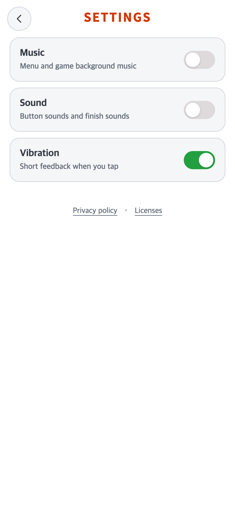
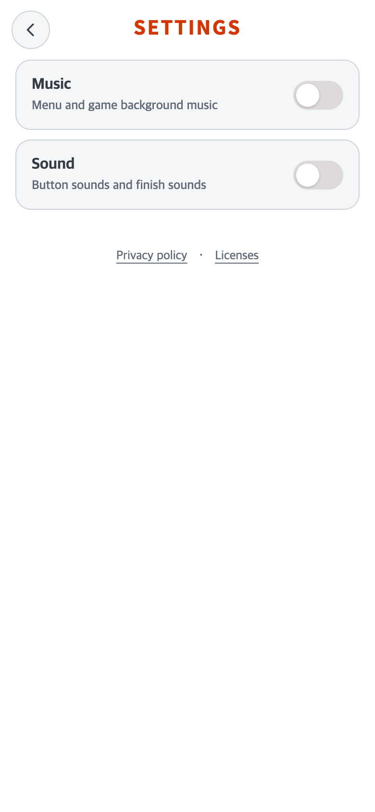
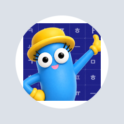
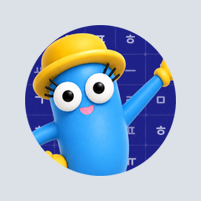

# 2026-10-02 설치 아이콘 여백·앱 이름·진동 설정

## 변경 제목

- 비교 커밋: `41385dbca02aed44433b26a6c85800328ca508f4` — 1.0.3(5) 출시 자료.
- 적용 코드: 이 커밋 위의 미커밋 소스 후보. AAB·버전 증가·commit/push 없음.
- 과거 재현: 비교 커밋을 `/private/var/folders/.../talk-icon-settings-*/before` 별도 임시 폴더에 archive하여 실행. 현재 작업 파일로 과거 화면을 임의 재현하지 않았다.
- Settings 조건:390×844 CSS px, DPR2, **780×1688 PNG**, Chrome Android 플랫폼 모의, 남은 native insets0. Music/Sound OFF·기존 진동ON 저장 상태를 두 버전에 동일하게 주입했다.

### 문제·개선 요구

사용자가 준 정사각형 캐릭터 PNG가 Android 원형 아이콘 안에서 작게 표시돼 흰 여백이 보였다. 앱 하단 이름도`TAP to TALK`으로 잘못 설정돼 있었다. 작동하지 않는 진동 설정은 제거해 달라는 요청이었다.

### 수정 내용과 이유

- 기존 adaptive의 가시 영역60/72 및 legacy40/48 비율을 **72/72·48/48**로 변경했다. 그림을 마스크 가장자리까지 채우며 adaptive108dp 외곽과 native 배경도 파란#1D2087로 채워 흰 테두리가 드러나지 않게 했다. 원본 PNG의 SHA/파일은 보존한다.2134×2135의 극미세한 정사각형 보정과 런처 모양 마스크 외에는 캐릭터를 다시 그리지 않는다.
- [Android 공식 adaptive icon 문서](https://developer.android.com/develop/ui/compose/system/icon_design_adaptive)에 따라108dp 레이어와 런처 mask를 유지한다. 기존 정사각형 사진은 원형 안에서 모서리가 가려질 수 있다. 원형 자체를 강제로 네모로 바꾸는 작업이 아니다.
- Android launcher와 activity의 표시 문자열, Capacitor/앱 구성/웹 title·alt를 **TAPtoTALK**으로 통일했다. 앱 이름의 띄어쓰기는 이 문자열 설정 때문이었다. 패키지명·서명키·기록 키는 변경하지 않았다.
- 진동 스위치와 미지원 안내·이벤트를 제거했다. 예전 저장값이true여도 읽을 때false, 저장 시false이며 활성 TALK feedback도 항상false다. 기존 저장 구조 호환을 위해 필드 자체는 남긴다. Music·Sound·tutorialDone과 모든 진도/기록은 유지한다.
- 한·영 개인정보 문서에서 활성 설정 목록의 진동을 제외하고 수정일을 갱신했다. 다른 정보 처리 설명/연락처는 유지했다.

### 수정 결과·검증

| 항목 | 결과 |
| --- | --- |
| Vitest | 48파일313개 통과. 이름 일치·과거 진동ON/OFF 호환·Music/Sound 보존 테스트 추가 |
| TypeScript/Vite·Capacitor sync | 통과. CSS·게임 규칙·이미지/음악 원본 변경 없음 |
| Android | `:app:processReleaseResources` 성공. AAB/APK 생성하지 않음 |
| compiled 리소스 | 5밀도×3PNG=15종 visible RGBA/alpha 일치·원본fit/꽉 찬 배치 검증. app_name/title_activity_main=TAPtoTALK, 배경#ff1d2087 확인 |
| 브라우저 | Settings3→2스위치, Music/Sound 독립 토글·정답 블록 진행, 진동 호출0·JS오류0 |
| 보호 | 원본 아이콘 파일·패키지/서명·저장 키·세 게임 진행/규칙 유지. 기존 미추적 자료·다른 게임 저장소 미수정 |
| 실제 Android | 미실시. 실제 설치/홈 런처 캐시 갱신/원형mask 확인은 다음 서명 빌드로 별도 검사해야 함 |

[브라우저 검증](verification.json), [compiled 아이콘/이름 검증](icon-verification.json). 초기 캡처 보조 도구의 archive 버퍼 한도와 macOS 경로 정규화를 보완했다. 최종 재실행은 접근 경고 없이 통과했으며 앱 코드를 이 오류에 맞춰 변경하지 않았다.

### 모바일 전후 화면

| 전 —41385db 별도 폴더 재현 | 후 —현재 소스 후보 |
| --- | --- |
|  |  |

둘 다780×1688 PNG. 실제 설치 Android 스크린샷이 아니다.

### 아이콘 전후 미리보기

아래 두 PNG는 동일256×256 회색 바탕·192px 원형 mask **리소스 미리보기**다. 실제 휴대폰 홈 화면이나390×844 모바일 캡처가 아니며 앱 이름을 이미지에 합성하지 않았다. 전은 변경 전 저장소의 실제 생성 파일을 복사했고 후는 새 리소스 생성기의 결과다.

| 전 —흰 inset40/48 | 후 —full-bleed48/48 |
| --- | --- |
|  |  |

[새 adaptive 원형 미리보기](after-adaptive-circle-preview.png), [새512px 스토어 아이콘](../../../store/android/taptotalk-play-icon-512.png).

기존1.0.3(5) AAB 파일을 수정하거나 덮어쓰지 않았다. 설치 앱에 반영하려면 추후 승인 후 versionCode를 높인 새 AAB를 생성·배포해야 한다.
