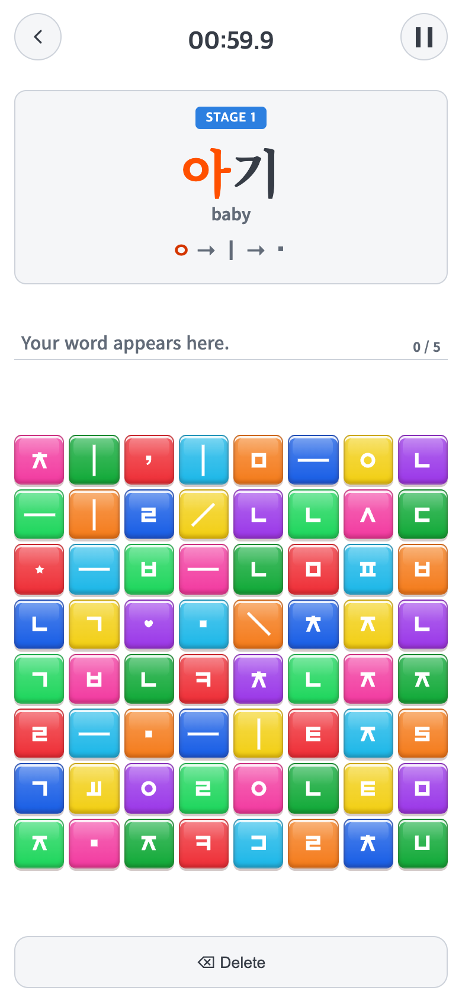

# 2026-10-08 Vocabulary 블록·자소 크기 연동

## 변경 제목

- 사용자 승인: Vocabulary 블록 속 자소 크기 수정, 연구기록·전후 캡처, origin push, 새 AAB·출시명·출시노트 제공.
- 적용 소스 커밋: `f145f67501e4abfe53c2622c0ff65fd0534f4009` (`f145f67`). 후속 커밋은 검증 결과·연구 문서만 추가하며 앱 소스는 바꾸지 않는다.
- 비교 커밋: `2ae4559` — Android 1.0.4/versionCode6.
- 과거 재현: 해당 커밋을 `git archive`로 별도 임시 폴더에 풀어 실제 실행했다. 현재 코드를 바꾸거나 과거 화면을 합성하지 않았다.
- 비교 조건: Chrome, 독립 임시 브라우저 컨텍스트, 랜덤 seed1234, Vocabulary 첫 제시어 `아기`, 동일8×8 배열, Music/Sound OFF. 캡처 중 타이머만 정지한다. 로고 대기 시간 생략·테스트 접근은 브라우저 응답에만 적용하고 앱 소스에는 포함하지 않는다.

### 문제·개선 요구

Vocabulary에서 화면 높이가 줄면 보드는 남은 높이에 맞춰 작아지지만, 자소는 화면 너비 기준 크기를 유지했다. 블록만 작아져 자소가 상대적으로 커지고 긴 획은 블록 가장자리에 가까워졌다. 사용자가 먼저 읽기 전용 진단을 요청한 뒤 수정·출시를 승인했다.

### 수정 내용과 이유

- Vocabulary 타일만 `container-type: inline-size`로 지정한다.
- 안쪽 자소는 `min(기존 1em, 실제 타일 내부 너비의57%)`로 정한다. 57%는 기존390×844에서22.93px인 자소를 그대로 유지하면서 작은 타일에만 축소가 적용되는 비율이다.
- CSS로 실제 타일에 연결하므로 화면 크기를 실행 중 변경해도 측정 JS·저장·게임 동작을 추가하지 않고 즉시 반영된다.
- Alphabet/Syllable, 제시어·입력칸·버튼 배치, 블록 색·광택, SVG 원본과 개별 확대/회전, 오답/정답 효과는 유지한다.
- 게임 규칙·점수·콘텐츠·음악·저장 키·패키지·업로드 서명키·네이티브 안전영역은 변경하지 않는다.
- Android 버전만 **1.0.5/versionCode7**로 올린다. 이전 AAB를 덮어쓰지 않는다.

### 수정 결과

아래 값은 일반 ㄱ의 SVG 표시영역 한 변이다. 원본 SVG 안 실제 흰 획의 bounding box와는 구분한다.

| 환경·CSS 화면 | 블록 크기(전후 동일) | 수정 전 자소 표시영역 | 수정 후 |
| --- | ---: | ---: | ---: |
| 웹390×844 | 42.25px | 22.92px | 22.92px |
| 웹390×600 | 29.25px | 22.92px | 15.53px |
| 웹1280×800 | 48.00px | 25.19px | 25.19px |
| 웹1280×600 | 29.25px | 25.19px | 15.53px |
| Android 모의390×640 | 32.72px | 22.92px | 17.50px |

- Vitest **49파일315개**, TypeScript/Vite·Capacitor sync 통과.
- 웹·Android 플랫폼 모의 각각8크기, 전후 총32조건. 기본390×844 크기, 보드 기하/자소 배열·특수 기호 확대/회전, 두 다른 게임의 기준 크기 동일.
- 실행 중 화면 크기 변경 후 실제 좌표 탭·Delete 모두 통과. 런타임 오류0개.
- [전후 비교 결과](comparison.json), 원본 [전 측정](screenshots/before-measurements.json)·[후 측정](screenshots/after-measurements.json).
- Android Gradle release 빌드 성공. 변경 없는 앱 Java 테스트는 기존5개 통과 결과에 대한 UP-TO-DATE 판정을 재사용했다.
- 실제 휴대폰 설치/화면 확대 설정 및 구버전→신버전 업데이트 보존 검증은 **미실시**다. 아래 Android 화면은 Chrome 플랫폼 모의이며 실제 기기 캡처가 아니다.

### 모바일 화면

기준 캡처는 모두 **390×844 CSS px, DPR2, 780×1688 PNG**다. 이 조건은 원래 크기를 유지하므로 전후가 동일하게 보이는 것이 의도한 결과다.

| 수정 전 — `2ae4559` 별도 폴더 재현 | 수정 후 — 이번 적용 소스 |
| --- | --- |
|  |  |
|  |  |

#### 작은 화면·PC 진단용 추가 캡처

실제 문제 조건을 보여주기 위해 아래는 별도 원본 크기로 저장했다. 표준780×1688 모바일 캡처로 잘못 표시하거나 늘려 합성하지 않는다. 전후 각각 동일 조건이며 DPR2다.

| 조건 | 전 | 후 |
| --- | --- | --- |
| 웹390×600 CSS / PNG780×1200 | [원본 전](screenshots/before-web-390x600.png) | [원본 후](screenshots/after-web-390x600.png) |
| Android 모의390×600 / PNG780×1200 | [원본 전](screenshots/before-android-simulation-390x600.png) | [원본 후](screenshots/after-android-simulation-390x600.png) |
| 웹1280×800 / PNG2560×1600 | [원본 전](screenshots/before-web-1280x800.png) | [원본 후](screenshots/after-web-1280x800.png) |
| 웹1280×600 / PNG2560×1200 | [원본 전](screenshots/before-web-1280x600.png) | [원본 후](screenshots/after-web-1280x600.png) |

### 재검사

`tests/browser/vocabulary-glyphs.mjs ROOT OUTPUT before|after`를 실행한다. 기존 Playwright 경로는 `PLAYWRIGHT_MODULE`, Chrome 실행파일은 `CHROME_EXECUTABLE`로 지정할 수 있다. Vite 의존성은 ROOT의 node_modules를 사용한다. 과거 ROOT는 비교 커밋의 별도 임시 폴더여야 한다. 전후 측정 후 `node docs/research/2026-10-08-vocabulary-glyph-sizing/compare.mjs`를 실행한다.

### 출시 입력값

- 새 파일: `android/releases/TAPtoTALK-1.0.5-vc7-20261008.aab`.
- 출시명: `1.0.5 - Vocabulary Display Fix`.
- [영문 출시노트·한글 해석](release-notes.md).
- 크기: **56,706,849bytes** (약56.7MB).
- SHA-256: `11cfef21bef8d9ba6039851168b1eec66128757690b83b44e16737eabb683505`.
- 패키지: `io.github.junyyyong.taptotalk`, minSDK24 / targetSDK36 유지.
- 기존1.0.4(6)과 업로드 인증서 동일. bundletool validate·jarsigner 검증 통과, 최신 dist89개 바이트 일치, 아이콘15개 픽셀 일치.
- 기존 영상·음악·서체·아이콘89항목과 네이티브 DEX는 이전 AAB와 바이트 동일하다. 개인 서명 자료·외부 server URL은 포함되지 않는다.
- [최종 AAB 검증](release-verification.json)은 `f145f67` 소스 작업 트리 clean 상태에서 수행했다. 이후 문서 커밋이 있어도 빌드 앱 코드는 동일하다.
- AAB와 서명 비밀자료는 Git 제외다. 기존 AAB·사용자 미추적 시안은 보존한다. 다른 게임 저장소는 수정/push하지 않는다.
- Play Console 업로드/출시와 실제 기기 검증은 수행하지 않는다.
